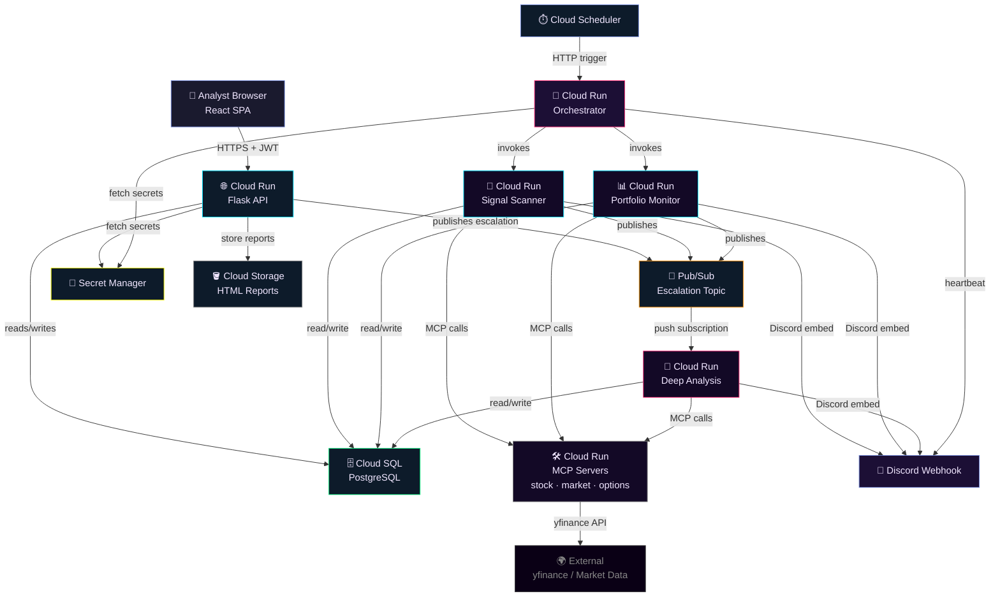
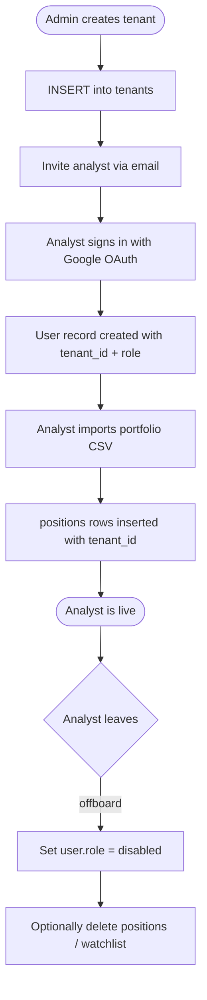
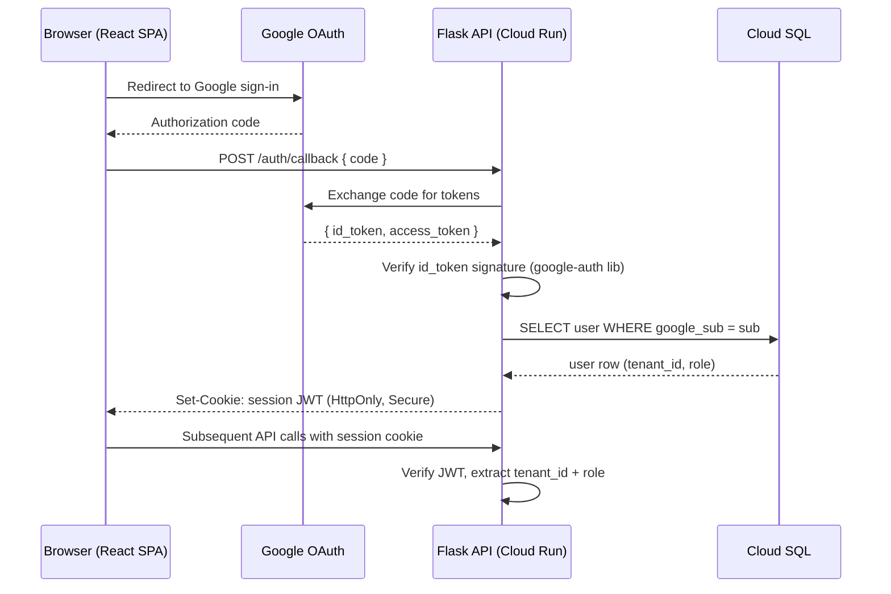
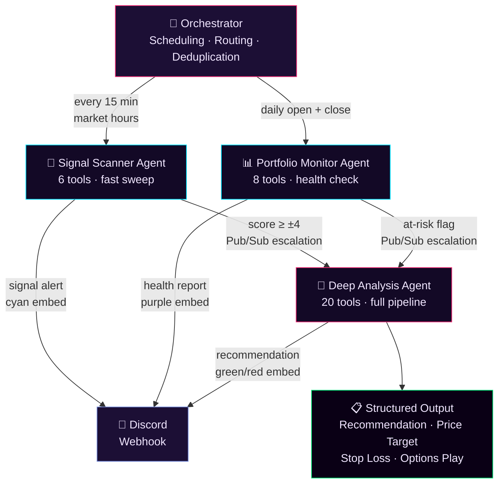
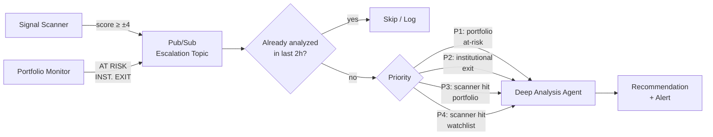
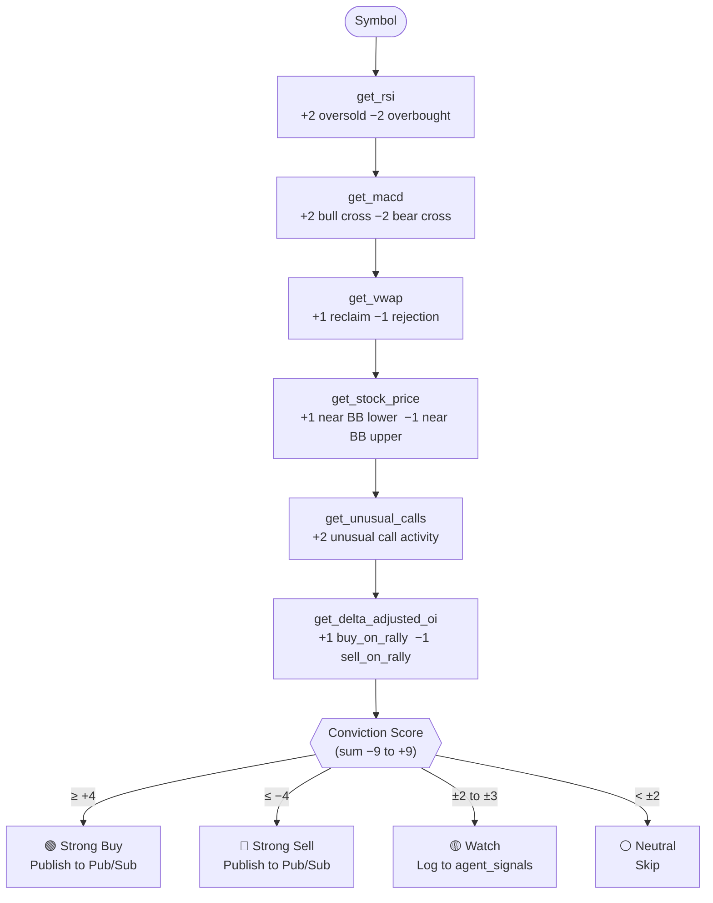
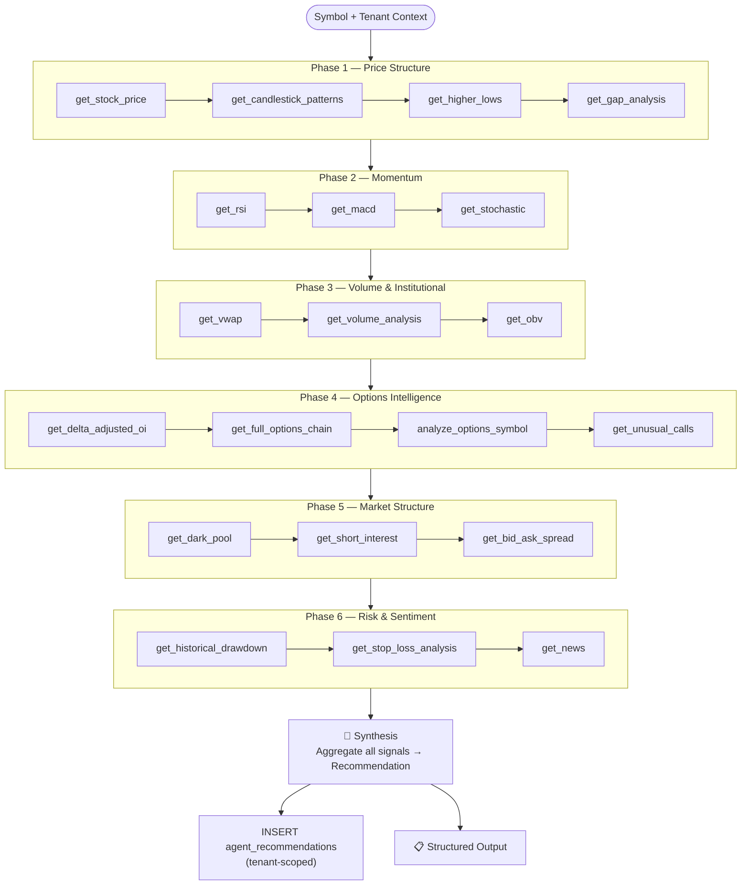
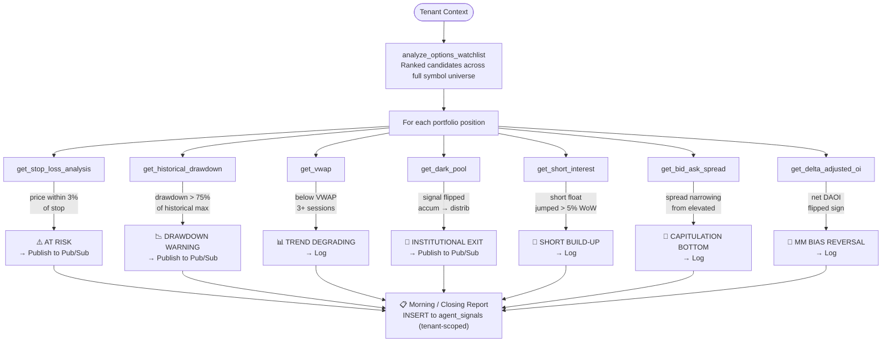
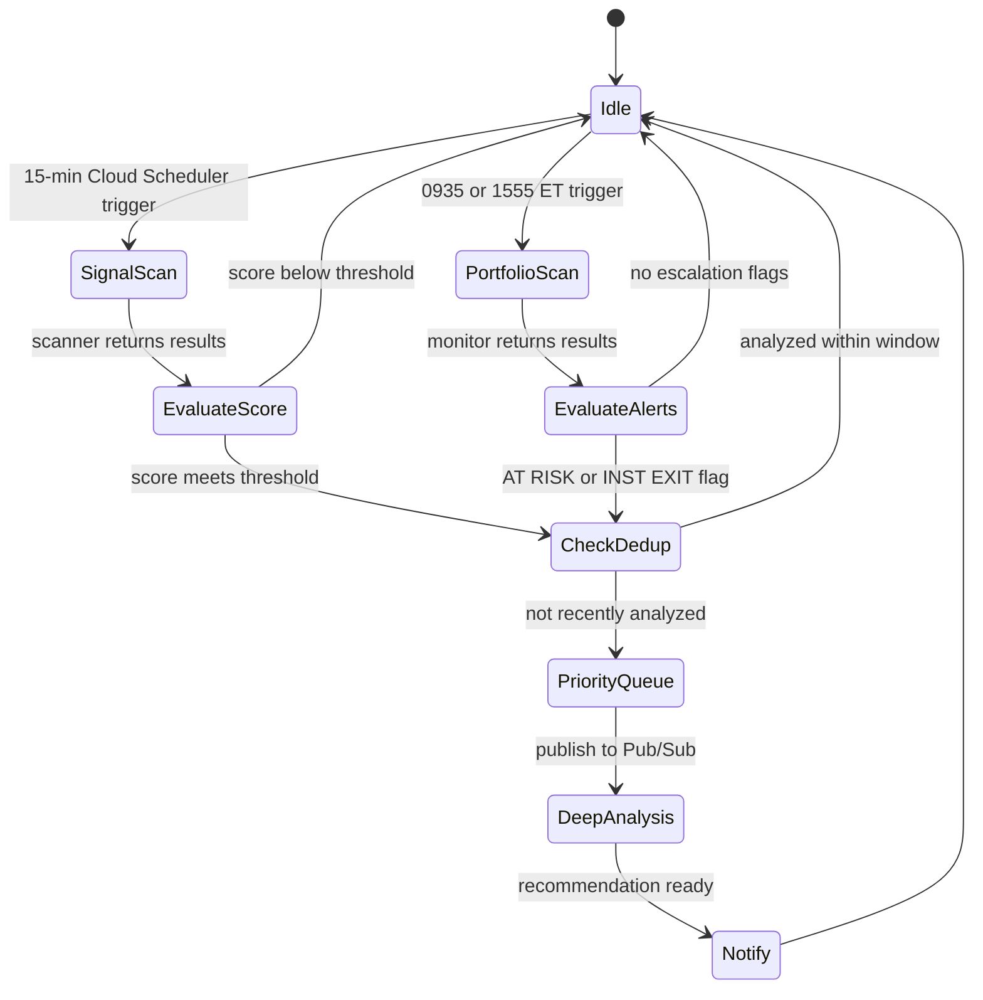

# Agentic Market Intelligence System — GCP Edition
### Proposal & Implementation Plan (Cloud-Native, Multi-Tenant, OAuth-Secured)

---

## Table of Contents

1. [Executive Summary](#executive-summary)
2. [Problem Statement](#problem-statement)
3. [Benefits Over Current Approach](#benefits-over-current-approach)
4. [GCP Architecture Overview](#gcp-architecture-overview)
5. [Data Layer Migration](#data-layer-migration)
6. [Multi-Tenancy Design](#multi-tenancy-design)
7. [Authentication & Authorization](#authentication--authorization)
8. [Existing Notification Infrastructure](#existing-notification-infrastructure)
9. [Proposed Solution](#proposed-solution)
10. [System Architecture](#system-architecture)
11. [Agent Designs](#agent-designs)
    - [Signal Scanner Agent](#agent-1--signal-scanner)
    - [Deep Analysis Agent](#agent-2--deep-analysis)
    - [Portfolio Monitor Agent](#agent-3--portfolio-monitor)
    - [Orchestrator](#orchestrator)
12. [MCP Tool Inventory](#mcp-tool-inventory)
13. [Implementation Plan](#implementation-plan)
14. [Technical Stack](#technical-stack)
15. [Decisions Log](#decisions-log)

---

## Executive Summary

This document extends the original Agentic Market Intelligence proposal with a full **GCP migration**, replacing all local file and SQLite storage with **Cloud SQL (PostgreSQL)**, introducing **multi-tenancy** so multiple analysts can maintain independent portfolios on shared infrastructure, and securing the platform with **OAuth 2.0 via Google Identity**.

The three-agent system — Signal Scanner, Deep Analysis, and Portfolio Monitor — remains architecturally unchanged. What changes is where it runs, how it stores state, who can access it, and how it scales. Each component migrates to a purpose-built GCP service: Cloud Run for compute, Cloud SQL for persistence, Cloud Scheduler for cron, Pub/Sub for the escalation queue, and Secret Manager for credentials.

The result is a system that can serve a team of analysts, runs without any local machine being online, and meets the security and auditability standards expected of a system handling financial decisions.

---

## Problem Statement

Active portfolio management against a universe of 20–40 symbols requires constant, repetitive work:

- **Signal generation** — manually checking RSI, MACD, VWAP, and options flow for every symbol, every session, to find tradeable setups before they pass
- **Deep analysis** — when a setup is found, assembling a complete picture from price structure, volume, options intelligence, dark pool prints, short interest, and news sentiment takes 30–60 minutes per symbol
- **Portfolio monitoring** — tracking stop levels, drawdown, institutional flow changes, and VWAP health across all open positions daily

The local-first version of this system solves the automation problem but introduces new constraints: it only runs when a developer's laptop is on, all data is local and non-shareable, and there is no access control — anyone with repo access can see everyone's portfolio. GCP removes these constraints.

---

## Benefits Over Current Approach

The table below contrasts the current ad-hoc workflow against the proposed GCP-hosted agentic system.

| Dimension | Current Ad-Hoc Approach | Agentic System (GCP) |
|-----------|------------------------|----------------------|
| **Coverage frequency** | Whenever a team member manually runs `main.py` — typically once or twice per session | Signal Scanner sweeps the full symbol universe every 15 minutes throughout market hours |
| **Symbols covered** | Whichever symbols a team member happens to check | Every portfolio position and watchlist symbol for every tenant, every sweep |
| **Time to detect a setup** | Hours — a breakout may not be noticed until end of day | Under 15 minutes from signal formation to Discord alert |
| **Depth of analysis** | Varies by analyst and available time | Consistent 6-phase, 20-tool pipeline every time |
| **Consistency** | Analyst-dependent | Deterministic scoring — same signal on same data produces same score every time |
| **Availability** | Only when a developer's machine is running | 24/7 on Cloud Run — no local machine required |
| **Data sharing** | Portfolio data lives in local CSV/YAML files — not shareable without manual file transfer | All portfolio and watchlist data in Cloud SQL — every team member sees their own data from any device |
| **Multi-user** | Single user per machine; running for a second analyst requires a second machine | Full multi-tenancy — each analyst has isolated portfolio, watchlist, and signal history |
| **Security** | No authentication — anyone with the repo has full access | OAuth 2.0 (Google Identity) + role-based access control; every API call is authenticated |
| **Audit trail** | None | All signals, recommendations, and user actions logged to PostgreSQL with tenant ID and timestamp |
| **Deduplication** | File-based `notification.log` that never rotates | SQLite time-windowed dedup (local) → PostgreSQL `alert_dedup` table (cloud), scoped per tenant |
| **Scalability** | Constrained by developer laptop specs | Cloud Run auto-scales; Cloud SQL scales vertically; Pub/Sub handles burst escalation load |
| **Secrets management** | `.env` file checked into or alongside the repo | GCP Secret Manager — no secrets in source control, rotation supported |

### Summary

The local-first prototype proves the concept. The GCP edition makes it production-grade: always-on, multi-user, secure, and auditable. The migration from flat files to PostgreSQL also unlocks queries that are impossible against CSV/YAML — cross-tenant signal pattern analysis, portfolio performance attribution, and historical recommendation accuracy scoring.

---

## GCP Architecture Overview

### Services Used

| GCP Service | Role |
|-------------|------|
| **Cloud Run** | Hosts the Flask API, Agent runtime (Orchestrator + all three agents), and FastMCP servers as containerized services |
| **Cloud SQL (PostgreSQL 15)** | Primary data store — replaces `portfolio.csv`, `watchlist.yaml`, `harvester.sqlite`, `agents.sqlite` |
| **Cloud Scheduler** | Replaces APScheduler — triggers Signal Scanner (every 15 min), Portfolio Monitor (0935 / 1555 ET), and maintenance jobs |
| **Pub/Sub** | Escalation queue between agents — Signal Scanner and Portfolio Monitor publish escalation events; Deep Analysis subscribes |
| **Secret Manager** | Stores `DISCORD_WEBHOOK_URL`, `GOOGLE_CLIENT_ID/SECRET`, database credentials, and any API keys |
| **Cloud Storage** | Stores generated HTML reports and chart images (replaces optional S3 upload) |
| **Artifact Registry** | Stores Docker images for all services |
| **Identity Platform** | Manages OAuth 2.0 user identities and issues JWT tokens |
| **VPC + Cloud NAT** | Private networking between Cloud Run services and Cloud SQL; Cloud NAT for outbound yfinance calls |
| **Cloud Logging** | Centralised log aggregation for all services |

### High-Level GCP Topology



---

## Data Layer Migration

### What Gets Replaced

| Current Storage | Format | Replaced By | Notes |
|----------------|--------|-------------|-------|
| `portfolio.csv` | CSV file | `positions` table | Per-tenant; supports sale tracking |
| `watchlist.yaml` | YAML file | `watchlist` table | Per-tenant; preserves `tags` column |
| `harvester.sqlite` | SQLite | `harvester_*` tables in PostgreSQL | Full schema preserved |
| `agents.sqlite` (new) | SQLite | `agent_signals`, `agent_recommendations`, `alert_dedup` tables | Per-tenant signal history |
| `notification.log` | Flat file | `alert_dedup` table | Time-windowed, per-tenant |
| `.env` secrets | File | Secret Manager | Never in source control |

### PostgreSQL Schema

```sql
-- ── Tenants & Users ─────────────────────────────────────────────
CREATE TABLE tenants (
    id          UUID PRIMARY KEY DEFAULT gen_random_uuid(),
    name        TEXT NOT NULL,
    created_at  TIMESTAMPTZ DEFAULT NOW()
);

CREATE TABLE users (
    id          UUID PRIMARY KEY DEFAULT gen_random_uuid(),
    tenant_id   UUID REFERENCES tenants(id) ON DELETE CASCADE,
    email       TEXT NOT NULL UNIQUE,
    google_sub  TEXT NOT NULL UNIQUE,   -- Google OAuth subject identifier
    role        TEXT NOT NULL CHECK (role IN ('admin','analyst','viewer')),
    created_at  TIMESTAMPTZ DEFAULT NOW()
);

-- ── Portfolio ────────────────────────────────────────────────────
CREATE TABLE positions (
    id              UUID PRIMARY KEY DEFAULT gen_random_uuid(),
    tenant_id       UUID REFERENCES tenants(id) ON DELETE CASCADE,
    name            TEXT,
    symbol          TEXT NOT NULL,
    purchase_price  NUMERIC(12,4) NOT NULL,
    quantity        NUMERIC(12,4) NOT NULL,
    purchase_date   DATE,
    currency        TEXT DEFAULT 'USD',
    sale_price      NUMERIC(12,4),
    sale_date       DATE,
    current_price   NUMERIC(12,4)
);

-- ── Watchlist ────────────────────────────────────────────────────
CREATE TABLE watchlist (
    id          UUID PRIMARY KEY DEFAULT gen_random_uuid(),
    tenant_id   UUID REFERENCES tenants(id) ON DELETE CASCADE,
    name        TEXT,
    symbol      TEXT NOT NULL,
    currency    TEXT DEFAULT 'USD',
    tags        TEXT[]
);

-- ── Agent Signals ────────────────────────────────────────────────
CREATE TABLE agent_signals (
    id          UUID PRIMARY KEY DEFAULT gen_random_uuid(),
    tenant_id   UUID REFERENCES tenants(id) ON DELETE CASCADE,
    symbol      TEXT NOT NULL,
    score       INT NOT NULL,
    direction   TEXT NOT NULL CHECK (direction IN ('buy','sell','neutral')),
    triggers    JSONB,
    escalated   BOOLEAN DEFAULT FALSE,
    fired_at    TIMESTAMPTZ DEFAULT NOW()
);

-- ── Agent Recommendations ────────────────────────────────────────
CREATE TABLE agent_recommendations (
    id              UUID PRIMARY KEY DEFAULT gen_random_uuid(),
    tenant_id       UUID REFERENCES tenants(id) ON DELETE CASCADE,
    symbol          TEXT NOT NULL,
    recommendation  TEXT NOT NULL CHECK (recommendation IN ('BUY','SELL','HOLD','AVOID')),
    conviction      TEXT NOT NULL CHECK (conviction IN ('HIGH','MEDIUM','LOW')),
    entry_low       NUMERIC(12,4),
    entry_high      NUMERIC(12,4),
    price_target    NUMERIC(12,4),
    stop_loss       NUMERIC(12,4),
    details         JSONB,
    fired_at        TIMESTAMPTZ DEFAULT NOW()
);

-- ── Alert Deduplication ──────────────────────────────────────────
CREATE TABLE alert_dedup (
    id          UUID PRIMARY KEY DEFAULT gen_random_uuid(),
    tenant_id   UUID REFERENCES tenants(id) ON DELETE CASCADE,
    symbol      TEXT NOT NULL,
    alert_type  TEXT NOT NULL,
    fired_at    TIMESTAMPTZ DEFAULT NOW()
);
CREATE INDEX idx_alert_dedup_lookup
    ON alert_dedup (tenant_id, symbol, alert_type, fired_at DESC);

-- ── Harvester (migrated from SQLite) ────────────────────────────
CREATE TABLE harvester_plan_templates (
    id          UUID PRIMARY KEY DEFAULT gen_random_uuid(),
    tenant_id   UUID REFERENCES tenants(id) ON DELETE CASCADE,
    symbol      TEXT NOT NULL,
    created_at  TIMESTAMPTZ DEFAULT NOW(),
    config      JSONB
);

CREATE TABLE harvester_plan_rungs (
    id              UUID PRIMARY KEY DEFAULT gen_random_uuid(),
    template_id     UUID REFERENCES harvester_plan_templates(id) ON DELETE CASCADE,
    price_target    NUMERIC(12,4) NOT NULL,
    shares_to_sell  NUMERIC(12,4) NOT NULL,
    hit             BOOLEAN DEFAULT FALSE,
    hit_at          TIMESTAMPTZ
);
```

### Row-Level Security

Every table with a `tenant_id` column is protected by PostgreSQL Row-Level Security. The application connects as a low-privilege role (`app_user`) and sets the tenant context at connection time:

```sql
ALTER TABLE positions ENABLE ROW LEVEL SECURITY;
CREATE POLICY tenant_isolation ON positions
    USING (tenant_id = current_setting('app.tenant_id')::UUID);
```

The Flask API sets `app.tenant_id` immediately after acquiring a connection from the pool:

```python
with db.connect() as conn:
    conn.execute(
        text("SET LOCAL app.tenant_id = :tid"),
        {"tid": str(current_user.tenant_id)}
    )
    # all subsequent queries on this connection are tenant-scoped
```

This means a misconfigured query cannot leak another tenant's data — the database enforces isolation, not just the application.

---

## Multi-Tenancy Design

### Tenancy Model

The system uses a **shared-database, shared-schema** model with Row-Level Security (RLS) enforced at the PostgreSQL layer. This is the right balance for a small team:

- **Simpler operations** — one database to back up, monitor, and upgrade
- **Strong isolation** — RLS ensures no query can cross tenant boundaries regardless of application bugs
- **Easy onboarding** — adding a new tenant is an INSERT into `tenants` + `users`; no schema migration required

A schema-per-tenant model would offer slightly stronger isolation but adds operational overhead (N schema migrations per deploy) that is not justified at this scale.

### Tenant Lifecycle



### What is Tenant-Scoped

Everything that represents an analyst's personal data is scoped to `tenant_id`:

- Portfolio positions
- Watchlist symbols and tags
- Signal history (`agent_signals`)
- Recommendations (`agent_recommendations`)
- Alert deduplication state (`alert_dedup`)
- Harvester plan templates and rungs
- Discord webhook URL (each tenant can have their own channel)

### What is Shared Across Tenants

- MCP server infrastructure (no per-tenant data flows through them)
- Market data cache (OHLCV, options chains) — same data, no sensitivity
- The agent runtime itself — agents are invoked with a tenant context, not one instance per tenant

### Agent Execution with Tenant Context

The Orchestrator passes a `tenant_id` with every agent invocation. Each agent opens its database connection with the tenant context set before any query:

```python
@dataclass
class AgentContext:
    tenant_id: UUID
    symbols: list[str]      # portfolio + watchlist for this tenant
    discord_webhook: str    # per-tenant webhook URL from Secret Manager
```

Cloud Scheduler sends one trigger per tenant. If three analysts are active, three Signal Scanner runs execute in parallel — each isolated to its own symbol universe and database rows.

---

## Authentication & Authorization

### OAuth 2.0 Flow

The system uses **Google OAuth 2.0** as the identity provider, leveraging GCP Identity Platform. Google is the natural choice: the infrastructure already lives in GCP, and most engineering teams already have Google accounts.



### Session Token

After the OAuth exchange, the API issues its own **short-lived JWT** (1-hour expiry) stored as an `HttpOnly`, `Secure`, `SameSite=Lax` cookie. The JWT payload:

```json
{
  "sub":       "user-uuid",
  "tenant_id": "tenant-uuid",
  "email":     "analyst@example.com",
  "role":      "analyst",
  "exp":       1713000000
}
```

A refresh endpoint (`POST /auth/refresh`) issues a new JWT using a longer-lived refresh token stored server-side in `user_sessions` table. This avoids requiring re-login every hour.

### Role-Based Access Control

Three roles cover all access patterns:

| Role | Permissions |
|------|------------|
| **admin** | Full access to all tenants' data (read), manage users, manage tenant settings, view system health |
| **analyst** | Full CRUD on own tenant's portfolio, watchlist, harvester plans; read own signals and recommendations; trigger manual Deep Analysis |
| **viewer** | Read-only access to own tenant's portfolio, watchlist, signals, and recommendations; cannot modify data or trigger agents |

RBAC is enforced in two places:
1. **Flask middleware** — a `@require_role('analyst')` decorator on every route rejects requests before they hit business logic
2. **PostgreSQL RLS** — even if middleware is bypassed, the database only returns rows for the authenticated tenant

```python
def require_role(*roles):
    def decorator(f):
        @wraps(f)
        def wrapper(*args, **kwargs):
            user = get_current_user()   # decoded from JWT cookie
            if user.role not in roles:
                abort(403)
            return f(*args, **kwargs)
        return wrapper
    return decorator

@app.route("/api/portfolio", methods=["POST"])
@require_auth
@require_role("analyst", "admin")
def add_position():
    ...
```

### API Security Checklist

- All endpoints require a valid JWT (`@require_auth`) — no anonymous access
- CORS restricted to the known frontend origin
- HTTPS enforced at the Cloud Run ingress level; HTTP redirected to HTTPS
- Secrets (webhook URLs, DB credentials, OAuth client secret) fetched from Secret Manager at startup — never in environment variables or source control
- Database connection uses a service account with Cloud SQL IAM authentication — no static password
- `HttpOnly` + `Secure` + `SameSite=Lax` cookies prevent XSS token theft and CSRF

---

## Existing Notification Infrastructure

The platform already has a production Discord notification system in `notifier.py`. Understanding it fully is essential before designing agent alerts — we extend this system, not replace it.

### What Exists Today

The `Notifier` class sends five types of Discord alerts, all triggered by a single run of `main.py`:

| Alert Type | Trigger Condition | Discord Color |
|-----------|-------------------|:-------------:|
| Moving Average Violation | Price below 30/50/100/200-day MA | 🟡 Yellow `#FFFF00` |
| Loss Alert | Current price < purchase price | 🔴 Red `#FF0000` |
| Harvest Rung Hit | Price crosses a ladder rung target | 🟢 Green `#00FF00` |
| Options Alert (ITM / Expiry / Profit) | Options position trigger | 🟢🔴🟠🔵 varies |
| Sentiment Flip | FinBERT sentiment changes positive ↔ negative | 🟢🔴 varies |

### Discord Embed Format

All alerts use the same envelope — agents must follow this convention:

```python
{
  "content": "Alert Type: YYYY-MM-DD HH:MM:SS SYMBOL",
  "embeds": [{
    "title":       "Human-readable alert title",
    "description": "Multi-line detail with [Chart link](url)",
    "color":       0xRRGGBB   # integer, not hex string
  }]
}
```

### Deduplication — Current Approach and its Limitation

Deduplication today is **file-based**: `send_notifications()` checks `notification.log` for the embed title before sending, and appends the title if it fires. This works well for `main.py` which runs once per session. It breaks for agents running every 15 minutes:

- The same "NVDA Strong Buy" signal would fire once and then be **permanently suppressed** — the log is never rotated
- There is no concept of a time window — a signal suppressed at 10:00 AM will not re-fire at 2:00 PM even if conditions have changed

**Required change for agents:** Replace file-based dedup with the `alert_dedup` PostgreSQL table — suppress the same `(tenant_id, symbol, alert_type)` triple for a configurable window per alert type.

### Proposed Agent Alert Color Scheme

| Agent | Alert Type | Color | Hex |
|-------|-----------|:------:|-----|
| Signal Scanner | Strong Buy signal | 🔵 Cyan | `0x00E5FF` |
| Signal Scanner | Strong Sell signal | 🟣 Magenta | `0xFF2D78` |
| Deep Analysis | BUY recommendation | 🟢 Green | `0x00E676` |
| Deep Analysis | SELL recommendation | 🔴 Red | `0xFF3366` |
| Deep Analysis | HOLD recommendation | 🔵 Blue | `0x00BFFF` |
| Portfolio Monitor | AT RISK | 🔴 Red | `0xFF3366` |
| Portfolio Monitor | Institutional Exit | 🟠 Orange | `0xFF9100` |
| Portfolio Monitor | Morning/Close Report | 🟣 Purple | `0xE040FB` |
| Orchestrator | Heartbeat / Error | ⚪ Grey | `0x808080` |

### Extension Strategy

```python
class AgentNotifier(Notifier):
    def send_signal_alert(self, symbol, score, direction, triggers): ...
    def send_recommendation(self, symbol, recommendation, conviction, details): ...
    def send_portfolio_alert(self, alert_type, symbol, details): ...
    def send_morning_report(self, report): ...
```

In the GCP edition, `AgentNotifier` retrieves the `DISCORD_WEBHOOK_URL` from the tenant's row in the database (fetched at agent context init time) rather than from a single `.env` variable — enabling per-tenant Discord channels.

---

## Proposed Solution

Replace manual scanning and monitoring with three coordinated AI agents that run on a schedule, escalate intelligently, and surface only what requires human attention.

```
Human attention is reserved for:
  → Final buy/sell decisions
  → Position sizing
  → Strategy adjustments

Everything else is automated.
```

---

## System Architecture

### High-Level Overview



### Scheduling Overview

```mermaid
gantt
    title Daily Agent Schedule (Market Hours ET)
    dateFormat HH:mm
    axisFormat %H:%M

    section Portfolio Monitor
    Morning Health Check     :pm1, 09:35, 15m

    section Signal Scanner
    Sweep 1  :ss1, 09:30, 15m
    Sweep 2  :ss2, 09:45, 15m
    Sweep 3  :ss3, 10:00, 15m
    Sweep N  :ss4, 10:15, 330m
    Final Sweep :ss5, 15:45, 15m

    section Portfolio Monitor
    Close Health Check       :pm2, 15:55, 10m

    section Deep Analysis
    On escalation (any time) :da1, 09:30, 390m
```



### Escalation & Data Flow



---

## Agent Designs

---

### Agent 1 — Signal Scanner

**Purpose:** Fast, lightweight sweep to detect tradeable setups across the full symbol universe.
**Frequency:** Every 15 minutes, 9:30 AM – 4:00 PM ET, triggered by Cloud Scheduler per tenant
**Symbols:** Portfolio positions only for initial rollout. Watchlist expansion follows once signal quality is validated.

#### Tool Sequence & Scoring



#### Discord Alert — Strong Buy

```python
{
  "content": "Signal Alert: 2026-04-12 14:15:00 NVDA",
  "embeds": [{
    "title": "🟢 NVDA — Strong Buy Signal  (score +6 / 9)",
    "description": (
        "**Triggers:**\n"
        "• RSI 28 — oversold\n"
        "• MACD bullish crossover\n"
        "• VWAP reclaimed\n"
        "• Unusual call sweep $195 strike\n\n"
        "Escalating to Deep Analysis...\n\n"
        "[NVDA chart](https://finance.yahoo.com/chart/NVDA)"
    ),
    "color": 0x00E5FF
  }]
}
```

> **Deduplication:** Signal alerts for the same `(tenant_id, symbol, direction)` triple are suppressed for **2 hours** in the `alert_dedup` PostgreSQL table.

---

### Agent 2 — Deep Analysis

**Purpose:** Comprehensive single-symbol conviction analysis producing an actionable recommendation.
**Trigger:** Pub/Sub message from Signal Scanner or Portfolio Monitor, or manual user request via API.

#### Six-Phase Pipeline



> **Deduplication:** BUY/SELL recommendations suppressed per `(tenant_id, symbol, direction)` for **4 hours**. HOLD suppressed for **24 hours**.

---

### Agent 3 — Portfolio Monitor

**Purpose:** Daily portfolio health check, risk alerts, and broad opportunity scan.
**Frequency:** Daily at 9:35 AM ET and 3:55 PM ET via Cloud Scheduler, one invocation per tenant.

#### Execution Flow



---

### Orchestrator

The Orchestrator is responsible for scheduling, routing, deduplication, and priority management. It does not call any MCP tools directly. In the GCP edition it runs as a Cloud Run service triggered by Cloud Scheduler; the in-process APScheduler is retired.

#### State Machine



#### Priority Levels

| Priority | Condition | Source |
|----------|-----------|--------|
| P1 | Portfolio position flagged AT RISK | Portfolio Monitor |
| P2 | Portfolio position — institutional exit | Portfolio Monitor |
| P3 | Scanner strong signal — portfolio position | Signal Scanner |
| P4 | Scanner strong signal — watchlist symbol | Signal Scanner |
| P5 | Manual user request via API | User (analyst/admin role) |

---

## MCP Tool Inventory

All 21 tools are accounted for across the three agents.

| Tool | Server | Scanner | Monitor | Deep Analysis |
|------|--------|:-------:|:-------:|:-------------:|
| `get_rsi` | stock-price | ✓ | | ✓ |
| `get_macd` | stock-price | ✓ | | ✓ |
| `get_vwap` | stock-price | ✓ | ✓ | ✓ |
| `get_stock_price` | stock-price | ✓ | | ✓ |
| `get_unusual_calls` | stock-price | ✓ | | ✓ |
| `get_delta_adjusted_oi` | stock-price | ✓ | ✓ | ✓ |
| `get_stochastic` | stock-price | | | ✓ |
| `get_volume_analysis` | stock-price | | | ✓ |
| `get_obv` | stock-price | | | ✓ |
| `get_candlestick_patterns` | stock-price | | | ✓ |
| `get_higher_lows` | stock-price | | | ✓ |
| `get_gap_analysis` | stock-price | | | ✓ |
| `get_historical_drawdown` | stock-price | | ✓ | ✓ |
| `get_stop_loss_analysis` | stock-price | | ✓ | ✓ |
| `get_full_options_chain` | stock-price | | | ✓ |
| `get_news` | stock-price | | | ✓ |
| `get_dark_pool` | market-analysis | | ✓ | ✓ |
| `get_short_interest` | market-analysis | | ✓ | ✓ |
| `get_bid_ask_spread` | market-analysis | | ✓ | ✓ |
| `analyze_options_symbol` | options-analysis | | | ✓ |
| `analyze_options_watchlist` | options-analysis | | ✓ | |

---

## Implementation Plan

### Phase 1 — GCP Foundation (Week 1–2)
> Goal: GCP project provisioned, PostgreSQL live, secrets migrated, CI/CD pipeline running.

- [ ] Create GCP project; enable Cloud Run, Cloud SQL, Pub/Sub, Scheduler, Secret Manager, Artifact Registry APIs
- [ ] Provision Cloud SQL PostgreSQL 15 instance (regional, private IP, automatic backups)
- [ ] Run schema migrations (Alembic); verify RLS policies for all tenant-scoped tables
- [ ] Migrate `.env` secrets to Secret Manager; update application to read via `google-cloud-secret-manager`
- [ ] Migrate `portfolio.csv` and `watchlist.yaml` data to `positions` and `watchlist` tables
- [ ] Set up Artifact Registry; write Dockerfiles for API and agent services
- [ ] Configure Cloud Build CI/CD pipeline — build, push, deploy to Cloud Run on merge to `main`
- [ ] Configure VPC + Cloud NAT for private Cloud SQL access and outbound market data calls
- [ ] Smoke-test: Flask API running on Cloud Run, connecting to Cloud SQL via IAM auth

**Deliverable:** Production Cloud SQL database running with full schema. Flask API deployed to Cloud Run reading from PostgreSQL. No agents yet.

---

### Phase 2 — Auth & Multi-Tenancy (Week 2–3)
> Goal: OAuth login live, all API endpoints protected, first tenants onboarded.

- [ ] Register OAuth 2.0 client in GCP Identity Platform; configure allowed redirect URIs
- [ ] Implement `/auth/login`, `/auth/callback`, `/auth/refresh`, `/auth/logout` endpoints
- [ ] Implement JWT middleware (`@require_auth`) and RBAC decorator (`@require_role`)
- [ ] Update all existing API endpoints with `@require_auth` + appropriate role requirements
- [ ] Build React login page — Google sign-in button, redirect flow, JWT cookie handling
- [ ] Add tenant context to all database queries (set `app.tenant_id` per connection)
- [ ] Verify RLS: confirm that a query authenticated as Tenant A cannot return Tenant B rows
- [ ] Onboard initial tenants via admin script; seed each tenant's portfolio from existing CSV data
- [ ] Write integration tests: auth happy path, role rejection (403), cross-tenant isolation

**Deliverable:** Full login flow working. Every API endpoint requires a valid Google-authenticated session. Two test tenants running in parallel with isolated data.

---

### Phase 3 — Notification System Extension (Week 3)
> Goal: `AgentNotifier` extended for multi-tenant + Pub/Sub; `alert_dedup` table live.

- [ ] Subclass `Notifier` as `AgentNotifier` — add signal, recommendation, portfolio, and report methods
- [ ] Update `AgentNotifier` to fetch `discord_webhook_url` from tenant record (not `.env`); schema must accommodate future per-channel routing
- [ ] Implement `alert_dedup` PostgreSQL-backed time-windowed deduplication, scoped per tenant; suppression windows stored in a config table and tunable without a deployment
- [ ] Validate `discord_webhook_url` per tenant at Orchestrator startup; heartbeat embed confirms connectivity
- [ ] Add `puts_budget` column to tenant config table; set explicitly during onboarding (no global default)

**Deliverable:** `AgentNotifier` unit-tested with all embed formats and per-tenant webhook routing.

---

### Phase 4 — Orchestrator & Signal Scanner (Week 3–4)
> Goal: Orchestrator running on Cloud Scheduler, Signal Scanner producing scored signals.

- [ ] Implement Orchestrator: Cloud Scheduler → Cloud Run HTTP endpoint → fan out per tenant
- [ ] Implement Signal Scanner with 6-tool sequence and conviction scoring
- [ ] Connect Signal Scanner to Pub/Sub escalation topic on score ≥ ±4
- [ ] Write all signals to `agent_signals` table (tenant-scoped)
- [ ] Deploy Signal Scanner as Cloud Run service; confirm 15-minute schedule firing
- [ ] Paper mode: signals logged and Discord embeds sent, Deep Analysis not yet wired

**Deliverable:** Signal Scanner running in production, generating cyan/magenta Discord embeds per tenant.

---

### Phase 5 — Portfolio Monitor (Week 4–5)
> Goal: Daily health reports live; AT RISK and INSTITUTIONAL EXIT escalations publishing to Pub/Sub.

- [ ] Implement Portfolio Monitor with 8-tool sequence and alert classification logic
- [ ] Build morning/closing report formatter; write to `agent_signals` table
- [ ] Connect AT RISK and INST. EXIT flags to Pub/Sub escalation topic
- [ ] Deploy Portfolio Monitor as Cloud Run service; configure 0935/1555 ET Cloud Scheduler jobs
- [ ] Test against current portfolio positions with live market data

**Deliverable:** Daily morning/close reports posting as purple embeds. Individual position alerts firing per tenant. MA violation and loss alert checks disabled in `main.py` — harvest rung and options alerts remain active there until covered by an agent.

---

### Phase 6 — Deep Analysis Agent (Week 5–7)
> Goal: Full 20-tool pipeline running, subscribing to Pub/Sub, writing recommendations to PostgreSQL.

- [ ] Implement all six phases sequentially; build synthesis and conviction scoring logic
- [ ] Deploy Deep Analysis as Cloud Run service with Pub/Sub push subscription
- [ ] Write recommendations to `agent_recommendations` table (tenant-scoped)
- [ ] Wire `alert_dedup` suppression: 4h for BUY/SELL, 24h for HOLD
- [ ] End-to-end test: Signal Scanner fires → Pub/Sub → Deep Analysis → Discord recommendation embed

**Deliverable:** Full pipeline running end-to-end. Human validates 10 recommendations against manual analysis.

---

### Phase 7 — Calibration & Hardening (Week 7–9)
> Goal: System is reliable enough to trust during live trading sessions, unattended.

- [ ] Back-test Signal Scanner conviction scores against known historical setups
- [ ] Tune escalation thresholds based on false-positive rate
- [ ] Add circuit breakers: pause during pre/post market, halt on MCP API errors
- [ ] Implement retry logic with exponential backoff for Cloud Run → MCP calls
- [ ] Rate-limit Deep Analysis to 2–3 concurrent runs; queue overflow to Pub/Sub dead-letter. Raise cap based on Phase 7 load data.
- [ ] Configure Cloud Logging dashboards and alerts for agent error rates and latency
- [ ] Penetration review: verify CORS, JWT expiry, RLS, Secret Manager access controls
- [ ] Implement Cloud Scheduler data retention job — prune `agent_signals` older than 90 days, `agent_recommendations` older than 1 year

**Deliverable:** System runs unattended for one full trading week per tenant without intervention.

---

### Phase 8 — UI Integration (Week 9–11)
> Goal: Full agent output surfaced in the existing dashboard with auth-aware React components.

- [ ] Add `/api/agents/signals` endpoint — returns latest scanner signals for authenticated tenant
- [ ] Add `/api/agents/recommendations` endpoint — returns Deep Analysis outputs for authenticated tenant
- [ ] Add `/api/agents/health` endpoint — system status + last report timestamp
- [ ] Build `SignalsPage` in React — live scanner feed with conviction scores
- [ ] Add recommendation panel to `SecurityDetailPage`
- [ ] Add portfolio health summary widget to `DashboardPage`
- [ ] Build tenant admin page (admin role only) — user management, webhook config
- [ ] Verify all React components respect JWT expiry — redirect to login on 401

**Deliverable:** Full multi-tenant dashboard live. Each analyst sees only their own data after Google sign-in.

---

## Technical Stack

| Component | Local Prototype | GCP Edition |
|-----------|----------------|-------------|
| Agent runtime | Claude Agent SDK (Python) | Claude Agent SDK — containerized on Cloud Run |
| MCP servers | FastMCP — local process | FastMCP — Cloud Run services behind VPC |
| Scheduling | APScheduler (in-process) | Cloud Scheduler (HTTP triggers to Cloud Run) |
| Escalation queue | In-process priority queue | Pub/Sub topic + push subscription |
| Primary data store | CSV / YAML / SQLite | Cloud SQL — PostgreSQL 15 |
| Dedup / state cache | File-based `notification.log` → SQLite | PostgreSQL `alert_dedup` table (time-windowed, per-tenant) |
| Signal history | SQLite | PostgreSQL `agent_signals` table |
| Report storage | Local HTML files / S3 | Cloud Storage |
| Secrets | `.env` file | Secret Manager |
| Authentication | None | Google OAuth 2.0 via GCP Identity Platform + JWT session cookies |
| Authorization | None | RBAC (admin / analyst / viewer) + PostgreSQL Row-Level Security |
| Container registry | N/A | Artifact Registry |
| CI/CD | N/A | Cloud Build |
| Observability | Local logs | Cloud Logging + Cloud Monitoring |
| Notifications | `AgentNotifier` → single Discord webhook | `AgentNotifier` → per-tenant webhook URLs stored in PostgreSQL |
| API layer | Flask (existing `api/app.py`) | Flask on Cloud Run (same codebase, containerized) |
| Frontend | React + MUI (Vite dev server) | React + MUI (static build served via Cloud Run or CDN) |
| Data source | yfinance | yfinance (outbound via Cloud NAT) |

---

## Decisions Log

All design questions have been resolved. The table below records each decision for reference.

| # | Question | Decision |
|---|----------|----------|
| 1 | GCP project structure | Single GCP project for all environments. Environment-specific configuration (Cloud SQL instances, secrets, Cloud Run service names) controlled per environment via config — not separate projects. |
| 2 | Cloud Run vs GKE | Start with Cloud Run. Revisit after Phase 7 instrumentation once real throughput and cold-start impact are measured. |
| 3 | Tenant onboarding flow | Invite-only. Admin creates the tenant and invites specific email addresses. No self-service signup. |
| 4 | Per-tenant Discord channels | One webhook URL per tenant to start. Per-channel routing (by alert type) is a planned future extension — schema must accommodate it but does not require it on day one. |
| 5 | Single vs. multiple Discord channels | Single channel per tenant, consistent with decision 4. Noise controlled via deduplication windows. |
| 6 | Deduplication window tuning | Keep proposed defaults (2h signals, 4h BUY/SELL, 24h HOLD, 2h AT RISK / INST. EXIT, 12h reports). Windows are configurable per alert type in the database — tunable without a deployment. |
| 7 | Conviction threshold | ±4 default is a reasonable starting point. Validate and tune during paper mode in Phase 7. Threshold is configurable without a deployment. |
| 8 | Symbol universe | Signal Scanner covers portfolio positions only for initial rollout. Expand to full watchlist once system is stable and signal quality is validated. |
| 9 | Deep Analysis rate limiting | Cap at 2–3 concurrent Deep Analysis runs. Overflow waits in the Pub/Sub queue. Raise the cap based on observed load after Phase 7 instrumentation. |
| 10 | Coexistence with `main.py` | Phased retirement. Once the Portfolio Monitor is live, disable MA violation and loss alert checks in `main.py`. Keep harvest rung and options alerts in `main.py` until those are explicitly covered by an agent, then fully retire it. |
| 11 | Data retention | 90 days for `agent_signals`, 1 year for `agent_recommendations`. Enforced by a Cloud Scheduler maintenance job. Revisit if storage costs become a concern. |
| 12 | Options budget per tenant | `puts_budget` stored per tenant in the database. Set explicitly during onboarding — no global default. |

---

*Document prepared April 2026. GCP edition extends the original Agentic Market Intelligence Proposal. Built on the Harvest Ladder platform.*
