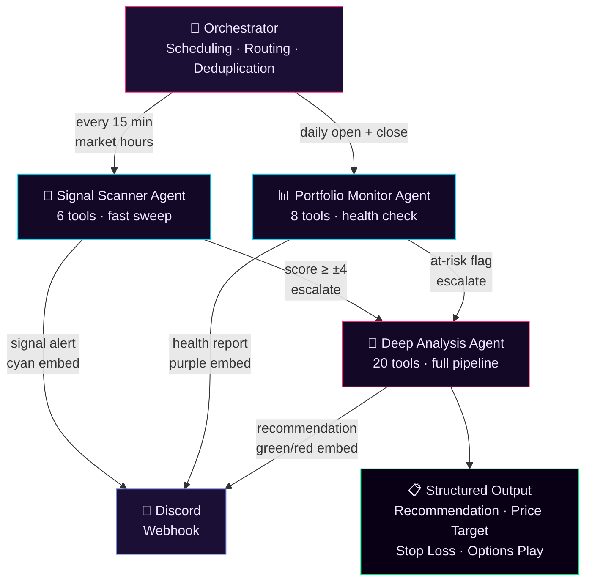
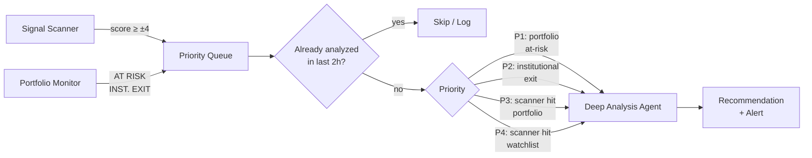
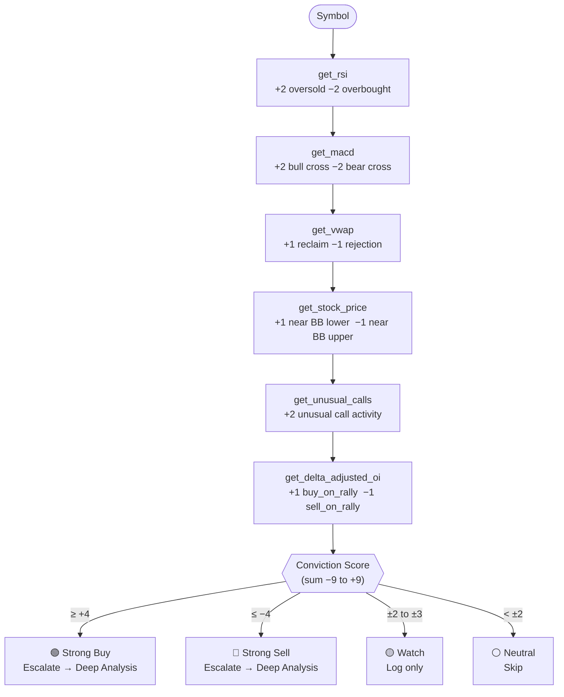
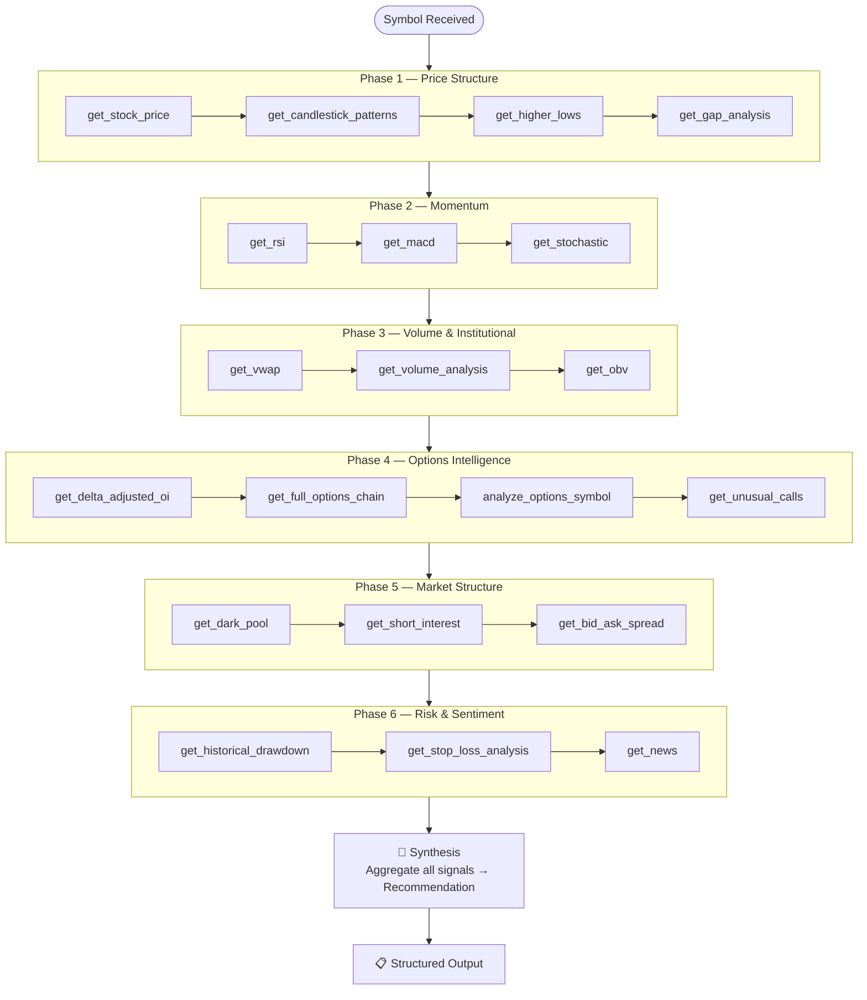
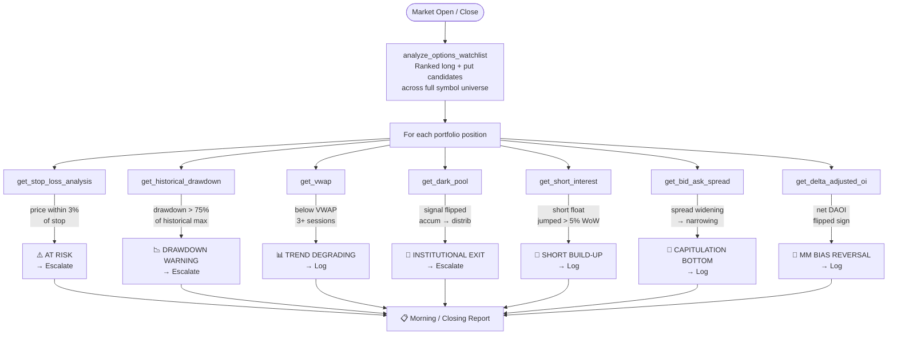
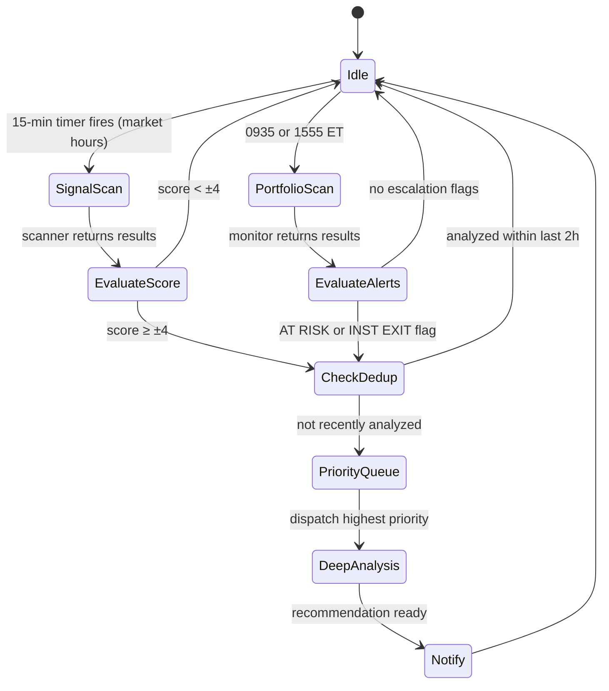

# Agentic Market Intelligence System
### Proposal & Implementation Plan

---

## Table of Contents

1. [Executive Summary](#executive-summary)
2. [Problem Statement](#problem-statement)
3. [Existing Notification Infrastructure](#existing-notification-infrastructure)
4. [Proposed Solution](#proposed-solution)
5. [System Architecture](#system-architecture)
6. [Agent Designs](#agent-designs)
   - [Signal Scanner Agent](#agent-1--signal-scanner)
   - [Deep Analysis Agent](#agent-2--deep-analysis)
   - [Portfolio Monitor Agent](#agent-3--portfolio-monitor)
   - [Orchestrator](#orchestrator)
7. [MCP Tool Inventory](#mcp-tool-inventory)
8. [Implementation Plan](#implementation-plan)
9. [Technical Stack](#technical-stack)
10. [Open Questions](#open-questions)

---

## Executive Summary

This proposal describes an **agentic market intelligence system** built on top of the existing Harvest Ladder platform. Three specialized AI agents — a Signal Scanner, a Deep Analysis engine, and a Portfolio Monitor — work in concert under an Orchestrator to automate the most time-intensive parts of active portfolio management: scanning for setups, performing deep single-symbol analysis, and monitoring portfolio health in real time.

The system is designed to operate on the existing MCP server infrastructure (three servers, 21 tools) and requires no third-party data subscriptions. It is modular by design — each agent can be developed, tested, and deployed independently. Critically, **it extends the existing Discord notification system** already in production rather than replacing it — agent alerts arrive in the same channel, in the same embed format, with the same color-coding conventions the team already relies on.

---

## Problem Statement

Active portfolio management against a universe of 20–40 symbols requires constant, repetitive work:

- **Signal generation** — manually checking RSI, MACD, VWAP, and options flow for every symbol, every session, to find tradeable setups before they pass
- **Deep analysis** — when a setup is found, assembling a complete picture from price structure, volume, options intelligence, dark pool prints, short interest, and news sentiment takes 30–60 minutes per symbol
- **Portfolio monitoring** — tracking stop levels, drawdown, institutional flow changes, and VWAP health across all open positions daily

These are not judgment tasks — they are data aggregation and pattern recognition tasks. They are exactly what an agent is suited for.

---

## Existing Notification Infrastructure

The platform already has a production Discord notification system in `notifier.py`. Understanding it fully is essential before designing agent alerts — we extend this system, not replace it.

### What Exists Today

The `Notifier` class sends five types of Discord alerts, all triggered by a single run of `main.py`:

| Alert Type | Trigger Condition | Discord Color |
|-----------|-------------------|:-------------:|
| Moving Average Violation | Price below 30/50/100/200-day MA | 🟡 Yellow `#FFFF00` |
| Loss Alert | Current price < purchase price | 🔴 Red `#FF0000` |
| Harvest Rung Hit | Price crosses a ladder rung target | 🟢 Green `#00FF00` |
| Options Alert (ITM / Expiry / Profit) | Options position trigger | 🟢🔴🟠🔵 varies |
| Sentiment Flip | FinBERT sentiment changes positive ↔ negative | 🟢🔴 varies |

### Discord Embed Format

All alerts use the same envelope — agents must follow this convention:

```python
{
  "content": "Alert Type: YYYY-MM-DD HH:MM:SS SYMBOL",
  "embeds": [{
    "title":       "Human-readable alert title",
    "description": "Multi-line detail with [Chart link](url)",
    "color":       0xRRGGBB   # integer, not hex string
  }]
}
```

### Deduplication — Current Approach and its Limitation

Deduplication today is **file-based**: `send_notifications()` checks `notification.log` for the embed title before sending, and appends the title if it fires. This works well for `main.py` which runs once per session. It breaks for agents running every 15 minutes:

- The same "NVDA Strong Buy" signal would fire once and then be **permanently suppressed** — the log is never rotated
- There is no concept of a time window — a signal suppressed at 10:00 AM will not re-fire at 2:00 PM even if conditions have changed

**Required change for agents:** Replace file-based dedup with **SQLite-backed, time-windowed dedup** — suppress the same `(symbol, alert_type)` pair for a configurable window (e.g., 2 hours for signals, 24 hours for daily reports), then allow it to fire again.

### Proposed Agent Alert Color Scheme

New alert types follow the existing color conventions (warm = bearish/risk, cool = bullish/informational):

| Agent | Alert Type | Color | Hex |
|-------|-----------|:------:|-----|
| Signal Scanner | Strong Buy signal | 🔵 Cyan | `0x00E5FF` |
| Signal Scanner | Strong Sell signal | 🟣 Magenta | `0xFF2D78` |
| Deep Analysis | BUY recommendation | 🟢 Green | `0x00E676` |
| Deep Analysis | SELL recommendation | 🔴 Red | `0xFF3366` |
| Deep Analysis | HOLD recommendation | 🔵 Blue | `0x00BFFF` |
| Portfolio Monitor | AT RISK | 🔴 Red | `0xFF3366` |
| Portfolio Monitor | Institutional Exit | 🟠 Orange | `0xFF9100` |
| Portfolio Monitor | Morning/Close Report | 🟣 Purple | `0xE040FB` |
| Orchestrator | Heartbeat / Error | ⚪ Grey | `0x808080` |

### Extension Strategy

The agents call a thin subclass of `Notifier` that adds agent-specific methods while reusing `send_notifications()` unchanged:

```python
class AgentNotifier(Notifier):
    def send_signal_alert(self, symbol, score, direction, triggers): ...
    def send_recommendation(self, symbol, recommendation, conviction, details): ...
    def send_portfolio_alert(self, alert_type, symbol, details): ...
    def send_morning_report(self, report): ...
```

The underlying `send_notifications()` and the webhook URL require zero changes.

---

## Proposed Solution

Replace manual scanning and monitoring with three coordinated AI agents that run on a schedule, escalate intelligently, and surface only what requires human attention.

```
Human attention is reserved for:
  → Final buy/sell decisions
  → Position sizing
  → Strategy adjustments

Everything else is automated.
```

---

## System Architecture

### High-Level Overview



### Scheduling Overview

```mermaid
gantt
    title Daily Agent Schedule (Market Hours ET)
    dateFormat HH:mm
    axisFormat %H:%M

    section Portfolio Monitor
    Morning Health Check     :pm1, 09:35, 15m

    section Signal Scanner
    Sweep 1  :ss1, 09:30, 15m
    Sweep 2  :ss2, 09:45, 15m
    Sweep 3  :ss3, 10:00, 15m
    Sweep N  :ss4, 10:15, 330m
    Final Sweep :ss5, 15:45, 15m

    section Portfolio Monitor
    Close Health Check       :pm2, 15:55, 10m

    section Deep Analysis
    On escalation (any time) :da1, 09:30, 390m
```



### Escalation & Data Flow



---

## Agent Designs

---

### Agent 1 — Signal Scanner

**Purpose:** Fast, lightweight sweep to detect tradeable setups across the full symbol universe.  
**Frequency:** Every 15 minutes, 9:30 AM – 4:00 PM ET  
**Symbols:** All portfolio positions + watchlist

#### Tool Sequence & Scoring



#### Sample Signal Output

```json
{
  "symbol": "NVDA",
  "score": 6,
  "direction": "buy",
  "triggers": [
    "RSI 28 — oversold",
    "MACD bullish crossover",
    "VWAP reclaimed",
    "Unusual call sweep $195 strike"
  ],
  "escalate": true,
  "timestamp": "2026-04-12T14:15:00Z"
}
```

#### Discord Alert — Strong Buy

```python
{
  "content": "Signal Alert: 2026-04-12 14:15:00 NVDA",
  "embeds": [{
    "title": "🟢 NVDA — Strong Buy Signal  (score +6 / 9)",
    "description": (
        "**Triggers:**\n"
        "• RSI 28 — oversold\n"
        "• MACD bullish crossover\n"
        "• VWAP reclaimed\n"
        "• Unusual call sweep $195 strike\n\n"
        "Escalating to Deep Analysis...\n\n"
        "[NVDA chart](https://finance.yahoo.com/chart/NVDA)"
    ),
    "color": 0x00E5FF   # cyan
  }]
}
```

#### Discord Alert — Strong Sell

```python
{
  "content": "Signal Alert: 2026-04-12 14:15:00 NVDA",
  "embeds": [{
    "title": "🔴 NVDA — Strong Sell Signal  (score −5 / 9)",
    "description": (
        "**Triggers:**\n"
        "• RSI 74 — overbought\n"
        "• MACD bearish crossover\n"
        "• VWAP rejected\n\n"
        "Escalating to Deep Analysis...\n\n"
        "[NVDA chart](https://finance.yahoo.com/chart/NVDA)"
    ),
    "color": 0xFF2D78   # magenta
  }]
}
```

> **Deduplication:** Signal alerts for the same `(symbol, direction)` pair are suppressed for **2 hours** via SQLite-backed time-windowed dedup. If the signal persists beyond the window it re-fires, keeping the team informed without flooding the channel.

---

### Agent 2 — Deep Analysis

**Purpose:** Comprehensive single-symbol conviction analysis producing an actionable recommendation.  
**Trigger:** Escalation from Signal Scanner or Portfolio Monitor, or manual user request.

#### Six-Phase Pipeline



#### Output Structure

```
RECOMMENDATION:    BUY / HOLD / SELL / AVOID
Conviction:        HIGH / MEDIUM / LOW

Entry zone:        $182.00 – $185.50
Price target:      $210.00  (R:R = 3.2:1)
Stop loss:         $173.00  (from get_stop_loss_analysis)

Bull case:
  → RSI oversold + MACD crossover
  → Dark pool accumulation (4 events, 5 days)
  → Max pain $190 — price has room to run

Bear case:
  → Below 50-day MA
  → Short float 18% — could pressure any rally
  → Negative news sentiment (FinBERT: 6/10 negative)

Options play:      Buy $190 call, 3 weeks out (score: 82/100)
MM bias:           buy_on_rally (net DAOI +2.8M shares)
Squeeze risk:      MEDIUM (short ratio 4.1)
Institutional:     ACCUMULATION (dark pool signal)
```

#### Discord Alert — BUY Recommendation

```python
{
  "content": "Deep Analysis: 2026-04-12 14:22:00 NVDA",
  "embeds": [{
    "title": "✅ NVDA — BUY  |  HIGH Conviction",
    "description": (
        "**Entry:** $182.00 – $185.50   "
        "**Target:** $210.00  (R:R 3.2:1)   "
        "**Stop:** $173.00\n\n"
        "**Bull case:**\n"
        "• RSI oversold + MACD bullish crossover\n"
        "• Dark pool accumulation (4 events, 5 days)\n"
        "• Max pain $190 — price has room to run\n\n"
        "**Bear case:**\n"
        "• Below 50-day MA\n"
        "• Short float 18% — could pressure any rally\n\n"
        "**Options play:** Buy $190 call 3w out  (score 82/100)\n"
        "**MM bias:** buy_on_rally (+2.8M DAOI shares)  "
        "**Squeeze:** MEDIUM  **Inst.:** ACCUMULATION\n\n"
        "[NVDA chart](https://finance.yahoo.com/chart/NVDA)"
    ),
    "color": 0x00E676   # green
  }]
}
```

#### Discord Alert — SELL Recommendation

```python
{
  "content": "Deep Analysis: 2026-04-12 14:22:00 NVDA",
  "embeds": [{
    "title": "🚨 NVDA — SELL  |  HIGH Conviction",
    "description": "...",
    "color": 0xFF3366   # red
  }]
}
```

> **Deduplication:** Deep Analysis recommendations are suppressed for the same `(symbol, direction)` for **4 hours**. A HOLD recommendation suppresses re-analysis for **24 hours** — if nothing has changed, there is nothing new to say.

---

### Agent 3 — Portfolio Monitor

**Purpose:** Daily portfolio health check, risk alerts, and broad opportunity scan.  
**Frequency:** Daily at 9:35 AM ET (open) and 3:55 PM ET (close)

#### Execution Flow



#### Discord Alerts — Portfolio Monitor

The monitor sends **individual embeds per position alert** (matching how the existing MA and options alerts work — one embed per event, not one giant message) plus a **single consolidated morning report embed**.

**AT RISK alert (individual — fires per position):**
```python
{
  "content": "Portfolio Alert: 2026-04-12 09:36:00 AAPL",
  "embeds": [{
    "title": "⚠️ AAPL — Position AT RISK",
    "description": (
        "Current Price: $171.20\n"
        "Stop Loss:     $167.50\n"
        "Gap to Stop:   2.1%\n\n"
        "Escalating to Deep Analysis.\n\n"
        "[AAPL chart](https://finance.yahoo.com/chart/AAPL)"
    ),
    "color": 0xFF3366   # red — consistent with existing loss alert
  }]
}
```

**Institutional Exit alert (individual):**
```python
{
  "content": "Portfolio Alert: 2026-04-12 09:36:00 NVDA",
  "embeds": [{
    "title": "🏦 NVDA — Institutional Exit Signal",
    "description": (
        "Dark pool signal flipped: ACCUMULATION → DISTRIBUTION\n"
        "4 high-volume absorption events detected (last 5 days)\n\n"
        "Escalating to Deep Analysis.\n\n"
        "[NVDA chart](https://finance.yahoo.com/chart/NVDA)"
    ),
    "color": 0xFF9100   # orange
  }]
}
```

**Morning Report (consolidated daily summary):**
```python
{
  "content": "Portfolio Health Report: 2026-04-12 09:35:00",
  "embeds": [{
    "title": "📊 Portfolio Health — Morning Report  2026-04-12",
    "description": (
        "**⚠️ AT RISK**\n"
        "AAPL $171.20 — stop $167.50 — gap 2.1%\n\n"
        "**📉 TREND DEGRADING**\n"
        "GOOG — below VWAP 4 consecutive sessions\n\n"
        "**🔥 SQUEEZE WATCH**\n"
        "MU — short float 22.4%, days-to-cover 6.2 (HIGH)\n\n"
        "**🔄 CAPITULATION SIGNAL**\n"
        "AMZN — bid/ask spread narrowing from elevated\n\n"
        "**📋 WATCHLIST OPPORTUNITIES**\n"
        "#1 MSFT score 91 — bullish setup, strong options flow\n"
        "#2 AMZN score 84 — confirmed by capitulation signal\n"
        "#3 TSM  score 77 — accumulation fingerprint\n\n"
        "**🎯 Escalated for Deep Analysis:** AAPL, NVDA"
    ),
    "color": 0xE040FB   # purple — distinct from all existing alert types
  }]
}
```

> **Deduplication:** The morning report is suppressed for **12 hours** (fires at open, suppressed until after the close report). Individual position alerts (AT RISK, INST. EXIT) suppress per `(symbol, alert_type)` for **2 hours** — if the condition persists past the window it re-fires, mirroring how the existing daily expiration alerts include the date in the title to allow once-per-day re-firing.

---

### Orchestrator

The Orchestrator is responsible for scheduling, routing, deduplication, and priority management. It does not call any MCP tools directly.

#### State Machine



#### Priority Levels

| Priority | Condition | Source |
|----------|-----------|--------|
| P1 | Portfolio position flagged AT RISK | Portfolio Monitor |
| P2 | Portfolio position — institutional exit | Portfolio Monitor |
| P3 | Scanner strong signal — portfolio position | Signal Scanner |
| P4 | Scanner strong signal — watchlist symbol | Signal Scanner |
| P5 | Manual user request | User |

---

## MCP Tool Inventory

All 21 tools are accounted for across the three agents.

| Tool | Server | Scanner | Monitor | Deep Analysis |
|------|--------|:-------:|:-------:|:-------------:|
| `get_rsi` | stock-price | ✓ | | ✓ |
| `get_macd` | stock-price | ✓ | | ✓ |
| `get_vwap` | stock-price | ✓ | ✓ | ✓ |
| `get_stock_price` | stock-price | ✓ | | ✓ |
| `get_unusual_calls` | stock-price | ✓ | | ✓ |
| `get_delta_adjusted_oi` | stock-price | ✓ | ✓ | ✓ |
| `get_stochastic` | stock-price | | | ✓ |
| `get_volume_analysis` | stock-price | | | ✓ |
| `get_obv` | stock-price | | | ✓ |
| `get_candlestick_patterns` | stock-price | | | ✓ |
| `get_higher_lows` | stock-price | | | ✓ |
| `get_gap_analysis` | stock-price | | | ✓ |
| `get_historical_drawdown` | stock-price | | ✓ | ✓ |
| `get_stop_loss_analysis` | stock-price | | ✓ | ✓ |
| `get_full_options_chain` | stock-price | | | ✓ |
| `get_news` | stock-price | | | ✓ |
| `get_dark_pool` | market-analysis | | ✓ | ✓ |
| `get_short_interest` | market-analysis | | ✓ | ✓ |
| `get_bid_ask_spread` | market-analysis | | ✓ | ✓ |
| `analyze_options_symbol` | options-analysis | | | ✓ |
| `analyze_options_watchlist` | options-analysis | | ✓ | |

---

## Implementation Plan

### Phase 1 — Foundation (Week 1–2)
> Goal: Orchestrator + scheduling infrastructure running, notification system extended, no agents yet.

- [ ] Define agent interface contract (input schema, output schema, error handling)
- [ ] Implement Orchestrator skeleton: scheduler, priority queue
- [ ] Wire Orchestrator to the three MCP servers (`mcp_health_check` passing for all three)
- [ ] **Subclass `Notifier`** as `AgentNotifier` — add `send_signal_alert`, `send_recommendation`, `send_portfolio_alert`, `send_morning_report` methods; keep `send_notifications()` unchanged
- [ ] **Migrate deduplication from file-based to SQLite-backed time-windowed dedup** — table: `(symbol, alert_type, fired_at)`, suppress window configurable per alert type (see table below)
- [ ] Define symbol universe loader (reads from `portfolio.csv` + `watchlist.yaml`)
- [ ] Validate `DISCORD_WEBHOOK_URL` is present at startup; fail fast with a clear error if missing

**Deduplication windows (initial defaults):**

| Alert Type | Suppress Window |
|-----------|----------------|
| Signal Scanner — buy/sell | 2 hours |
| Deep Analysis — BUY/SELL | 4 hours |
| Deep Analysis — HOLD | 24 hours |
| Portfolio Monitor — AT RISK | 2 hours |
| Portfolio Monitor — Institutional Exit | 2 hours |
| Portfolio Monitor — Morning/Close Report | 12 hours |

**Deliverable:** Orchestrator runs on schedule, calls `mcp_health_check`, posts heartbeat embed (grey, `0x808080`) to Discord. `AgentNotifier` unit-tested with all embed formats.

---

### Phase 2 — Signal Scanner Agent (Week 2–3)
> Goal: First agent live, producing scored signals every 15 minutes.

- [ ] Implement Signal Scanner agent with 6-tool sequence
- [ ] Implement conviction scoring logic (−9 to +9 scale)
- [ ] Define escalation threshold (default ±4, configurable)
- [ ] Connect to Orchestrator priority queue
- [ ] Test against historical data: verify scoring produces expected signals on known setups
- [ ] Log all signals to SQLite for backtesting signal quality

**Deliverable:** Signal Scanner running in paper mode — generating signals, logging to DB, sending cyan/magenta Discord embeds, but not yet triggering Deep Analysis.

---

### Phase 3 — Portfolio Monitor Agent (Week 3–4)
> Goal: Daily health reports running, AT RISK and INSTITUTIONAL EXIT alerts live.

- [ ] Implement Portfolio Monitor with 8-tool sequence
- [ ] Implement alert classification logic (AT RISK, DRAWDOWN, INST. EXIT, etc.)
- [ ] Build morning/closing report formatter
- [ ] Connect escalation flags to Orchestrator priority queue
- [ ] Test against current portfolio positions with live data

**Deliverable:** Daily morning/close reports posting as purple Discord embeds. Individual AT RISK and INST. EXIT alerts posting as red/orange embeds. Escalation to Deep Analysis stubbed (returns mock recommendation).

---

### Phase 4 — Deep Analysis Agent (Week 4–6)
> Goal: Full 20-tool pipeline running end-to-end, producing structured recommendations.

- [ ] Implement all six phases sequentially
- [ ] Build synthesis logic: aggregate signals → conviction score → recommendation
- [ ] Implement price target and stop loss computation
- [ ] Format output as structured recommendation (JSON + human-readable)
- [ ] Connect to Orchestrator as escalation target
- [ ] Run end-to-end test: Signal Scanner fires → Orchestrator routes → Deep Analysis completes

**Deliverable:** Full pipeline running. Green/red Discord recommendation embeds posting end-to-end. Human validates 10 recommendations against their own manual analysis to calibrate scoring.

---

### Phase 5 — Calibration & Hardening (Week 6–8)
> Goal: System is reliable enough to trust during live trading sessions.

- [ ] Back-test Signal Scanner conviction scores against known historical setups
- [ ] Tune escalation thresholds based on false-positive rate
- [ ] Add circuit breakers: pause scanning during pre/post market, halt on API errors
- [ ] Implement retry logic and MCP server health monitoring
- [ ] Add deduplication window tuning (currently 2h, may need adjustment)
- [ ] Rate-limit Deep Analysis to avoid running > N analyses per hour
- [ ] Instrument everything: log latency, tool call counts, escalation rates

**Deliverable:** System runs unattended for one full trading week without human intervention.

---

### Phase 6 — UI Integration (Week 8–10)
> Goal: Agent output surfaces in the existing Harvest Ladder dashboard.

- [ ] Add `/api/agents/signals` endpoint — returns latest scanner signals
- [ ] Add `/api/agents/recommendations` endpoint — returns Deep Analysis outputs
- [ ] Add `/api/agents/health` endpoint — returns monitor status + last report
- [ ] Build `SignalsPage` in React frontend (live scanner feed, conviction scores)
- [ ] Add recommendation panel to `SecurityDetailPage`
- [ ] Add portfolio health summary widget to `DashboardPage`

**Deliverable:** Full agent output visible in the existing dashboard without leaving the app.

---

## Technical Stack

| Component | Technology |
|-----------|-----------|
| Agent runtime | Claude Agent SDK (Python) |
| MCP servers | FastMCP (`stock-price-server`, `market-analysis-server`, `options-analysis-server`) |
| Scheduling | APScheduler (in-process) or a lightweight cron |
| Dedup / state cache | SQLite — dedicated `agents.sqlite` with time-windowed `(symbol, alert_type, fired_at)` table; replaces file-based `notification.log` for agent alerts |
| Signal log / history | SQLite |
| Notifications | `AgentNotifier` extends existing `notifier.py` — same webhook, same embed format, new alert types |
| API layer | Flask (existing `api/app.py`, new `/api/agents/` routes) |
| Frontend | React + MUI (existing dashboard, new pages/widgets) |
| Data source | yfinance (no paid subscription required) |

---

## Open Questions

1. **Single channel vs. multiple channels** — Currently all alerts (MA violations, harvest rungs, options, sentiment flips, and the new agent alerts) go to one Discord webhook. As agent volume increases (up to ~26 alerts per sweep across 40 symbols), the channel could become noisy. Do we want separate channels by alert type (e.g., `#signals`, `#recommendations`, `#portfolio-health`) with separate webhook URLs per channel? This is a Discord server configuration change and a one-line code change — low effort, worth deciding before Phase 2.

2. **Deduplication window tuning** — The proposed windows (2h signals, 4h recommendations, 12h reports) are initial defaults. What's the right balance between staying informed and not being flooded? This should be validated empirically during paper mode.

3. **Conviction threshold** — ±4 out of ±9 is the proposed escalation cutoff. This should be validated against a sample of historical setups before going live. What's the acceptable false-positive rate?

4. **Symbol universe** — Should the Signal Scanner cover the full watchlist (currently ~40 symbols) or only portfolio positions first? Covering 40 symbols every 15 minutes is ~240 MCP tool calls per sweep.

5. **Deep Analysis rate limiting** — If multiple symbols escalate simultaneously, how many parallel Deep Analysis runs do we allow? Each run is ~20 tool calls.

6. **Paper mode** — Should the system run in "paper mode" for the first N weeks, generating recommendations without alerting, to build a track record before we trust it?

7. **Options budget** — `analyze_options_symbol` and `analyze_options_watchlist` accept a `puts_budget` parameter (default $1,000). This should be configurable per user.

8. **Coexistence with `main.py`** — The existing `main.py` runs the current `Notifier` on demand (MA, harvest, options, sentiment). The agentic system runs continuously. If both run simultaneously, `notification.log` (used by `main.py`) and `agents.sqlite` (used by agents) are separate — no collision. But if `main.py` fires a "NVDA MA violation" and the agent fires a "NVDA AT RISK" for the same condition, the user gets two alerts. Should `main.py`'s MA violation check be retired once the Portfolio Monitor is live?

---

*Document prepared April 2026. Built on the Harvest Ladder platform.*
