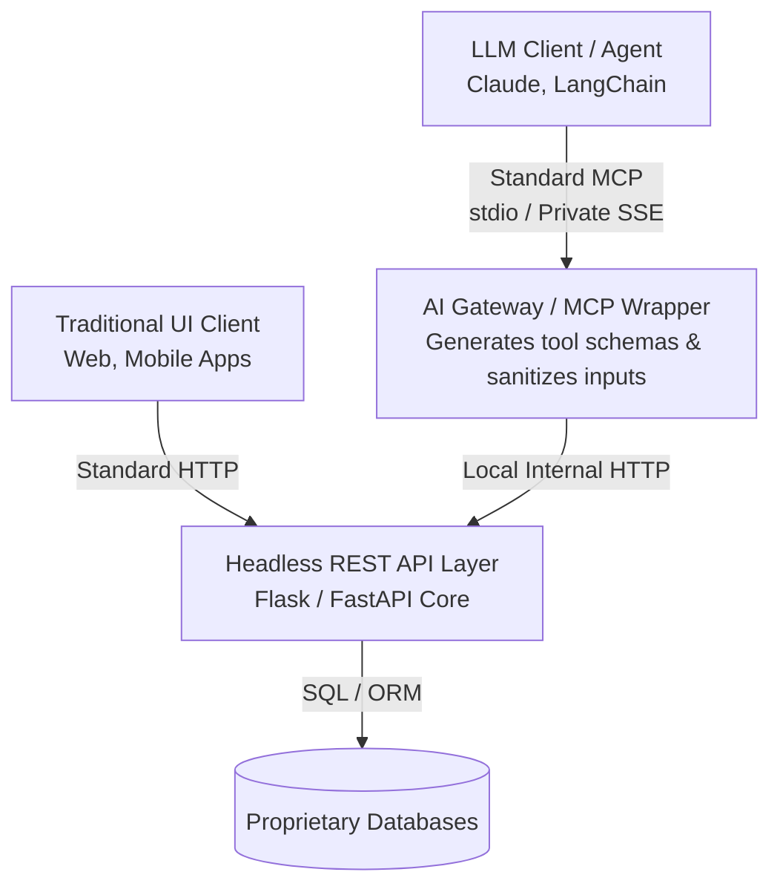
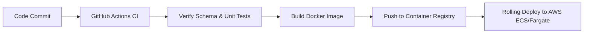

## RFC: Standardization of Backend Architecture for AI Model Context Protocol (MCP) Integration
Status: Draft / Request for Comments
Author(s): [John Funk / Google Gemini]
Date: June 2026
Target Reviewers: Backend Engineering, DevOps, Security Architecture, AI Infrastructure
------------------------------
## 1. Executive Summary
As our ecosystem expands to serve both traditional frontend user interfaces (web/mobile) and Large Language Model (LLM) agents, we must establish a scalable, secure pattern for data and tool access.
This RFC proposes the adoption of a "Headless API with an AI Gateway" architectural pattern. We will deprecate the creation of standalone, pure Model Context Protocol (MCP) servers containing native business logic. Instead, all core utilities and proprietary data access will be built as standard, stateless REST web services. We will layer a lightweight, decoupled MCP Server Wrapper on top of these REST endpoints to serve as our AI Gateway.
------------------------------
## 2. Problem Statement & Context
Our current trajectory risks creating an N × M integration nightmare and fragmented code bases:

   1. Dual Code Maintenance: Building standalone MCP servers forces engineers to duplicate database models, validation logic, and utility functions that already exist (or will exist) in our Flask/Node.js REST applications.
   2. Security & Hallucination Vulnerabilities: Exposing high-privilege MCP servers or database connections directly to LLM clients bypasses standard API gateway firewalls, leaving us vulnerable to Prompt/Argument Injection and "Confused Deputy" privilege elevation.
   3. Vendor & Protocol Lock-in: Tying core business logic directly to the emergent MCP standard limits our ability to pivot if alternative orchestration frameworks gain market dominance.

------------------------------
## 3. Proposed Architecture: Headless API with an AI Gateway
We will decouple the Execution Layer (Business Logic) from the Semantic Translation Layer (LLM Presentation).

## 3.1 Design Principles

* REST-First: All new proprietary workflows must be exposed via standard HTTP REST endpoints first.
* The MCP Server as a Semantic Wrapper: The MCP server should be a "thin" layer. Its only jobs are to expose tool schemas to the model via listTools() and translate the incoming JSON-RPC payloads into standard HTTP fetch/request actions against our headless APIs.
* Isolation of Transport: Pure MCP standard input/output (stdio) and private Server-Sent Events (SSE) will live exclusively behind our private network/VPC. Public clients will interact strictly with our verified backend API gateways.

------------------------------
## 4. Architectural Advantages## 4.1 Multi-Consumer System Support
By centralizing business logic inside a headless REST layer, the exact same endpoint can be consumed simultaneously by our React frontend application, standard background cron jobs, and external developer partners, while the MCP wrapper grants smooth access to AI clients.
## 4.2 Deterministic Security Boundaries
Rather than letting an LLM attempt to form raw queries against our databases, the LLM is restricted to the strict input schemas defined by the wrapper. The backend REST layer performs standard type-validation and permission checking, eliminating the risk of data corruption or unauthorized extraction via prompt injection.
## 4.3 Decoupled Lifecycles & Maintenance
Database migrations, dependency upgrades, and code changes can happen inside our REST apps without breaking the AI interface. If a schema changes, we simply update a few lines of data mapping in the lightweight wrapper rather than re-engineering the entire toolchain.
------------------------------
## 5. Technical Implementation Blueprint (Example)
Instead of rewriting logic, our backend teams will utilize high-level tools like FastMCP to map out wrappers quickly.
## 5.1 The Headless Service Core (Flask/REST)

# app/routes/financials.py
@app.route('/api/v1/proprietary-data', methods=['GET'])def get_proprietary_data():
    # Enforces strict corporate compliance, logging, and database connection limits
    user_id = request.args.get('user_id')
    return jsonify(fetch_secure_records(user_id))

## 5.2 The AI Gateway Wrapper (MCP Server)

# ai/mcp_gateway.pyfrom mcp.server.fastmcp import FastMCPimport requests
mcp = FastMCP("Corporate Data Gateway")

@mcp.tool()def query_proprietary_records(user_id: str) -> str:
    """
    Retrieves proprietary user record details from the data warehouse.
    Use this when answering questions regarding client status or system audits.
    """
    # Simply acts as an internal HTTP client proxying the request safely
    response = requests.get(f"http://internal-api/api/v1/proprietary-data?user_id={user_id}", timeout=5)
    return response.text
if __name__ == "__main__":
    mcp.run()

------------------------------
## 6. Industry References & Literature
Please review these technical publications on this pattern prior to the formal architecture review meeting:

   1. Tyk Technical Analysis: MCP Gateway Architecture Complete Technical Guide — Highlights the production failure modes of direct client-server MCP connections and the necessity of central control planes.
   2. Teleport Systems Architecture: What is MCP Wrapping? — Defines the standard pattern for semantic mapping over pre-existing corporate HTTP services.
   3. Gravitee AI Patterns: One Runtime for LLM, MCP, and A2A — Explains how to achieve unified auditing, billing, and token tracking by using an AI Gateway.
   4. Composio Developer Guides: A Developer's Guide to AI Agent Gateways — Evaluates stateful session management inside enterprise AI infrastructure.

------------------------------
## 7. Open Questions & Call for Feedback (RFC)
Please leave comments directly inline or respond via our slack channel regarding:

* Authentication Mapping: How should we pass user JWT context from the AI orchestrator down through the MCP Wrapper to the underlying REST service to maintain user-level audit trails?
* Rate Limiting: Should rate-limiting thresholds live entirely at our current REST API gateway layer, or do we need token-aware counters implemented inside the MCP Wrapper itself?
* Performance Overhead: What are the latency implications of introducing an extra HTTP hop between the MCP Server and the local REST API?

------------------------------
## 8. Continuous Integration / Continuous Deployment (CI/CD) Pipeline
To minimize operational overhead, the deployment lifecycle of the MCP Wrapper will be tightly coupled to our existing containerization and infrastructure-as-code (IaC) pipelines.

## 8.1 Automated Schema Verification (CI)
To prevent breaking changes between our headless REST endpoints and the AI interfaces, the CI pipeline will run automated validation scripts:

   1. Schema Sync Checks: Every pull request targeting a core REST API endpoint will run a static analysis script to verify that any modified query parameters or response blocks do not break the corresponding FastMCP or Python MCP tool inputs.
   2. Automated Unit Testing: The CI suite will spin up the MCP server via stdio transport mock instances to ensure listTools() successfully exports valid JSON schemas that adhere strictly to the Model Context Protocol standard.

## 8.2 Deployment Strategy (CD)

* Containerization: The MCP Server Wrapper will be packaged as a lightweight Docker container utilizing a minimal base image (e.g., python:3.11-slim).
* Runtime Environment: For internal orchestration layers (like Claude Desktop or internal LangChain agents), the container will run within our secure Private VPC on AWS ECS/Fargate or Kubernetes.
* Zero-Downtime Rolling Updates: We will utilize standard rolling deployment strategies. The AI Gateway container will verify successful local health checks before traffic routes shift, ensuring our AI agents experience zero downtime during updates.

------------------------------
## 9. Frequently Asked Questions (Developer FAQ)## Q: Does adding an extra network hop between the MCP Wrapper and the Flask REST API cause noticeable latency?
A: In production benchmarks, the local internal network hop (VPC or localhost) adds less than 3–5ms of latency. Compared to the 1,500ms+ time-to-first-token latency typically introduced by the LLM itself during a generation cycle, this internal network overhead is completely negligible.
## Q: How do we pass the user's specific identity and permissions down through the wrapper?
A: The orchestrator layer fetching the user request must extract the client's JWT and pass it inside the MCP metadata or custom JSON-RPC arguments. The MCP Wrapper then simply proxies this token inside the Authorization: Bearer <token> header when it calls the internal Flask API. This ensures our underlying REST app handles permission scopes identically for both human UIs and LLMs.
## Q: Should we build one massive MCP Wrapper for the entire company, or multiple smaller ones?
A: We will follow a domain-driven micro-wrapper approach. Instead of a single giant server, teams will build domain-specific wrappers (e.g., mcp-financials-bridge, mcp-user-auth-bridge). This keeps the tool context narrow for the LLM (preventing context window bloat) and allows different engineering squads to maintain their own code independent of each other.
## Q: If an endpoint is updated in Flask, do I have to rewrite the MCP tool text?
A: If you utilize native type-hinting and robust docstrings in your Python methods, modern toolkits like FastMCP automatically extract your docstrings and types to generate the JSON schemas on the fly. You will only need to modify code if the fundamental business inputs or outputs of your core REST API change.

