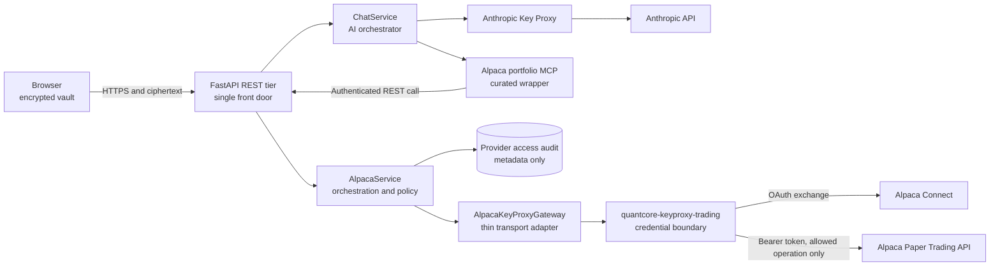
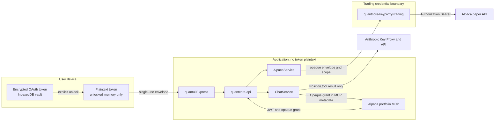
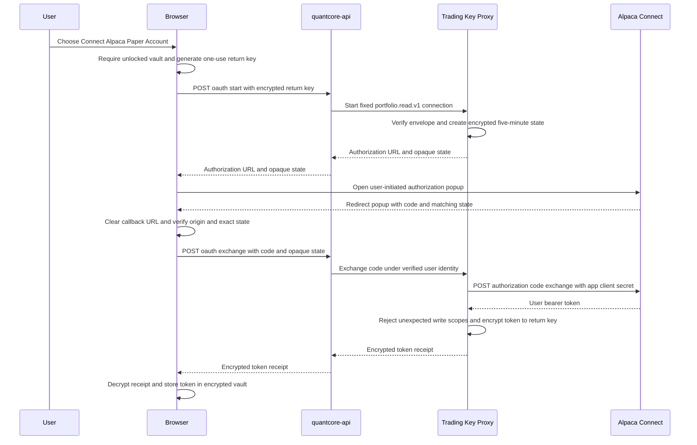
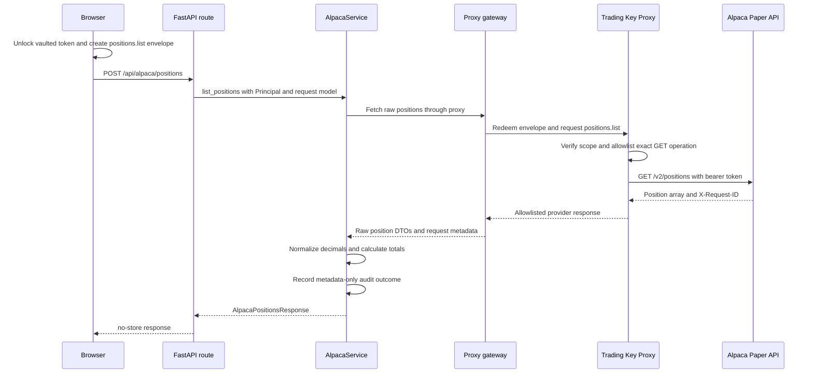
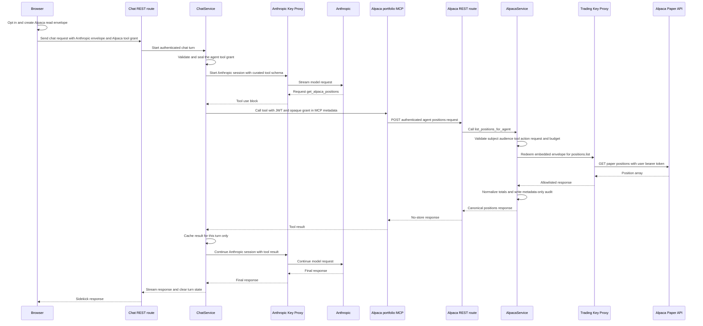
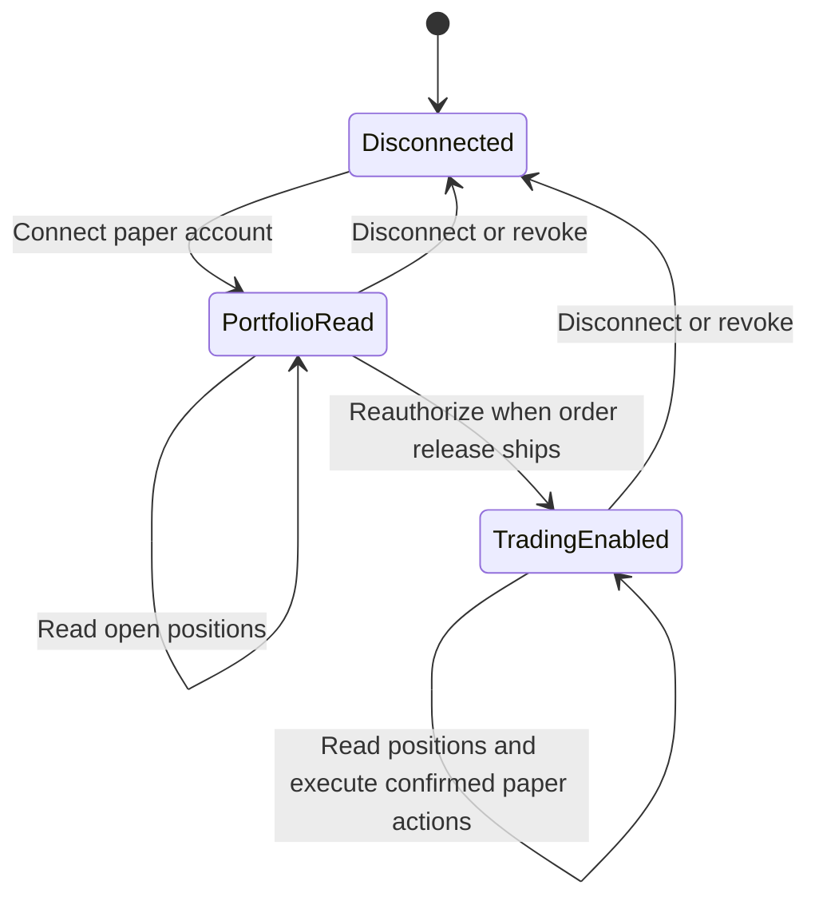

# Alpaca Connect — browser-vault OAuth + Trading Key Proxy plan

> **Status: PROPOSAL — awaiting team review.** No Alpaca integration code has been written.
> This document extends [`byok-key-proxy-plan.md`](byok-key-proxy-plan.md) for an Alpaca paper
> trading account and follows [`architectural-standard-v2.md`](architectural-standard-v2.md).
> The first delivery connects one paper account per user and displays its open positions. A
> second read-only milestone lets the authenticated Anthropic chat sidekick retrieve those same
> positions through a curated MCP wrapper after explicit per-message consent. Paper-order
> execution is designed into the security boundary but is a later release.
>
> **Revision 2026-07-19:** review pass applying lessons from the completed base BYOK rollout
> (PRs #105/#106 at `177e411`, live on test and prod since 2026-07-18): prerequisite gate
> updated to actual status, BYOK packet-8b runbook rules folded into packet A7, the JWT-mint
> audience gap closed, SPKI pin baking aligned with digest-copy promotion, `sub_hash`
> construction specified, execution protocol and checkpoint log added, and the reentrant
> sidekick topology flagged as an explicit team-review question.
>
> **Revision 2026-07-19 (b):** incorporated concepts from the draft OKAP (Open Key Access
> Protocol) specification after review — grant profiles become structured, versioned
> authorization documents (RFC 9396 style), grant responses echo the effective granted profile
> for verbatim rendering, and the metadata-only audit trail gains a user-visible connection
> activity view. See "Prior art: OKAP". The OKAP reference library itself is deliberately not
> used.

## Executive summary

QuantCore will let each authenticated user connect an existing Alpaca **paper trading account**
through Alpaca Connect OAuth. The resulting user access token will not be stored by QuantCore,
quantui, or a database. It will be encrypted back to the browser, stored in the existing
passphrase-protected IndexedDB vault, and freshly enveloped to a dedicated Trading Key Proxy for
each user action.

The first capability is a functional `/portfolio` page showing the user's current Alpaca open
positions. The next milestone exposes that canonical service capability to the built-in
Anthropic sidekick through the architecture required by Architectural Standard v2:
`AI orchestrator -> curated MCP wrapper -> FastAPI REST -> AlpacaService`. The tool is present only
when the user opts in for that message, and only the normalized result enters the Anthropic
conversation. Alpaca credentials and capabilities never enter model-visible content or the
Anthropic Key Proxy.

Neither milestone places, replaces, or cancels orders. They use Alpaca's default read grant
because no mutation exists yet. When order functionality is ready, the user will explicitly
reauthorize the same paper account with Alpaca's `trading` scope and the browser will atomically
replace the vaulted token. The account is therefore a **paper trading account connected with
portfolio-read permission for these milestones**, not a permanently read-only account.

Plaintext credential visibility is limited to two locations:

- the user's browser while the vault is unlocked; and
- `quantcore-keyproxy-trading`, briefly, while exchanging an OAuth code or making an in-scope
  Alpaca call.

`quantui Express` and `quantcore-api` see OAuth codes, opaque state, and ciphertext, but never the
Alpaca client secret or user access token. Position data necessarily returns through the REST tier
to the user, but is neither persisted nor logged.

## Source documentation and an important authentication distinction

This design uses the following Alpaca documentation:

- [Using OAuth2 and Trading API](https://docs.alpaca.markets/us/docs/using-oauth2-and-trading-api)
- [All Open Positions](https://docs.alpaca.markets/us/reference/getallopenpositions)
- [Create an Order](https://docs.alpaca.markets/us/reference/postorder)
- [Get All Orders](https://docs.alpaca.markets/us/reference/getallorders-1)
- [Delete Order by ID](https://docs.alpaca.markets/us/reference/deleteorderbyorderid-1)
- [Replace Order by ID](https://docs.alpaca.markets/us/reference/patchorderbyorderid-1)
- [Alpaca authentication](https://docs.alpaca.markets/us/v1.4.2/docs/authentication)

The initially supplied [Issue tokens](https://docs.alpaca.markets/us/reference/issuetokens)
endpoint, `https://authx.alpaca.markets/v1/oauth2/token`, is the Broker API client-credentials
flow. Alpaca explicitly documents that client credentials are not available for Trading API.
It is not the flow for a user connecting an existing Alpaca Trading account, and it does not pair
with `GET /v2/positions`.

This plan instead uses Alpaca Connect's authorization-code flow:

```text
Authorize: https://app.alpaca.markets/oauth/authorize
Exchange:  https://api.alpaca.markets/oauth/token
Positions: https://paper-api.alpaca.markets/v2/positions
```

## Goals and non-goals

### Goals for this delivery

- Connect one Alpaca paper account per authenticated QuantCore user.
- Use the Alpaca-hosted consent screen rather than asking users to paste Trading API keys.
- Keep the Alpaca application client secret inside the Trading Key Proxy only.
- Return the user access token to the browser without exposing it to quantui or quantcore-api.
- Store the user token only in the existing encrypted browser vault.
- Retrieve and display all open positions with accurate decimal precision.
- Let the built-in Anthropic chat sidekick retrieve the same normalized positions and totals
  through a curated, read-only MCP tool after explicit per-message consent.
- Preserve the required `AI Agent -> MCP wrapper -> REST -> Service` topology and authenticated
  identity passthrough from Architectural Standard v2.
- Make OAuth connection, token use, and positions access attributable through metadata-only audit
  events.
- Keep the proxy operation taxonomy fail-closed so no order call is reachable in v1.
- Establish interfaces and security invariants that can later support broad paper-order execution
  and predefined multi-order workflows.

### Non-goals for this delivery

- Live-account access.
- Placing, replacing, cancelling, or listing orders.
- Requesting Alpaca's `trading`, `account:write`, or `data` OAuth scopes.
- Multiple Alpaca accounts per QuantCore user.
- Persisting or periodically refreshing Alpaca data on the server.
- WebSocket trade updates.
- External or general-purpose Alpaca MCP access.
- MCP access to Alpaca orders or any other mutation.
- A generic Alpaca HTTP proxy.

## Decisions already made

1. **Alpaca Connect authorization code, not raw Trading API keys.** Users authorize on Alpaca's
   site. QuantCore owns one OAuth client per deployment, while each user owns a distinct grant.
2. **Paper only.** Authorization sends `env=paper`; the proxy hardcodes the paper Trading API host.
3. **One connection per user.** A successful reconnect replaces the existing encrypted vault
   record. It creates no server-side connection row.
4. **Positions only in v1.** The only provider operation is `positions.list`.
5. **Least-privilege scope progression.** V1 relies on Alpaca's documented default read access.
   The first order release triggers a new consent for exactly `trading` and replaces the token.
6. **Dedicated trading deployment.** `quantcore-keyproxy-trading` is isolated from the LLM proxy
   with its own keys, identity, secrets, pins, limits, and egress policy.
7. **Encrypted return channel.** The OAuth access token is encrypted to a one-use key that exists
   only in browser memory and opaque proxy state. Intermediaries never receive token plaintext.
8. **No server-side credential persistence.** Tokens, token ciphertext, OAuth state, and account
   connection records never enter PostgreSQL, Redis, object storage, logs, or queues.
9. **Metadata-only audit is persisted.** The services layer records who performed which provider
   operation and its outcome, but never credentials, position contents, or OAuth payloads.
10. **No inactive write routes.** Order endpoints are not stubbed or hidden behind flags. They do
    not exist until their confirmation, idempotency, audit, and durable-replay controls exist.
11. **Sidekick-only MCP position reads.** The built-in Anthropic sidekick may receive one curated
    `get_alpaca_positions` tool only when an unlocked user explicitly opts in for that message.
    The wrapper calls the canonical REST endpoint and never calls a service, database, provider,
    or key proxy directly.
12. **Credentials are out-of-band.** The model-visible tool has no credential arguments. A
    server-sealed, audience-bound `AgentToolGrant` and the user's JWT travel in MCP request
    metadata. Anthropic receives neither value; it receives the normalized position result only
    after the tool succeeds.
13. **Agent access stays read-only.** Paper trading through MCP remains prohibited until a later
    design adds explicit human confirmation, idempotency, service-owned risk and entitlement
    checks, durable audit, and a distinct mutation grant.

### Prior art: OKAP (Open Key Access Protocol)

The team reviewed the draft OKAP specification
([github.com/openkeyprotocol/okap](https://github.com/openkeyprotocol/okap)), which addresses
the neighboring problem of delegating AI-provider API keys to applications through a vault that
proxies provider calls. Its reference implementation is not used — it is a single-maintainer
project, and its `okap_` tokens are unbound bearer strings with no signing, replay protection,
client authentication, or audit schema. Three of its ideas do improve this design and are
folded in:

1. **Structured authorization documents instead of scope strings** (OKAP's core idea, borrowed
   from OAuth 2.0 Rich Authorization Requests, RFC 9396). Grant profiles such as
   `portfolio.read.v1` are now defined as typed, versioned JSON documents with explicit
   standing limits, not just named constants — see "Grant profiles as structured documents".
2. **Echo the granted authorization; render granted, not requested.** OKAP grant responses
   carry the effective (possibly narrowed) authorization back to the requesting app. Adopted:
   the exchange response and the vault record carry the effective profile document, and the UI
   renders that document verbatim on the connection card and consent disclosure.
3. **User-visible usage audit.** OKAP vaults show the key owner a per-app usage trail.
   Adopted: a principal-scoped, metadata-only connection activity view — see "Metadata-only
   audit".

Deliberately not adopted: OKAP's custody model, in which the vault holds master keys at rest
and proxies every provider call — this plan's browser-vault custody with single-use envelopes
is strictly stronger for our threat model — and OKAP's unauthenticated bearer tokens; the
AAD-bound, single-use, replay-protected envelope and grant constructions in this document are
unchanged.

## High-level architecture



The browser never calls Alpaca APIs, either key proxy, or MCP directly. The direct portfolio path
is `Browser -> REST -> AlpacaService`. The sidekick path intentionally re-enters the canonical
front door as `ChatService -> MCP -> REST -> AlpacaService`: the first REST request hosts the AI
orchestrator, while the second is an independently authenticated tool request. This preserves
Rule 6 instead of giving the in-process chat loop a privileged service bypass.

### Considered alternative: in-process dispatch (flagged for team review)

Every existing sidekick tool (`get_stock_price`, `get_rsi`, `price_vertical_spread`, …) is
dispatched **in-process**: `ChatService` holds constructor-injected services and calls them
directly (see the handler table in `quantcore/services/chat.py`), which is the standard's
blessed composition pattern (P1 plus the composition root). Rule 6's stated motivation is
external AI agents reaching business logic while bypassing REST enforcement; whether it also
governs the in-process sidekick — whose originating request already passed the REST front door
and `require_principal` — is a genuine interpretation question this proposal should not settle
silently.

The alternative is `ChatService -> AlpacaService.list_positions_for_agent(...)` with the grant
validation, rate policy, audit, and consent semantics unchanged inside the service, and the
curated MCP wrapper still built — but only for *external* AI clients (the `.mcp.json` pattern),
not the sidekick. That removes one Cloud Run service from the sidekick's critical path, the
self-call deadlock hazard, the nested reentrant timeout budget, and one network round trip. The
cost is that the sidekick and a future external agent would exercise different transport paths
to the same capability, and the sidekick would set a precedent of skipping the wrapper.

The reentrant design above remains this proposal's default because it yields one audited
enforcement chokepoint and makes the sidekick indistinguishable from an external agent. The
team should settle this deliberately in packet A0, before A9b is built — see the first
team-review question.

### Security boundaries



Compromising quantcore-api can expose position responses passing through it and can drive calls
within a currently live, user-sealed scope. It cannot decrypt a captured token envelope, mint a
different user's identity, widen the operation to an order, or substitute an unpinned proxy key.
Compromising the Trading Key Proxy can expose credentials active in its memory; preventing that is
not possible without a trusted execution environment because the proxy must authenticate to
Alpaca. Isolation, small code size, egress restriction, and short lifetimes contain that risk.
Compromising the MCP wrapper exposes at most one already-authorized position result: the wrapper
cannot decrypt the `AgentToolGrant`, widen its action, change its subject, or reach Alpaca without
passing the REST tier's validation again.

## Architectural Standard v2 adherence

The capability follows the required dependency direction:

```text
Direct UI: React -> FastAPI REST -> AlpacaService -> provider gateway -> Alpaca
Agent read: ChatService -> MCP transport gateway -> curated MCP wrapper
                -> FastAPI REST -> AlpacaService -> provider gateway -> Alpaca
```

| Component | Standard layer and responsibility |
|---|---|
| `/portfolio` React page | §5.7 front end: presentation and UI state only; calls REST exclusively |
| Chat composer consent control | §5.7 front end: per-message presentation and UI state; creates a user-sealed envelope but never calls MCP or a provider |
| `ChatService` | §5.1 AI orchestrator: dynamically curates tools, issues the tool grant through an injected grant service, caches a result for one turn, and never bypasses MCP for agent execution |
| `api/routers/alpaca.py` | §5.4 route: Pydantic validation, principal, HTTP status/headers, exactly one service call |
| `api/schemas/alpaca.py` | §5.4/§9: canonical request and response contracts shared by OpenAPI, WebUI, and MCP |
| `AgentToolGrantService` | §5.1/Rule 5: centralized issuance and validation of encrypted, audience-bound, per-message capabilities |
| `quantcore/services/alpaca.py` | §5.1 mandatory center: grant validation, profile selection, authorization, rate policy, orchestration, normalization, totals, cache policy, and audit events |
| `McpToolGateway` | §5.3 gateway: FastMCP client transport, IAM, timeout, cancellation, and transport-error translation only |
| Alpaca portfolio MCP wrapper | §5.5/Rule 6: hand-curated, one-call-deep semantic wrapper that forwards JWT and opaque grant to REST |
| `quantcore/gateways/alpaca_keyproxy_gateway.py` | §5.3 gateway: proxy I/O, auth forwarding, timeouts, retries, transport error translation only |
| provider-access audit repository | §5.1/Rule 5: metadata persistence invoked only by the service |
| `quantcore-keyproxy-trading` | Provider-side credential boundary described below; not a second business-services layer |

### Standard compliance matrix

| Standard requirement | Enforced design consequence |
|---|---|
| P1 and Rule 1: business logic belongs in services | Tool curation, authorization, grant policy, normalization, totals, caching, and audit are service-owned; route and wrapper bodies remain one call deep |
| P2: REST is the single remote front door | Both the WebUI and MCP wrapper invoke authenticated FastAPI endpoints; no remote client calls a service or provider directly |
| P3 and Rule 6: MCP is a thin wrapper over REST | `get_alpaca_positions` only translates one tool call to `POST /api/alpaca/agent/positions` and returns its canonical response |
| P4 and Rule 7: capabilities are born as services | The existing `AlpacaService` position capability remains canonical and is exposed to MCP only after REST exists |
| Rule 2: adapters cannot access gateways or persistence | Architecture guards forbid the wrapper and route from importing services' collaborators, stores, DB modules, provider SDKs, or proxies |
| Rule 3: gateways stay thin | MCP and key-proxy gateways own transport only and cannot select scope, grant, environment, risk, totals, or audit behavior |
| Rule 5: cross-cutting policy is centralized | Grant policy, rate limiting, ephemeral cache policy, and metadata-only audit live in services |
| §8 identity passthrough | Chat orchestration passes the user's JWT in hidden MCP metadata; the wrapper forwards it as the REST `Authorization` value |
| §8 prompt-injection containment | The tool accepts no model-controlled arguments; REST still authenticates, validates the grant, rate-limits, and authorizes the exact action |
| §8 transport isolation | The MCP service has internal ingress and a least-privilege runtime identity; only the REST front door is public |
| §8 write gating | The curated tool is read-only; any later mutation requires confirmation, idempotency, audit, risk, and entitlement enforcement in services |

### Enforceable consequences

- The capability is born as `AlpacaService`, then exposed by REST, then consumed by the WebUI.
- MCP exposure is an explicit per-capability curation decision, not automatic OpenAPI mirroring.
- Routes do not import repositories, gateways, Alpaca libraries, `httpx`, or database modules.
- Each route calls one service method and returns a Pydantic response model.
- `AlpacaService` owns profile selection, validation, position normalization, aggregate
  calculations, authorization, rate policy, cache policy, and audit behavior.
- The API-side gateway owns external I/O only. It cannot choose OAuth scopes, environments,
  allowed actions, or position calculations.
- The MCP wrapper owns no validation beyond strict metadata presence and response translation. It
  never imports a service, store, database module, provider SDK, or proxy gateway.
- `ChatService` reaches Alpaca business logic only through the MCP wrapper and canonical REST
  endpoint. Direct UI reads still use the normal `REST -> Service` path.
- The frontend cannot calculate trading limits, construct provider requests, or choose OAuth
  scopes. It displays a service-selected authorization URL and formats service-returned values.
- Async routes, service methods, and gateways are used for I/O-bound work.
- No CLI or cron entry point is added because browser-vault access requires an interactive user.
- The MCP wrapper calls REST only. It cannot call a service, database, gateway, key proxy, or
  Alpaca directly.
- `docs/openapi-surface.txt` is updated and reviewed with every REST contract change.

### Controlled proxy exception

The Trading Key Proxy independently checks cryptographic scope even though canonical policy lives
in the services layer. This is a security-boundary control, not duplicated business logic. It must
remain effective when quantcore-api is assumed compromised.

The proxy may only:

- verify Google IAM and the per-user JWT;
- verify envelope AAD, subject, provider, time, nonce, and `scope_hash`;
- enforce the already sealed environment, operation, parameters, and budget;
- classify an exact provider operation against a fail-closed allowlist;
- attach a credential to a hardcoded provider request;
- return an allowlisted provider response; and
- discard credential material.

It may not select product behavior, calculate portfolio totals, implement UI decisions, plan
orders, perform risk analysis, or own business audit policy. Session plaintext is controlled
security state and never leaves process memory, matching the exception already accepted in the
base BYOK plan.

## OAuth connection and encrypted token return

### Why a reverse channel is needed

The original BYOK envelope flows from browser to proxy. OAuth adds the opposite problem: Alpaca
returns the access token to the proxy that holds the application client secret, but the browser is
the sole persistent store. Returning token plaintext through quantcore-api would collapse the
credential boundary.

The solution is a one-use symmetric return key generated by the browser. The browser encrypts it
to the pinned Trading Key Proxy, the proxy seals it into opaque OAuth state, and only the browser
and proxy can use it to wrap or unwrap the returned token.

### Connection sequence



### OAuth start contract

The public route is fixed-purpose:

```text
POST /api/alpaca/oauth/start
```

Input:

```json
{
  "return_key_envelope": { "v": 1, "alg": "...", "kid": "...", "aad": {}, "ct": "..." },
  "scope": {
    "v": 1,
    "provider": "alpaca",
    "action": "oauth.connect",
    "params": {},
    "budget": { "max_calls": 1, "max_mutations": 0, "ttl": 300 }
  }
}
```

The browser does not submit `env`, Alpaca scopes, client ID, or redirect URI. `AlpacaService`
selects the fixed `portfolio.read.v1` profile. The proxy constructs the URL using configured,
allowlisted values.

Output:

```json
{
  "authorization_url": "https://app.alpaca.markets/oauth/authorize?...",
  "state": "<opaque>",
  "expires_at": "2026-07-17T18:05:00Z"
}
```

The URL includes `response_type=code`, the deployment's client ID and exact redirect URI, and
`env=paper`. It omits `trading`, `account:write`, and `data` in v1.

### Grant profiles as structured documents

Following the rich-authorization-request pattern of RFC 9396 (adopted via the OKAP review — see
"Prior art: OKAP"), each grant profile is a server-defined, versioned JSON document rather than
a bare name. `portfolio.read.v1` is:

```json
{
  "type": "brokerage_account_access",
  "profile": "portfolio.read.v1",
  "v": 1,
  "provider": "alpaca",
  "environment": "paper",
  "operations": ["positions.list"],
  "consumers": ["portfolio_ui", "anthropic_chat"],
  "limits": {
    "requests_per_minute": 4,
    "requests_per_day": 2000,
    "mutations": 0
  },
  "oauth_scopes": []
}
```

(The `limits` values above are the reviewable defaults; packet A3 fixes the final numbers, which
must stay above the 60-second UI refresh cadence.) Profile documents are defined only in
`AlpacaService`; the Trading Key Proxy keeps its own fail-closed operation allowlist as the
independent boundary check and never derives behavior from a client-supplied document. The
standing `limits` block is the service-owned rate policy already required in this plan, now
declared in one reviewable place — per-envelope budgets (`max_calls`, `max_mutations`, `ttl`)
remain separate and strictly tighter. The future `paper-trading.v1` profile extends the same
shape with structured order ceilings (maximum order notional, mutations per day, allowed order
types) instead of inventing ad hoc constants at mutation time.

The exchange response and the browser vault record both carry the effective profile document,
and the UI renders the granted document — never a client-side assumption of what was requested —
on the connection card and in the consent disclosure.

### OAuth state

State is an authenticated encrypted value under `ALPACA_OAUTH_STATE_KEYS`, a rotatable AES-256
key bundle held only by the Trading Key Proxy. Its wire form is three unpadded b64url segments:

```text
b64url(canonical header).b64url(12-byte IV).b64url(ciphertext and GCM tag)
```

The authenticated header is `{"v":1,"alg":"A256GCM","kid":"alpaca-state-2026-07-a"}` and is
also the AES-GCM AAD. This lets the proxy select a rotation key before decryption without trusting
an unauthenticated `kid`; unknown algorithms, versions, and key IDs fail closed. The encrypted
plaintext contains:

```json
{
  "v": 1,
  "nonce": "<128-bit random>",
  "sub_hash": "<keyed hash of verified JWT sub>",
  "environment": "paper",
  "grant_profile": "portfolio.read.v1",
  "redirect_uri_hash": "<SHA-256>",
  "return_key": "<b64url 32 bytes>",
  "iat": 1784311200,
  "exp": 1784311500
}
```

The opaque state is safe to traverse Alpaca and the callback URL. The browser retains the exact
opaque value in memory and requires byte-for-byte equality on return. The proxy separately checks
authentication, expiry, subject binding, environment, grant profile, and redirect URI.

`sub_hash` is `b64url(HMAC-SHA256(k_sub, sub))`, where `k_sub` is a dedicated subject-hash key
carried alongside the encryption key in the same rotatable bundle (`ALPACA_OAUTH_STATE_KEYS`
here; `AGENT_TOOL_GRANT_KEYS` for agent grants). It is never a bare or truncated SHA-256 of the
subject, and its exact construction is pinned by packet A1's shared Python/TypeScript vectors.

Alpaca's published Connect flow does not document PKCE, so this plan does not invent a PKCE
contract. CSRF and account-mix-up protection instead come from unpredictable encrypted state,
exact browser state matching, subject and callback binding, short expiry, and Alpaca's single-use
authorization code.

### Popup callback hardening

- Callback URI: `https://<quantui-origin>/oauth/alpaca/callback`.
- The user click opens the popup synchronously so normal popup blocking rules permit it.
- The callback accepts only `code`, `state`, and documented OAuth error fields.
- It immediately calls `history.replaceState` to remove query parameters.
- It uses `window.opener.postMessage` with the exact quantui origin, never `*`.
- The opener checks `event.origin`, `event.source`, exact state, and that one connection is pending.
- `Referrer-Policy: no-referrer` prevents callback query leakage.
- `Cross-Origin-Opener-Policy: same-origin-allow-popups` preserves the intentional opener while
  retaining cross-origin isolation from unrelated windows.
- A missing opener, blocked popup, denial, close, or five-minute timeout ends the flow without
  changing the vault.
- No full-page redirect fallback exists in v1 because it would require persisting the one-use
  return key outside memory.

### Token receipt

The proxy accepts only a bearer-token response. If Alpaca returns a `scope` field, the proxy fails
closed if it includes `trading`, `account:write`, or `data` during `portfolio.read.v1`.

It returns:

```json
{
  "v": 1,
  "alg": "A256GCM",
  "iv": "<b64url 12 bytes>",
  "ct": "<b64url ciphertext and tag>",
  "aad": {
    "provider": "alpaca",
    "environment": "paper",
    "grant_profile": "portfolio.read.v1",
    "state_hash": "<b64url SHA-256>",
    "iat": 1784311200
  }
}
```

The ciphertext contains only the token type and access token. The browser verifies the AAD,
decrypts with the in-memory return key, and writes a provider record to the existing vault. No
last-four token hint is displayed or stored. Safe cleartext metadata may include provider,
environment, grant profile, connection label, and connected timestamp. The exchange response
also returns the effective grant profile document (see "Grant profiles as structured
documents") beside the receipt; the browser stores it as vault metadata and the UI renders it
verbatim, so what the user sees is always what was actually granted.

If Alpaca later expires or revokes the token, v1 requires reconnect. No refresh-token behavior is
invented because Alpaca's Trading API Connect documentation does not publish one for this flow.

## Positions request and data contract

### User-action scope

Every refresh mints a new envelope containing the vaulted token:

```json
{
  "v": 1,
  "provider": "alpaca",
  "action": "positions.list",
  "params": { "environment": "paper" },
  "budget": { "max_calls": 1, "max_mutations": 0, "ttl": 30 }
}
```

The envelope AAD binds the authenticated `sub`, provider, issue time, unique `jti`, and canonical
scope hash. The proxy redeems it once, holds the bearer token only for this one call, and tears the
session down whether the call succeeds or fails.

### Positions sequence



### Public REST surface

All routes require `require_principal` and use the existing per-user ES256 identity before real
cloud credentials are permitted.

| Route | Purpose |
|---|---|
| `GET /api/alpaca/key-info` | Relay trading-proxy public keys plus authenticated subject for envelope AAD |
| `POST /api/alpaca/oauth/start` | Start the fixed paper `portfolio.read.v1` consent flow |
| `POST /api/alpaca/oauth/exchange` | Exchange code and opaque state for an encrypted token receipt |
| `POST /api/alpaca/positions` | Fetch current paper positions using a single-use token envelope |
| `POST /api/alpaca/agent/positions` | Redeem an audience-bound sidekick grant through the canonical positions service |
| `GET /api/alpaca/activity` | Return the authenticated principal's own recent metadata-only provider access events |

Sensitive material uses POST bodies, never query parameters. There is no arbitrary URL, HTTP
method, header, environment, or provider path in any public request model.

### Normalized Pydantic response

Alpaca represents financial values as decimal strings. The service parses with `Decimal`, rejects
malformed values, and returns normalized decimal strings so `QuantCoreJSONResponse` cannot coerce
them through binary floating point.

Each position contains:

```text
asset_id
symbol
exchange
asset_class
side
qty
qty_available
avg_entry_price
current_price
market_value
cost_basis
unrealized_pl
unrealized_plpc
unrealized_intraday_pl
unrealized_intraday_plpc
change_today
```

All market-derived fields are nullable. This covers Alpaca assets whose price data is temporarily
unavailable. Unknown additional provider fields are ignored and never become accidental API
surface.

Response shape:

```json
{
  "environment": "paper",
  "as_of": "2026-07-17T18:00:00Z",
  "positions": [],
  "totals": {
    "market_value": "0",
    "cost_basis": "0",
    "unrealized_pl": "0",
    "unrealized_plpc": "0",
    "unrealized_intraday_pl": "0"
  }
}
```

Totals are service-owned business logic:

- dollar totals are sums of non-null position values;
- aggregate unrealized percentage is `total_unrealized_pl / abs(total_cost_basis)` when cost
  basis is nonzero, otherwise `null`;
- position percentages are never added together; and
- short and fractional positions retain their signed and fractional decimal values.

The response carries:

```text
Cache-Control: no-store, private
Pragma: no-cache
```

### Error contract

Provider credential failures must not masquerade as failure of the QuantCore app JWT. Stable safe
error codes are returned through the Alpaca response schema:

| Condition | REST status | Code | UI action |
|---|---:|---|---|
| Alpaca token invalid or revoked | 409 | `ALPACA_RECONNECT_REQUIRED` | Clear positions and offer reconnect |
| Alpaca throttling | 429 | `ALPACA_RATE_LIMITED` | Honor safe retry delay |
| Alpaca unavailable | 502 | `ALPACA_UNAVAILABLE` | Preserve vault token and allow retry |
| Provider timeout | 504 | `ALPACA_TIMEOUT` | Preserve vault token and allow retry |
| Invalid or replayed envelope | 400 | `ALPACA_REQUEST_REJECTED` | Mint a fresh user-action envelope |
| Missing, invalid, expired, or mismatched agent grant | 403 | `ALPACA_TOOL_GRANT_REJECTED` | Retry with explicit per-message consent |
| Internal MCP wrapper unavailable | 503 | `ALPACA_TOOL_UNAVAILABLE` | Preserve vault token and allow retry |
| Wrong or missing QuantCore identity | 401 | existing auth response | Return to application authentication |

Error bodies never contain Alpaca response bodies, OAuth values, envelopes, credentials, or
position data. The proxy disables HTTP redirects, so a bearer token cannot follow a provider
redirect to another host.

## Anthropic sidekick access through MCP

This is the second read-only milestone, after the direct `/portfolio` path is proven against a
paper account. It deliberately exposes the existing service capability rather than introducing
an MCP-specific position implementation.

### Per-message consent and chat contract

The chat composer adds `Allow this message to access Alpaca positions`. It is off by default,
available only while a `portfolio.read.v1` Alpaca vault record is unlocked, and reset immediately
after send. It is never stored in localStorage, IndexedDB, React Query, or another sticky client
store. The adjacent disclosure states that enabling it lets the sidekick retrieve positions once
and sends the returned position data to the user's configured Anthropic account.

When enabled, the browser creates a fresh envelope and adds one provider grant to the existing
Anthropic BYOK chat request. Existing top-level `key_envelope` and `scope` fields remain the
Anthropic credential contract from the base proposal; `tool_grants` is a separate, bounded list
for provider tools:

```json
{
  "chat_request_id": "5d6b94c8-52fd-4f3c-8f97-46bfe8fb0493",
  "messages": [],
  "key_envelope": {},
  "scope": {},
  "tool_grants": [
    {
      "provider": "alpaca",
      "envelope": {},
      "scope": {
        "v": 1,
        "provider": "alpaca",
        "action": "positions.list",
        "params": {
          "environment": "paper",
          "consumer": "anthropic_chat",
          "chat_request_id": "5d6b94c8-52fd-4f3c-8f97-46bfe8fb0493"
        },
        "budget": {
          "max_calls": 1,
          "max_mutations": 0,
          "ttl": 300
        }
      }
    }
  ]
}
```

The browser generates `chat_request_id` with `crypto.randomUUID()`. The schema accepts zero or one
tool-grant entry in this milestone and only `provider=alpaca`; its list shape permits additive
providers later without changing the chat envelope. It rejects duplicate or unknown providers,
extra fields, mutation budgets, or a scope request ID that differs from the body. The
Trading Key Proxy applies a provider-specific maximum envelope age of 300 seconds only to
`positions.list` with `consumer=anthropic_chat`, one call, zero mutations, and the paper host.
The direct `/portfolio` action retains its 30-second lifetime. This narrow exception accommodates
the first Anthropic turn without widening any operation or permitting a second provider call.

If the toggle is off, `tool_grants` contains no Alpaca entry and `ChatService` omits the Alpaca
tool entirely. The model cannot ask for, discover, or synthesize a missing capability.

### Server-sealed agent tool grant

`AgentToolGrantService`, wired through the composition root, validates the submitted grant's
shape and binding and seals the still-encrypted Alpaca envelope and scope into an
`AgentToolGrant`. The API does not decrypt the OAuth token. The opaque wire value is AES-256-GCM
under the rotatable `AGENT_TOOL_GRANT_KEYS` bundle and uses the same versioned
`header.iv.ciphertext` convention as OAuth state.

The encrypted claims are:

```json
{
  "v": 1,
  "aud": "alpaca-portfolio-mcp",
  "sub_hash": "<keyed hash of authenticated subject>",
  "tool": "get_alpaca_positions",
  "provider": "alpaca",
  "action": "positions.list",
  "chat_request_id": "5d6b94c8-52fd-4f3c-8f97-46bfe8fb0493",
  "envelope": {},
  "scope": {},
  "nonce": "<128-bit random>",
  "iat": 1784311200,
  "exp": 1784311500
}
```

`sub_hash` uses the same keyed HMAC-SHA256 construction as OAuth state, keyed from the
`AGENT_TOOL_GRANT_KEYS` bundle. The expiry cannot exceed the embedded scope or Trading Key
Proxy envelope deadline. The grant is not persisted. Its embedded envelope `jti` provides one-use redemption at the credential
boundary; after the first successful redemption, replay fails even if a grant is captured. The
extra encryption prevents the MCP wrapper from inspecting or altering provider capability
details and binds the ciphertext to one audience and one tool.

`ChatService` advertises exactly this model-visible schema when the grant is present:

```text
get_alpaca_positions() -> AlpacaPositionsResponse
```

It has no model-controlled arguments. The service calls an injected `McpToolGateway`, which passes
the following namespaced FastMCP request metadata out-of-band from the Anthropic tool schema:

```json
{
  "quantcore": {
    "user_authorization": "Bearer <per-user JWT>",
    "agent_tool_grant": "<opaque>",
    "chat_request_id": "5d6b94c8-52fd-4f3c-8f97-46bfe8fb0493"
  }
}
```

The API-to-MCP HTTP request uses a Google IAM ID token to invoke the internal Cloud Run service;
the user's JWT stays inside MCP metadata on that hop. The wrapper extracts it and sends it as
`Authorization` to FastAPI. If the REST service also requires Cloud Run IAM, the wrapper sends its
Google ID token separately as `X-Serverless-Authorization`. This follows the standard's identity
passthrough rule without confusing application identity with service identity.

### Curated wrapper and canonical REST endpoint

The dedicated Alpaca portfolio FastMCP server exports only `get_alpaca_positions`. Its tool body:

1. requires the three namespaced metadata values;
2. constructs `POST /api/alpaca/agent/positions` with body
   `{ "tool_grant": "<opaque>" }`;
3. forwards the user JWT;
4. returns the canonical `AlpacaPositionsResponse`; and
5. converts bounded HTTP failures to safe tool errors.

The wrapper performs no decryption, claim validation, authorization, rate limiting, audit,
normalization, calculation, cache decision, database access, or provider access. The endpoint's
Pydantic request has only `tool_grant`; there are no symbol, URL, path, environment, scope, header,
or provider-operation fields for the model to influence.

The one-call-deep REST route obtains `Principal` and calls
`AlpacaService.list_positions_for_agent(principal, request)`. The service opens the grant through
the injected `AgentToolGrantService`, validates every claim against the principal and route,
applies service-owned rate policy, then executes the same private canonical positions workflow
used by `list_positions`. Both entry methods share normalization, aggregate totals, error mapping,
and audit behavior; neither route nor MCP duplicates them.

### Agent request sequence



The Anthropic Key Proxy receives only the Anthropic envelope and session, model messages, tool
schema, and eventual tool result. It never receives the Alpaca envelope, OAuth token,
`AgentToolGrant`, JWT metadata, or Trading Key Proxy session. The full normalized positions and
totals necessarily become part of the user's Anthropic conversation after tool execution; the
per-message disclosure makes that data transfer explicit.

After one successful call, `ChatService` returns the ephemeral cached result if the model requests
the same tool again in that turn. It does not call MCP, REST, the Trading Key Proxy, or Alpaca a
second time. The cache is bounded to the request, never persisted, never logged, and cleared in a
`finally` path on success, error, timeout, disconnect, or cancellation.

Missing metadata, invalid consent, grant mismatch, expiry, replay, locked vault, REST/MCP timeout,
or provider failure returns a safe tool error and no position data. `ChatService` may let the model
explain that the user must retry with the toggle enabled, but it does not reveal which security
check failed. No fallback path calls `AlpacaService` directly.

## Metadata-only audit

Architectural Standard v2 puts audit policy in the services layer. Add a small append-only
`provider_access_audit` table and repository. This is not credential persistence.

Each event records:

- timestamp;
- authenticated principal subject or stable internal identifier;
- provider (`alpaca`);
- environment (`paper`);
- operation (`oauth.start`, `oauth.exchange`, or `positions.list`);
- consumer (`portfolio_ui` or `anthropic_chat`);
- grant profile;
- success or safe error category;
- QuantCore correlation ID;
- chat request ID and MCP tool name for agent calls;
- Alpaca `X-Request-ID`, when present; and
- latency.

It must never record:

- client ID secrets or user tokens;
- authorization codes or OAuth state;
- token receipts or BYOK envelopes;
- request or response bodies;
- symbols, quantities, prices, position values, or totals; or
- exception dumps containing provider material.

`AlpacaService` writes an `attempted` event before provider access and a `succeeded` or `failed`
event afterward through the injected audit repository. Routes, gateways, the proxy, and the
frontend cannot write audit rows directly. If the initial audit write fails, provider access fails
closed. If the outcome write fails after an attempt was durably recorded, operational monitoring
is raised under the same correlation ID; the read-only v1 response may still complete. Future
mutations will require both their durable pre-execution audit and idempotency record before the
provider call.

### User-visible connection activity (adopted from OKAP)

The audit trail is also user-facing: `GET /api/alpaca/activity` returns the authenticated
principal's own recent events — timestamp, operation, consumer, grant profile, and safe outcome
category only — and the `/portfolio` page shows them in a connection-activity panel, with agent
accesses (consumer `anthropic_chat`) visually distinguished. A user can therefore see every
time the sidekick touched their account and when, turning the audit table into a detection
layer for the account owner rather than a purely operational record — a layered-mitigation
surface in the same spirit as the rest of this design. The route reads only fields already on
the metadata allowlist above and is principal-scoped by the verified JWT `sub`; it can never
widen into position, order, or credential data.

## Frontend experience

### Navigation and naming

Add a `Portfolio` navigation item and `/portfolio` route titled **Alpaca Paper Portfolio**. The
existing DB-backed holdings remain on the Securities page and its user-facing filter is renamed
from “Portfolio” to **Tracked holdings** to distinguish the manual QuantCore universe from the
connected brokerage account.

### Chat consent control

Add a non-sticky checkbox or toggle next to the chat send control labeled
`Allow this message to access Alpaca positions`. Its accessible description says:

> The sidekick may read your current Alpaca paper positions once for this message. Position data
> returned by the tool will be sent to your configured Anthropic account.

The control is disabled with an `Unlock Alpaca to enable` explanation when the provider vault is
locked, absent, or lacks `portfolio.read.v1`. Sending captures the current boolean, resets it
before awaiting the network response, and constructs the Alpaca envelope only when it was true.
A failed or cancelled send does not silently re-enable consent; the user must opt in again.
Neither the assistant nor a prompt can change the control.

### Page states

| State | Experience |
|---|---|
| No Alpaca vault record | Explain Alpaca Connect and show `Connect Alpaca Paper Account` |
| Vault locked | Show `Unlock to view positions`; make no Alpaca request |
| Connecting | Show popup progress and a cancel action |
| Popup blocked | Explain how to allow the user-initiated Alpaca popup and retry |
| Consent denied or expired | Leave the vault unchanged and show a safe retry message |
| Connected and loading | Show skeleton summary cards and grid |
| Connected with positions | Show totals and sortable position rows |
| Connected with zero positions | Confirm the connection worked and state `No open positions` |
| Token invalid or revoked | Clear cached positions and show `Reconnect Alpaca` |
| Provider temporarily unavailable | Keep the vault record and offer retry |

### Positions panel

Summary cards:

- market value;
- cost basis;
- unrealized gain/loss and percentage; and
- intraday unrealized gain/loss.

Sortable grid columns:

- symbol;
- asset class;
- side;
- quantity and available quantity;
- average entry;
- current price;
- market value;
- daily change;
- intraday P/L; and
- total unrealized P/L and percentage.

Clicking a symbol opens the existing `/securities/:symbol` detail page. Formatting is
presentation-only; calculations and provider normalization stay in `AlpacaService`.

Positions refresh every 60 seconds while the vault is unlocked and the page is visible. A manual
refresh is available. Auto-refresh pauses when hidden, offline, locked, or rate-limited. Locking
or disconnecting cancels in-flight queries and removes Alpaca position data from React Query.
No position data enters localStorage, IndexedDB, service workers, analytics, or error telemetry.

### Disconnect and revocation

Disconnect deletes the encrypted Alpaca record from the browser after confirmation and clears
all in-memory data. Because the v1 design has no published Alpaca token-revocation API to call, the
UI also tells the user how to remove the application's authorization in Alpaca. Exact copy and
link target are verified during Alpaca Connect application registration before rollout.

## Trading Proxy deployment and controls

`quantcore-keyproxy-trading` uses the same reviewed crypto primitives and generic session model as
the base key proxy, but is a different Cloud Run service and trust domain.

| Control | Trading deployment |
|---|---|
| Ingress | `--no-allow-unauthenticated`; only quantcore-api runtime SA has `run.invoker` |
| Identity | ES256 JWT, audience specific to the trading proxy, verified independently |
| Envelope key | Separate P-256 keypair and frontend SPKI pin list |
| OAuth secrets | Separate test/prod client secret and rotatable OAuth-state key bundle |
| Session TTL | At most 30 seconds for a direct UI read; at most 300 seconds for the explicitly tagged agent read; one provider call and explicit teardown in either case |
| Scaling | `--max-instances=1` for v1 session coherence |
| Redirects | Disabled on token and provider HTTP clients |
| Provider hosts | Hardcoded, never request-influenced |
| Egress | FQDN-aware deny-by-default policy for the required Alpaca hosts only |
| Logging | Allowlist metadata only, with body/header logging disabled |
| Rate limit | Per-sub redemption limit sized above the 60-second UI refresh cadence |

Use a Google Cloud Secure Web Proxy or an approved equivalent for FQDN-aware egress policy. Code
allowlisting alone is required but is not considered the network control. The service may reach:

```text
api.alpaca.markets:443
paper-api.alpaca.markets:443
```

`app.alpaca.markets` is opened by the user's browser, not by the proxy. Secrets are injected by
Cloud Run at startup. No arbitrary outbound host, URL, proxy, or redirect target is configurable
from request data.

**Required change to the JWT mint:** the per-user ES256 tokens are minted by quantui Express
(`frontend/server/auth.mjs`) with `aud: ['quantcore-api', 'quantcore-keyproxy']` today. The
trading proxy verifies audience membership against `KEYPROXY_JWT_AUDIENCE`, so the mint's `aud`
array must gain the trading-proxy audience (for example `quantcore-keyproxy-trading`) before
any trading-proxy call can succeed. The addition is backward-compatible — each verifier checks
only for its own audience — but it must ship in packet A5 and be deployed to quantui before
A7's smoke test. Without it, every trading-proxy request fails audience verification with a
misleading 401.

## Alpaca portfolio MCP deployment

Deploy `quantcore-mcp-alpaca-portfolio` as a separate, internal-ingress Cloud Run service using
FastMCP streamable HTTP transport. It has no Alpaca credentials, database access, Cloud SQL
binding, Trading Key Proxy permission, or general outbound internet access. Its runtime identity
may invoke only the QuantCore REST tier, and only the quantcore-api runtime identity may invoke
the MCP service.

The service exports one hand-curated tool rather than mirroring the whole Alpaca OpenAPI group.
Its shared REST client is the only HTTP seam and must preserve user identity as required by
Architectural Standard v2. Local development runs the wrapper as a separate process or container
against the local FastAPI base URL; production uses the internal Cloud Run URL. The tool contract
and behavior are identical in both environments.

The reentrant `quantcore-api -> MCP -> quantcore-api` call requires an async, concurrently served
REST deployment. The MCP hop uses a bounded connect/read/total timeout shorter than the remaining
chat-turn deadline and propagates cancellation. A deployment smoke test must exercise the loop to
prevent connection-pool starvation or a single-worker deadlock. No fallback can replace it with
`ChatService -> AlpacaService`, because that would violate Rule 6 (whether Rule 6 applies to the
in-process sidekick at all is the flagged team-review question; if the team selects in-process
dispatch, this section reduces to the wrapper's external-client deployment).

Timeout budgets nest strictly, applying the base plan's decision-11 lesson that the platform
timeout must be at least the application timeout on **every** hop: Cloud Run request timeout on
quantcore-api > chat-turn deadline > `ALPACA_PORTFOLIO_MCP_TIMEOUT` > the wrapper's REST-call
timeout > `TRADING_KEYPROXY_TIMEOUT` > the proxy's Alpaca client timeout. The chat SSE heartbeat
keeps flowing during the tool hop so intermediaries do not idle-close the stream.

## OAuth permission progression

The encrypted vault record carries a grant profile so the UI and service never infer authority
from token presence alone.



For the future upgrade:

- the user selects `Enable Paper Trading` in a dedicated consent flow;
- `AlpacaService` selects `paper-trading.v1` and requests exactly `trading`;
- Alpaca displays the expanded permission to the user;
- the proxy verifies the returned grant includes the expected scope and no unrequested scope;
- the browser validates and stores the new encrypted token before deleting the old record; and
- failure leaves the previous portfolio-read token intact.

The upgrade does not automatically enable any provider endpoint. Proxy operation taxonomy and
REST/service capabilities remain separately fail-closed.

## Future roadmap designed into the boundary

These phases are intentionally not implemented by the positions release. They are documented so
v1 does not create an unsafe dead end.

### Broad single-order paper trading

The next trading proposal may cover:

- equities, options, and crypto;
- market, limit, stop, stop-limit, and trailing-stop orders;
- bracket, OCO, OTO, and Alpaca-supported multi-leg orders;
- extended-hours eligibility;
- open-order listing and terminal-state reconciliation;
- cancellation and replacement; and
- quantity-based sizing initially, with any later sizing modes added explicitly to the schema.

Every mutation must use plan, confirm, execute:

1. The browser sends user intent to a thin REST route.
2. `AlpacaService` validates the intent and creates a canonical, bounded order plan.
3. The browser renders that plan verbatim, including paper environment, asset, side, quantity,
   type, prices, order class, time in force, extended-hours flag, and mutation limit.
4. The user explicitly confirms.
5. The browser seals the exact plan into `scope_hash` with a fresh `jti`.
6. The service owns idempotency, risk, entitlement, and audit behavior.
7. The proxy independently permits one exact Alpaca mutation matching the sealed plan.

The envelope `jti` deterministically supplies Alpaca's `client_order_id`. If the submission
outcome is unknown, the service reconciles by client order ID using a new read scope. It never
blindly resubmits with a new mutation envelope.

Before the first mutation ships:

- replace in-memory nonce replay protection with a dedicated durable atomic store;
- add service-owned risk and entitlement policy;
- require a durable pre-execution audit record and terminal reconciliation event;
- add explicit human confirmation and a short mutation TTL;
- enforce server-side quantity, price, call, and mutation ceilings;
- add an operation-by-operation provider taxonomy with fail-closed tests;
- keep all execution hosts fixed to Alpaca paper endpoints; and
- complete a new security review before any live-account design begins.

### Additional AI and MCP access

The delivered MCP surface remains limited to sidekick-initiated position reads with per-message
consent. External MCP clients, unattended agents, scheduled portfolio polling, other Alpaca read
operations, and every mutation require a separate capability review. New capabilities must still
be born in `AlpacaService`, exposed through canonical REST, and then deliberately curated for MCP.

Any future paper-order tool must use a separate confirmed-mutation grant. The human confirmation
must render the final service-generated order plan, and services must enforce the confirmation,
idempotency key, entitlements, risk limits, durable pre-execution audit, and reconciliation. The
MCP wrapper remains a one-call-deep REST adapter and cannot implement or weaken those controls.

### Predefined multi-order workflows

A later scope-v2 release may execute named, versioned workflow templates:

- the service expands a selected workflow into an ordered, fully bounded step list;
- the user confirms the complete list before the first mutation;
- the envelope seals template ID, version, steps, limits, order, and allowed failure handling;
- the proxy enforces next-step ordering, success gating, per-step idempotency, and budgets;
- compensation steps must be declared and confirmed in advance; and
- partial completion is a saga requiring reconciliation and a blocking alert, not an ACID
  rollback.

There will never be a generic “execute these arbitrary Alpaca requests” endpoint or workflow.

## Environment variables and secrets

| Component | Name | Purpose |
|---|---|---|
| quantcore-api | `TRADING_KEYPROXY_URL` | Internal Cloud Run URL for the trading proxy |
| quantcore-api | `TRADING_KEYPROXY_TIMEOUT` | Bounded proxy request timeout |
| quantcore-api | `ALPACA_PORTFOLIO_MCP_URL` | Internal streamable HTTP endpoint for the curated wrapper |
| quantcore-api | `ALPACA_PORTFOLIO_MCP_TIMEOUT` | Bounded MCP tool-call timeout below the chat-turn deadline |
| quantcore-api | `AGENT_TOOL_GRANT_KEYS` | Rotatable AES-256-GCM keys for opaque per-message tool grants |
| quantcore-api | `AGENT_TOOL_GRANT_MAX_TTL` | Server ceiling of 300 seconds for the read-only sidekick grant |
| Alpaca portfolio MCP | `QUANTCORE_API_URL` | Canonical REST front-door base URL |
| Alpaca portfolio MCP | `QUANTCORE_API_AUDIENCE` | Cloud Run IAM audience for the REST hop |
| trading proxy | `KEYPROXY_PRIVATE_KEYS` | Trading-only envelope private-key bundle |
| trading proxy | `ALPACA_OAUTH_CLIENT_ID` | Deployment-specific public OAuth client identifier |
| trading proxy | `ALPACA_OAUTH_CLIENT_SECRET` | Secret Manager-mounted OAuth application secret |
| trading proxy | `ALPACA_OAUTH_REDIRECT_URI` | Exact allowlisted quantui callback URI |
| trading proxy | `ALPACA_OAUTH_STATE_KEYS` | Rotatable AES-256 state-encryption keys |
| trading proxy | `QUANTCORE_JWT_PUBLIC_KEY` | ES256 verification key only |
| trading proxy | `KEYPROXY_JWT_AUDIENCE` | Trading-proxy-specific audience |
| trading proxy | `ALPACA_AGENT_ENVELOPE_MAX_SKEW` | Hard ceiling of 300 seconds for the exact agent positions profile |
| frontend build | `VITE_TRADING_KEYPROXY_SPKI_PINS` | Trading-proxy public-key fingerprints — one bundle carries BOTH projects' pins (see below) |

Test and production use different OAuth applications, callback URIs, client secrets, state keys,
envelope keys, pins, runtime identities, and GCP projects. One deliberate exception, inherited
from the base plan's packet-8b amendment: production promotes the already-built UI image **by
digest** and never rebuilds it, so `cloudbuild.yaml` bakes BOTH projects' trading-proxy SPKI
pins into the single frontend bundle (exactly as `VITE_KEYPROXY_SPKI_PINS` is handled today),
and key rotation follows the base plan's dual-pin choreography (add the new pin, ship the
bundle, rotate the key, remove the old pin). No real secret has a local default. Local and CI
tests use deterministic fake providers and test-only key material.

## Implementation packets

Implementation follows the base proposal's one-packet, one-reviewable-commit cadence and adopts
its "Executing this plan — session protocol" in full:

- One packet per session, ending in one reviewable commit; compact context between packets.
- Each packet starts by loading its **Context** list — the relevant sections of this proposal
  plus the named source files — before writing code.
- The packet's **Verify** items are the exit contract: the packet is not done until every one
  passes alongside the repo-wide gates (backend coverage ratchet, `tsc -b`, frontend coverage,
  `docs/openapi-surface.txt` diff, MCP list-tools snapshot, gitleaks).
- Every new failure path adds its corresponding never-log assertion in the same packet.
- Design is settled at packet time — mid-packet scope changes stop the session and come back to
  this document.
- Blockers are reported, not worked around.

Packet A0 opens a GitHub tracking issue (the issue-#100 pattern from the base plan) and each
packet closes with a comment on it. A0 also schedules the external security review of this
document; on the base plan that review produced the ES256-only and AAD-binding decisions before
any crypto code existed, so its findings must be folded in **before A2 starts** (the first
crypto and proxy code).

### Written for a smaller implementation model

These packets are structured so an Opus-class model can execute each one in a fresh session
without inheriting judgment calls from this design conversation. That imposes five rules on the
packet definitions themselves:

- **Decision-complete.** Every module, class, route, env var, and test file a packet touches is
  named in the "File and name map" below or in the packet's **Files** list. The implementing
  session never invents a name, a package location, or a structural pattern; if a needed name
  is missing, that is a blocker to report, not a decision to make.
- **One coherent deliverable per packet**, sized to one session: roughly one new module plus
  its tests. Packets whose original scope exceeded that have been split (A5/A6, A9a/A9b).
- **Ordered steps.** Each packet's bullets are executed top to bottom; later steps assume
  earlier ones.
- **A hard out-of-scope fence.** Each packet says what it must *not* build, because the most
  common smaller-model failure is helpfully building the next packet early and half-wiring it.
- **Operator-led packets are labeled.** A0, A7, and the deployment half of A10 involve external
  registration, secrets, and `gcloud` against live projects; the model drafts commands and
  verifies outcomes, but a human runs anything that touches a cloud project or a secret.

### Repo-wide gates — exact commands, run before every packet's commit

```bash
source .venv/bin/activate
coverage run -m unittest discover && coverage report        # backend tests + coverage ratchet
PYTHONPATH=. python scripts/check_openapi_snapshot.py       # REST surface unchanged?
# when a packet intentionally changes routes:
#   PYTHONPATH=. python scripts/check_openapi_snapshot.py --update   (commit the diff, review line by line)
cd frontend && npx tsc -b && npx vitest run --coverage      # frontend types + tests + thresholds
```

Gitleaks and the MCP wrapper smoke (`scripts/ci_wrapper_smoke.py`) run in CI; packet A9b adds
the Alpaca wrapper to the smoke and the list-tools snapshot.

### File and name map (pinned)

Renaming anything below is a review-visible edit to this document first, then code — never a
mid-packet choice.

| Thing | Pinned location and name |
|---|---|
| OAuth-state + receipt crypto (Python) | `keyproxy/oauth_state.py` |
| Shared crypto vectors | `keyproxy/providers/vectors/alpaca_*.json` (consumed by Python unittest and vitest) |
| Alpaca provider taxonomy (proxy side) | `keyproxy/providers/alpaca.py` |
| Deterministic Alpaca fake (mock OAuth + positions) | `keyproxy/providers/alpaca_fake.py`, selected by `ALPACA_FAKE=1` (mirrors `CHAT_FAKE=1`) |
| Trading proxy FastAPI app | `keyproxy/trading_main.py` — service `quantcore-keyproxy-trading`, image `Dockerfile.keyproxy-trading`. Same package as the base proxy so auth/replay/sessions/scopes/crypto are reused; trust separation is deployment-level (separate service, SA, keys, audience) |
| Return-key + receipt crypto (browser) | `frontend/src/vault/alpacaReceipt.ts` (+ vault record types in the existing vault modules) |
| Alpaca feature UI | `frontend/src/alpaca/` (connection card, popup handler, `/portfolio` page components); route registered in `frontend/src/App.tsx` |
| Proxy gateway | `quantcore/gateways/alpaca_keyproxy_gateway.py` — `AlpacaKeyProxyGateway` |
| Canonical service | `quantcore/services/alpaca.py` — `AlpacaService` |
| Agent grant service | `quantcore/services/agent_grants.py` — `AgentToolGrantService` |
| Audit repository | `quantcore/repositories/provider_access_audit_repository.py` — `ProviderAccessAuditRepository` |
| REST routes / schemas | `api/routers/alpaca.py` / `api/schemas/alpaca.py` |
| MCP wrapper | `fastMCPTest/alpaca_portfolio_server.py` — service `quantcore-mcp-alpaca-portfolio` |
| MCP tool gateway (ChatService seam) | `quantcore/gateways/mcp_tool_gateway.py` — `McpToolGateway` |
| Backend test files | `test_alpaca_oauth_state.py`, `test_keyproxy_alpaca.py`, `test_alpaca_service.py`, `test_alpaca_api.py`, `test_agent_grants.py`, `test_alpaca_mcp.py`, `test_alpaca_sidekick_e2e.py`; extend `test_architecture_guards.py` |

| Packet | Deliverable | Status |
|---|---|---|
| A0 | This proposal, tracking issue, external + team security review, and Alpaca Connect registration request | ☐ |
| A1 | OAuth-state and token-receipt crypto with shared Python/TypeScript vectors | ☐ |
| A2 | Trading proxy deployment skeleton, OAuth exchange, and `positions.list` provider | ☐ |
| A3 | Metadata-only audit repository, proxy gateway, and `AlpacaService` with fake collaborators | ☐ |
| A4 | Thin Pydantic REST routes, activity route, error mapping, and OpenAPI snapshot | ☐ |
| A5 | Vault Alpaca record, popup callback flow, connection UI, headers, and JWT-mint audience | ☐ |
| A6 | `/portfolio` page, summaries, position grid, activity panel, and cache lifecycle | ☐ |
| A7 | IAM, secrets, pins, FQDN-restricted egress, CI, and paper smoke test | ☐ |
| A8 | Agent-tool grant service, chat request contract, and per-message consent UI | ☐ |
| A9a | Agent REST endpoint and `AlpacaService.list_positions_for_agent` | ☐ |
| A9b | Curated FastMCP wrapper, `McpToolGateway`, and ChatService tool wiring | ☐ |
| A10 | MCP IAM, private deployment, architecture guards, and sidekick end-to-end test | ☐ |

### Prerequisite gate

The base BYOK proposal this plan depends on is **complete** — live on test and production since
2026-07-18 (PRs #105/#106 at `177e411`; checkpoint log in
[`byok-key-proxy-plan.md`](byok-key-proxy-plan.md)). Gate status against its deliverables:

- browser vault and explicit unlock lifecycle — **met**;
- strict CSP and Trusted Types — **met** (base phase 5b);
- `Referrer-Policy: no-referrer` and popup-compatible COOP (`same-origin-allow-popups`) —
  **not part of the base work**: these are new headers this plan delivers in packet A5
  (`frontend/server/server.mjs`) and they must land before any real callback carries an
  authorization code;
- per-user ES256 JWTs — **met** (base phase 7), but the minted `aud` array does not yet
  include a trading-proxy audience — extending it is packet A5 work (see "Required change to
  the JWT mint");
- public-key pinning and rotation — **met** (base packet 8/8b, including the
  both-projects-in-one-bundle pin-baking amendment this plan inherits); and
- IAM-locked Cloud Run invocation — **met** (base packet 8b).

Packets A8 through A10 additionally require the base proposal's authenticated Anthropic
`TurnContext`, Key Proxy chat client, and provider-scoped session lifecycle — all delivered.
A7's direct `/portfolio` paper-account acceptance must pass before A8 begins, so the MCP
milestone wraps a known canonical service rather than debugging OAuth, normalization, and agent
orchestration at the same time.

Alpaca application registration can proceed in parallel. Development remains on a mock OAuth and
mock positions provider until the two remaining header items and the audience extension land.

### Packet A0 — review and registration (operator-led)

- Open the GitHub tracking issue and link this document.
- Run the team review (the questions section below) and the external security review; fold
  resulting edits into this document before A2.
- Submit the Alpaca Connect application registrations (test and prod, exact callback URLs).
- Resolve the flagged reentrant-vs-in-process decision so A9b starts settled.

No implementation model runs this packet; it is meetings, registrations, and document edits.
Its exit is a comment on the tracking issue recording the review outcomes and any changed
defaults.

### Packet A1 — return-channel crypto

**Files:** `keyproxy/oauth_state.py`, `keyproxy/providers/vectors/alpaca_*.json`,
`frontend/src/vault/alpacaReceipt.ts` (+ colocated `.test.ts`), `test_alpaca_oauth_state.py`.

- Implement OAuth-state seal/unseal and token-receipt seal/open in `keyproxy/oauth_state.py`,
  reusing the reviewed primitives in `keyproxy/crypto.py` — no new cryptographic constructions,
  only the compositions specified in "OAuth state" and "Token receipt".
- Implement the browser half in `frontend/src/vault/alpacaReceipt.ts` on native
  `crypto.subtle`, mirroring `frontend/src/vault/envelope.ts`.
- Generate shared vectors covering round-trip, tampering (header, IV, ciphertext, AAD), expiry,
  wrong-key/unknown-`kid` rotation, Unicode payloads, and the keyed `sub_hash` construction;
  both test suites consume the same JSON files.
- Prove intermediaries cannot decrypt the return key or token receipt.

**Out of scope:** no proxy app, no routes, no UI, no vault-record persistence.
**Context to load first:** the base plan's crypto sections plus `keyproxy/crypto.py` and
`frontend/src/vault/envelope.ts` (the reviewed primitives being reused).
**Verify:** the same vector files pass in both languages (`python -m unittest
test_alpaca_oauth_state` and `npx vitest run` on the new spec), including every tamper, expiry,
rotation, and Unicode case.

### Packet A2 — Trading Key Proxy

**Files:** `keyproxy/providers/alpaca.py`, `keyproxy/providers/alpaca_fake.py`,
`keyproxy/trading_main.py`, `Dockerfile.keyproxy-trading`, `test_keyproxy_alpaca.py`.

- Build the provider taxonomy in `keyproxy/providers/alpaca.py`: exactly three operations —
  `oauth.start`, `oauth.exchange`, `positions.list` — against hardcoded hosts, with a
  fail-closed match on everything else.
- Build the deterministic fake (`alpaca_fake.py`, selected by `ALPACA_FAKE=1`) first and
  develop against it; no real Alpaca credentials exist in this packet.
- Assemble `keyproxy/trading_main.py` from the existing `keyproxy/` auth, envelope, replay,
  scope, and session primitives, with its own audience, key env vars, and session store —
  nothing shared at runtime with the LLM proxy.
- Use pooled async HTTP clients with redirects disabled, TLS verification, strict timeouts, and
  constant safe failures; raw provider bodies never enter exception logs.

**Out of scope:** no `quantcore/` service, gateway, REST route, or frontend change; no
deployment (that is A7).
**Context to load first:** the base `keyproxy/` package (auth, replay, sessions, scopes) plus
this document's OAuth-state and proxy-exception sections.
**Verify:** the taxonomy fails closed on every non-matching operation (host, path, method,
environment), each new failure path has its never-log capture assertion, OAuth-state round-trip
vectors pass, and the app boots and serves the full flow with `ALPACA_FAKE=1`.

### Packet A3 — service and audit

**Files:** `quantcore/services/alpaca.py`, `quantcore/gateways/alpaca_keyproxy_gateway.py`,
`quantcore/repositories/provider_access_audit_repository.py`, `quantcore/services/registry.py`
(wiring), `quantcore/db.py` (schema), `test_alpaca_service.py`, plus the CLAUDE.md and
docstring table-count updates.

- Add the `provider_access_audit` schema to `init_schema()` through the repo's normal additive
  path, and the SQL-only `ProviderAccessAuditRepository` over it.
- Add `AlpacaKeyProxyGateway` as a thin HTTP seam to the trading proxy — no scope selection,
  totals, risk, or audit logic in the gateway.
- Add `AlpacaService` holding grant-profile selection (the structured document), position
  validation, Decimal normalization, totals, error categories, and attempted/succeeded/failed
  audit behavior; wire everything through `get_services()` in the registry.

**Out of scope:** no REST routes, no MCP, no frontend; the service is reachable only from
tests.
**Context to load first:** `quantcore/services/registry.py`, one existing service/repository
pair as the pattern, and this document's audit and grant-profile sections.
**Verify:** service tests run against fake collaborators only, the audit row shape matches the
metadata-only contract, and every "16 tables" reference is updated — `provider_access_audit`
makes `init_schema()` 17 tables, so CLAUDE.md and the `quantcore/db.py` docstrings change in
this packet.

### Packet A4 — REST front door

**Files:** `api/routers/alpaca.py`, `api/schemas/alpaca.py`, `api/main.py` (router include),
`docs/openapi-surface.txt`, `test_alpaca_api.py`, `test_architecture_guards.py` (extension).

- Add Pydantic request/response schemas and one-call-deep routes for the five user-facing
  routes in "Public REST surface" (the agent route is A9a).
- Apply `require_principal` to every route; return no-store headers and the stable safe errors
  from the error-contract table.
- Add the principal-scoped `GET /api/alpaca/activity` route over the audit repository
  (metadata-only fields, filtered by the verified `sub`).
- Regenerate the OpenAPI snapshot and extend the architecture guards to the new router.

**Out of scope:** no `/api/alpaca/agent/*` route, no frontend, no MCP.
**Context to load first:** the existing `api/routers/*` and `api/schemas/*` pattern plus this
document's error-contract section.
**Verify:** `PYTHONPATH=. python scripts/check_openapi_snapshot.py --update` produces exactly
the expected new lines (reviewed line by line in the diff), architecture guards pass, and
no-store headers are asserted on every route in `test_alpaca_api.py`.

### Packet A5 — connection flow frontend

**Files:** `frontend/src/alpaca/` (connection card, popup handler), vault record types in
`frontend/src/vault/`, `frontend/server/server.mjs` (headers), `frontend/server/auth.mjs`
(audience), colocated frontend tests.

- Add the vault Alpaca record type and the return-key lifecycle around
  `alpacaReceipt.ts` (from A1); implement connect, reconnect (atomic replace), and disconnect.
- Implement the exact-origin popup handler per "Popup callback hardening"; consent denial,
  popup close, popup block, timeout, and reload leave the vault unchanged.
- Render the effective grant profile document verbatim on the connection card.
- Add `Referrer-Policy: no-referrer` and COOP `same-origin-allow-popups` headers in
  `frontend/server/server.mjs`, and the trading-proxy audience in the minted `aud` array in
  `frontend/server/auth.mjs` (see "Required change to the JWT mint").

**Out of scope:** no `/portfolio` positions page, grid, or activity panel (A6); no chat consent
control (A8).
**Context to load first:** `frontend/src/vault/`, `frontend/server/server.mjs`,
`frontend/server/auth.mjs`, and this document's popup-hardening and token-receipt sections.
**Verify:** the connection-flow items of the frontend test list pass, the two new headers are
asserted present in server responses (extend `frontend/server/auth.test.mjs` or a sibling), and
a mint test asserts the `aud` array contains the trading-proxy audience.

### Packet A6 — portfolio page

**Files:** `frontend/src/alpaca/` (page components), route registration in
`frontend/src/App.tsx`, the tracked-holdings filter rename, colocated frontend tests.

- Add the `/portfolio` route and page states exactly as specified in "Page states".
- Add summaries and the position grid per the positions contract; Decimal-string formatting,
  negatives, and nulls handled per the frontend test list.
- Add the connection-activity panel fed by `GET /api/alpaca/activity`, visually distinguishing
  agent accesses.
- Fetch only while unlocked, online, and visible; clear all position data on lock or
  disconnect; rename the Securities-page filter to **Tracked holdings**.
- Do not add trading controls, disabled order buttons, or future-order placeholders.

**Out of scope:** no chat/sidekick surface, no new REST routes.
**Context to load first:** the positions-contract, page-states, and activity sections of this
document plus an existing data-grid component in `frontend/src/components/`.
**Verify:** the remaining frontend test-list items pass and no position data is written to
localStorage or IndexedDB (asserted in tests).

### Packet A7 — rollout (operator-led)

**Files:** `cloudbuild.yaml`, `.github/workflows/deploy.yml`,
`.github/workflows/prod-rollout.yml`, `.gitleaks.toml`; everything else in this packet is
`gcloud` runbook work a human executes. The implementation model may draft the CI edits and the
runbook commands, but a human runs anything that touches cloud projects, service accounts, or
secrets.

- Register separate test/prod Alpaca Connect apps with exact callbacks.
- Provision trading-only identities, secrets, keys, pins, Cloud Run service, and egress policy.
- Deploy test first, verify a dedicated paper account, then promote the exact reviewed image by
  digest through the existing gated production workflow.
- Record callback, consent, disconnect/revocation, and log-audit results in this document.

**Runbook rules learned on the base BYOK prod rollout (packet 8b — all mandatory here):**

- On existing Cloud Run services use `--update-secrets` / `--update-env-vars` **only** —
  `--set-*` replaces the entire set and briefly broke prod `quantui` and `quantcore-api` on
  2026-07-18.
- Never accept an "this env var is inert" claim without checking the image *actually running*
  on the service: the pre-BYOK `api/auth.py` consumed `QUANTCORE_JWT_PUBLIC_KEY` as an HMAC
  secret and broke every HS256 token on prod.
- Create the new runtime service accounts (`keyproxy-trading-runtime@`, `mcp-alpaca-runtime@`
  or equivalent) with **zero project roles** and per-secret grants only, and in the same step
  grant `quantcore-deployer@` `roles/iam.serviceAccountUser` on each of them **in both
  projects** — the missing actAs grant is exactly what failed the base keyproxy CI deploy.
- Private keys and the Alpaca client secret are generated and piped straight into Secret
  Manager, never printed to a terminal or log.
- CI wiring mirrors base packet 8a: named `cloudbuild.yaml` build steps for the two new images,
  `deploy.yml` image-only deploys with skip-if-service-absent guards, `prod-rollout.yml`
  digest-copy + deploy for both services, and `.gitleaks.toml` rules extended for the new
  secret shapes (OAuth client secret, `ALPACA_OAUTH_STATE_KEYS`, `AGENT_TOOL_GRANT_KEYS`).

**Context to load first:** the base plan's packet 8a/8b runbook (including the amendments) plus
`deploy.yml`, `prod-rollout.yml`, and `cloudbuild.yaml`.
**Verify:** the paper-account smoke test is green on test, and the runbook results (including
any incidents) are recorded in this document before promotion.

### Packet A8 — per-message agent capability

**Files:** `quantcore/services/agent_grants.py`, `api/schemas/chat.py` (contract extension),
`quantcore/services/chat.py` (accept and thread the grant — no dispatch yet),
`quantcore/services/registry.py` (wiring), the consent control in `frontend/src/chat/`,
`test_agent_grants.py`, colocated frontend tests.

- Add canonical Pydantic `ToolGrant`, `AgentPositionsRequest`, and existing response-model reuse;
  extend `ChatRequest` with `chat_request_id` and the bounded `tool_grants` list.
- Add `AgentToolGrantService` with versioned AES-GCM issuance and validation, rotation vectors,
  exact claim binding, expiry, and never-log tests; wire it only through the composition root.
- Add the off-by-default chat control, disclosure, vault-unlocked gate, fresh Alpaca envelope,
  immediate reset-on-send behavior, and cancellation cleanup.
- Verify the Anthropic request and tool schema contain no Alpaca envelope, grant, JWT, or
  credential-shaped tool parameter.

**Out of scope:** no MCP wrapper, no `McpToolGateway`, no agent REST endpoint, and no
`get_alpaca_positions` tool exposure — in this packet a granted turn validates the grant and
goes no further (A9a/A9b add the dispatch path).
**Context to load first:** this document's chat contract and grant sections,
`quantcore/services/chat.py`, and the existing chat request/response schemas.
**Verify:** grant issuance/validation tests pass (including rotation and replay), and an
assertion proves the Anthropic request contains no credential-shaped fields.

### Packet A9a — agent REST endpoint

**Files:** `api/routers/alpaca.py` (one added route), `api/schemas/alpaca.py`,
`quantcore/services/alpaca.py` (`list_positions_for_agent`), `docs/openapi-surface.txt`,
`test_alpaca_api.py` and `test_alpaca_service.py` (extensions).

- Add the one-call-deep `POST /api/alpaca/agent/positions` route reusing the canonical
  `AlpacaPositionsResponse` Pydantic contract.
- Add `AlpacaService.list_positions_for_agent`, sharing the direct-read normalization, totals,
  errors, and audit workflow while adding principal/grant/rate checks (grant validation via the
  injected `AgentToolGrantService` from A8).
- Regenerate the OpenAPI snapshot.

**Out of scope:** no MCP wrapper, no `McpToolGateway`, no `ChatService` changes.
**Context to load first:** this document's agent-endpoint contract, `api/routers/alpaca.py`
as landed in A4, and `quantcore/services/agent_grants.py` from A8.
**Verify:** the OpenAPI snapshot diff shows exactly the one new route, agent-path audit rows
carry the agent consumer marker, and grant/replay/expiry rejections return the stable safe
errors.

### Packet A9b — wrapper, gateway, and chat wiring

**Files:** `fastMCPTest/alpaca_portfolio_server.py`,
`quantcore/gateways/mcp_tool_gateway.py`, `quantcore/services/chat.py` (dispatch),
`quantcore/services/registry.py` (wiring), `test_alpaca_mcp.py`,
`test_architecture_guards.py` (extension), the MCP list-tools snapshot,
`scripts/ci_wrapper_smoke.py` (add the new wrapper).

- Add the one-tool FastMCP wrapper over REST (service `quantcore-mcp-alpaca-portfolio`) and the
  thin async `McpToolGateway` for `ChatService`; preserve user JWT metadata and separate Cloud
  Run service identity.
- Dynamically include `get_alpaca_positions` only with a valid per-message grant; cache one
  successful result for the turn and clear it on every terminal path.
- Update the MCP list-tools snapshot and the wrapper smoke in the same packet.

**Out of scope:** no deployment (A10), no REST or schema changes.
**Context to load first:** this document's wrapper and reentrant-topology sections (including
team-review question 1 and its A0 resolution), an existing `fastMCPTest/*_server.py` wrapper,
and `mcp_gateway/rest_client.py`.
**Verify:** MCP list-tools snapshot updated and reviewed, the wrapper smoke passes, and the
architecture guard rejects a direct `ChatService -> AlpacaService` path (if the reentrant
default stands).

### Packet A10 — private deployment and end-to-end proof (deployment half operator-led)

**Files:** `test_alpaca_sidekick_e2e.py` plus extensions to the guard/contract tests; the
deployment steps are `gcloud` runbook work a human executes, mirroring A7.

- Deploy the wrapper with internal ingress, least-privilege invoker relationships, bounded
  timeouts, cancellation propagation, no Cloud SQL attachment, and no provider egress
  (operator-led).
- Add architecture-import guards, OpenAPI/MCP contract checks, never-log capture, replay and
  confused-deputy tests, and a reentrant-call concurrency smoke test.
- Exercise a complete tool-using chat in `test_alpaca_sidekick_e2e.py` against deterministic
  Anthropic and Alpaca fakes (`CHAT_FAKE=1` / `ALPACA_FAKE=1` selection), then against a
  dedicated paper account on the deployed stack, and record credential/data-flow inspection
  results in this proposal.

**Context to load first:** this document's MCP deployment section (timeout nesting included)
and the base plan's packet 8b runbook.
**Verify:** end-to-end acceptance items 8–12 pass, and the reentrant-call concurrency smoke
test passes under the production worker and connection-pool configuration.

### Checkpoint log

| Packet | Date | Status | Commit |
|---|---|---|---|
| A0 | — | ☐ | — |
| A1 | — | ☐ | — |
| A2 | — | ☐ | — |
| A3 | — | ☐ | — |
| A4 | — | ☐ | — |
| A5 | — | ☐ | — |
| A6 | — | ☐ | — |
| A7 | — | ☐ | — |
| A8 | — | ☐ | — |
| A9a | — | ☐ | — |
| A9b | — | ☐ | — |
| A10 | — | ☐ | — |

## Verification

### Security invariants → tests

Mirroring the base plan's invariant map (added there at the external reviewers' request), each
numbered invariant must have a named test before the packet that implements it closes:

1. The Alpaca client secret exists only in the Trading Key Proxy — never in the api, UI,
   wrapper, or any log.
2. A user's access token is never persisted or logged server-side; it exists only as vault
   ciphertext in the browser and transiently in trading-proxy memory.
3. Every envelope and agent grant is single-use — replay fails even when the ciphertext is
   captured verbatim.
4. A captured envelope or grant is unusable without the matching per-user JWT (AAD subject
   binding).
5. Only exact `GET /v2/positions` on the hardcoded paper host is reachable in v1; every
   mutation-shaped operation fails closed.
6. OAuth state is authenticated, subject-bound, single-flow, and expires in five minutes.
7. The token receipt can be opened only by the browser holding the one-use return key.
8. The model never sees a credential, envelope, grant, or JWT — only the tool schema and the
   normalized result, and only after per-message consent.
9. No log line, error body, or audit row ever contains credentials, OAuth values,
   request/response bodies, or position financial data.
10. All four auth layers — Cloud Run IAM, per-user ES256 JWT, envelope/grant AAD, and
    scope/taxonomy enforcement — are independently tested to fail closed.

### Architecture tests

- `api/routers/alpaca.py` imports only schemas, auth/dependency seams, and service DTOs/errors.
- Each route body contains exactly one service call and no provider or persistence logic.
- `AlpacaKeyProxyGateway` contains no scope selection, totals, risk, entitlement, or audit logic.
- `AlpacaService` tests use fake gateway and audit repository collaborators.
- The React feature imports only frontend API/hook/vault abstractions and never provider SDKs.
- The Alpaca MCP package imports only its FastMCP/REST adapter seams and canonical contract types;
  it cannot import services, stores, DB modules, provider SDKs, or key-proxy gateways.
- `get_alpaca_positions` makes exactly one REST call and exports no other Alpaca tool.
- `ChatService` reaches the agent positions capability only through `McpToolGateway`; import and
  call-graph guards reject a direct `ChatService -> AlpacaService` path.
- The MCP request re-enters REST without deadlock under the production worker and connection-pool
  configuration.
- OpenAPI snapshot changes are explicit and reviewed.

### Crypto and OAuth tests

- Python and TypeScript agree on every shared vector.
- Wrong subject, environment, callback, grant profile, key, state, and expiry fail closed.
- Token receipt AAD or ciphertext tampering fails authentication.
- Popup messages with wrong origin, source, state, or no pending connection are ignored.
- Consent denial, popup close, popup block, timeout, and callback reload leave the vault unchanged.
- V1 authorization URL contains `env=paper` and no `trading`, `account:write`, or `data` scope.
- An unexpected write scope in the token response is rejected.
- State and authorization-code values never appear in logs or browser history after callback.

### Provider and security tests

- The only allowed provider operation is exact `GET /v2/positions` on
  `paper-api.alpaca.markets`.
- POST, PATCH, DELETE, alternate paths, alternate hosts, live environment, and redirects fail.
- Replayed and stale envelopes fail; cross-user token envelopes fail.
- Agent envelopes are accepted for at most 300 seconds only when provider, action, consumer,
  environment, request binding, max calls, and zero-mutation budget match the fixed profile.
- The proxy tears down token sessions on success, provider error, timeout, and client cancellation.
- A captured envelope is not sufficient without the matching per-user JWT.
- Failure log capture contains no client secret, token, envelope, code, state, symbol, quantity,
  price, value, total, request body, or provider response body.

### Service and contract tests

- Empty and populated positions normalize correctly.
- Whole, fractional, long, short, equity, option, crypto, and nullable market fields are accepted
  within the documented response shape.
- Invalid decimal fields fail safely without leaking provider bodies.
- Aggregate dollar values and percentage calculations are exact.
- Alpaca 401/403, 429, 5xx, timeout, and malformed payloads map to stable safe errors.
- Audit rows contain required metadata and no disallowed financial or credential data.
- The exchange response's effective profile document matches the server-defined
  `portfolio.read.v1` document exactly; the service never reflects a client-supplied profile.
- `GET /api/alpaca/activity` returns only rows belonging to the verified `sub` and only
  allowlisted metadata fields; a request by one principal can never surface another's events.
- Response headers prevent browser/intermediary caching.

### Agent grant, MCP, and chat tests

- Grant ciphertext tampering, unknown key/version/algorithm, expiry, replay, wrong subject hash,
  audience, tool, provider, action, environment, request ID, or budget fail closed.
- The tool is absent when consent is off, the vault is locked, the profile is missing, or the
  submitted grant is invalid; it is present only for the opted-in message.
- The Anthropic tool schema has zero arguments and Anthropic proxy traffic contains no Alpaca
  envelope, token, tool grant, Trading Key Proxy session, or user JWT metadata.
- FastMCP metadata remains out of model-visible arguments. The wrapper forwards the user JWT in
  REST `Authorization` and uses a separate Google identity for each Cloud Run hop.
- Repeated model requests for the tool in one turn return the ephemeral cached result and produce
  exactly one MCP, REST, Trading Key Proxy, and Alpaca call.
- Success, rejection, timeout, client disconnect, and cancellation clear turn cache and grant
  references and tear down any live provider session.
- A caller outside the internal service identity cannot invoke the wrapper; a caller without a
  valid user JWT and matching agent grant cannot use the REST endpoint.
- Tool errors are bounded and reveal no claim mismatch, credential, provider body, position body,
  or internal endpoint.

### Frontend tests

- All page states render and transition correctly.
- A successful token receipt is vaulted only after cryptographic validation.
- Reconnect replaces the vault record atomically.
- Lock and disconnect cancel queries and clear position data.
- Auto-refresh runs only while unlocked, online, visible, and below the rate limit.
- Decimal formatting, negative values, null values, sorting, responsive layout, and symbol
  navigation work correctly.
- No position data is written to localStorage or IndexedDB.
- The connection card and consent disclosure render the effective profile document from the
  vault metadata, never hardcoded assumptions of what was requested.
- The connection-activity panel shows only metadata fields and visually distinguishes agent
  accesses from UI refreshes.
- The chat opt-in is off initially, disabled while Alpaca is unavailable or locked, resets before
  awaiting send, and never persists or silently re-enables after retry or cancellation.
- The exact Anthropic data-transfer disclosure is visible and accessible beside the consent
  control.

### End-to-end acceptance

1. Connect a dedicated Alpaca paper account through the test OAuth application.
2. Ensure the paper account has at least one open position created outside this feature.
3. Confirm the `/portfolio` rows and totals match Alpaca.
4. Confirm zero order endpoints exist and no provider mutation was attempted.
5. Lock the vault and confirm position data disappears and refresh stops.
6. Reconnect and disconnect successfully.
7. Inspect browser storage, quantui logs, API logs, proxy logs, audit rows, and network traces for
   forbidden credential or financial payloads; the count must be zero.
8. Ask the sidekick to show current positions without opting in and confirm no Alpaca tool is
   advertised or called.
9. Opt in for one message, ask the same question, and confirm the tool result and response match
   the `/portfolio` canonical positions and totals.
10. Confirm the next message has no Alpaca tool unless the user opts in again, and confirm a
    repeated tool request within the opted-in turn causes no second Alpaca request.
11. Inspect Anthropic proxy traffic and confirm it contains only the tool schema and normalized
    result, never the Alpaca token, envelope, grant, JWT metadata, or Trading Key Proxy session.
12. Run the full backend suite, architecture guards, OpenAPI check, MCP smoke/contract tests,
    frontend typecheck, unit tests, coverage ratchet, and Playwright flow with no skipped or
    weakened security tests.

## Risks and mitigations

| Risk | Mitigation |
|---|---|
| XSS can act as an unlocked user | Strict CSP, Trusted Types, strong passphrase, short unlocked lifetime, no third-party scripts, exact confirmation in future mutation flows |
| Compromised API observes positions | Positions necessarily traverse REST; use per-user auth, no-store, no body logs, short memory retention, and metadata-only telemetry |
| Position data is disclosed to Anthropic unexpectedly | Per-message non-sticky opt-in, adjacent explicit disclosure, tool omission without a grant, and no automatic retry consent |
| Prompt injection requests broker access | The model cannot create a tool or capability; the tool has no arguments and exists only when the browser supplies a user-sealed grant |
| Confused-deputy MCP call | Preserve the per-user JWT in hidden metadata and revalidate subject, audience, tool, request, scope, and rate policy at REST |
| Compromised MCP wrapper consumes a grant | Encrypted audience-bound grant, matching JWT, single-use envelope, exact read-only scope, short expiry, internal ingress, and no provider egress |
| Reentrant REST/MCP call deadlocks | Async clients and handlers, bounded timeouts, separate connection pools, cancellation propagation, and deployment concurrency smoke tests |
| Compromised API substitutes proxy key | Separate build-time SPKI pins for the trading proxy |
| OAuth state theft or login CSRF | Encrypted unpredictable state, exact browser equality, subject/callback/profile binding, five-minute expiry, single pending flow |
| OAuth token exposed on return path | One-use in-memory return key and AES-GCM token receipt |
| Provider redirect exfiltrates token | Redirects disabled and provider hosts hardcoded |
| Proxy compromise exposes active tokens | Separate smallest-TCB deployment, restricted ingress/egress, short sessions, no persistence, future TEE roadmap |
| Browser data is cleared | User reconnects through Alpaca; no unrecoverable user-created secret is lost |
| Alpaca token expiry behavior changes | Treat 401 as reconnect; do not invent refresh behavior; monitor official docs before implementation |
| V1 token lacks future trade permission | Deliberate least privilege; explicit `trading` reauthorization is part of the order release |
| In-memory replay state is lost on restart | Accepted for read-only positions under short skew; durable atomic replay is mandatory before mutations |
| OAuth app approval blocks real testing | Build and test against deterministic mocks; registration is a rollout gate, not a reason to weaken controls |

## Team-review questions

The implementation defaults above are decision-complete, but reviewers should challenge the
specific boundaries below before approval. Each entry states the question, why it exists, the
default this plan takes, and what changes depending on the answer.

**1. Should the sidekick's tool call use the reentrant `ChatService -> MCP -> REST` loop, or
dispatch in-process to `AlpacaService`?** Every existing chat tool in
`quantcore/services/chat.py` dispatches in-process to constructor-injected services — the
composition pattern Architectural Standard v2 blesses — and Rule 6 ("agents reach capabilities
through the MCP wrapper over REST") was written for *external* AI agents, not for our own
service calling itself. The plan's default is the reentrant loop (see "Considered alternative:
in-process dispatch") because it gives one uniform enforcement path, identical audit rows for
internal and external agents, and free reuse when external agents later need the same tool. The
costs are real: an extra Cloud Run service in the request path, a self-call (the API calling
back into itself through the wrapper) that can deadlock under exhausted worker or connection
pools, added latency inside the chat turn, and the strict nested timeout budget in "MCP
deployment". If reviewers choose in-process instead: packet A9b shrinks to building the wrapper
for external agents only, grant validation moves wholly into `AlpacaService`, and the
architecture guard that forbids `ChatService -> AlpacaService` is inverted for this one tool.
If reviewers keep the loop: the deadlock, concurrency, and timeout-nesting tests stop being
nice-to-haves and become the packet's exit criteria.

**2. Is the one-use return-key protocol small and auditable enough, or should the browser vault
gain a persistent encrypted receipt keypair instead?** The OAuth token receipt is encrypted to
a fresh keypair that exists only in page memory for the duration of a single connect flow;
nothing capable of decrypting a receipt ever exists at rest. The alternative is a durable
receipt keypair stored in the vault (mirroring how the Anthropic-key envelope works), which
simplifies the flow and survives a page reload mid-connect — but it puts a long-lived private
key in IndexedDB whose compromise silently exposes every *future* receipt. The default favors
the one-use key because connects are rare and the failure mode is cheap (the user reconnects);
reviewers should confirm the extra protocol steps are simple enough to audit correctly, since
a subtle bug in a bespoke handshake is worse than a well-understood stored key.

**3. Does the chosen GCP egress control provide a true FQDN deny-by-default policy for both
required Alpaca hosts?** The Trading Key Proxy should be *infrastructurally* unable to reach
anything but `app.alpaca.markets` and `paper-api.alpaca.markets`, so that even a compromised
proxy cannot exfiltrate a token to an attacker host. The honest difficulty is that classic VPC
firewall rules are IP-based (Alpaca's IPs are not stable), and hostname-level control requires
something like Secure Web Proxy with an FQDN allowlist — which adds cost and a new component in
the data path — and must be evaluated for SNI-vs-Host-header bypasses. If no true FQDN control
is acceptable, the fallback is layered compensation (hardcoded hosts and disabled redirects in
the proxy code, plus the narrowest achievable network policy) with the residual risk recorded
here, not a silent downgrade.

**4. Does Alpaca's registered-app dashboard provide a stable user-revocation link we can safely
place in the disconnect UI?** Disconnect deletes the browser-vault record, which removes *our*
ability to use the token — but the token itself remains valid at Alpaca until it expires or the
user revokes the app authorization on Alpaca's side, and Alpaca publishes no revocation API for
this flow. The disconnect UI therefore wants to deep-link the user to Alpaca's authorized-apps
page to finish the job. Reviewers should verify during A7 that a stable URL exists; if it does
not, the disconnect copy must instruct the user in words, and the consent disclosure must state
the residual-validity window honestly.

**5. Are metadata-only audit fields sufficient for privacy and operational investigation?** The
question cuts both ways. Too little: can an on-call engineer actually trace a failed or
suspicious provider call end-to-end using only correlation IDs, Alpaca `X-Request-ID`, latency,
and safe error categories — with no request or response bodies anywhere? Too much: in a
multi-user database, is any retained field (precise timestamps joined with consumer and
operation) itself a privacy concern, especially now that the activity view exposes rows to the
account owner? Review the field list against a concrete incident-response walkthrough, not in
the abstract.

**6. Is the OKAP-inspired user-visible activity view correctly scoped, and is passive UI
visibility enough?** The route is principal-scoped by the verified JWT `sub` and returns only
allowlisted metadata; reviewers should confirm both choices (is `sub` the right partition key
for shared or renamed accounts? is every exposed field genuinely safe to show?). The deeper
question is detection posture: the panel only helps a user who looks at it. An out-of-band
notification on agent access (the existing Discord notifier is precedent) converts detection
from pull to push, but at one alert per opted-in sidekick message it risks training users to
ignore alerts. The default is UI-only for v1 with the notification decision deferred until real
usage volume is known.

**7. Are the base BYOK CSP, per-user JWT, pinning, and vault prerequisites complete enough to
permit a real paper token?** The prerequisite gate marks most items met by the completed BYOK
rollout, with the two new headers assigned to packet A5. The 8b lesson applies directly:
"met" claims must be re-verified against what is *actually running* in both projects — inspect
the live services, not this document — before the first real paper token is minted. A paper
token moves no money, but it exposes real account structure and position data, so the gate is
about data protection, not trading risk.

**8. Is the per-message disclosure sufficiently clear that normalized position data enters the
user's Anthropic conversation after a successful tool call?** When the sidekick tool succeeds,
the user's symbols, quantities, and dollar values become part of a conversation processed by
Anthropic under the user's own API key. The consent control discloses this per message, but
reviewers should judge the wording as a non-technical user would read it: does it name the
data classes that leave QuantCore, is it visible beside the control rather than behind a
tooltip, and does it meet the accessibility bar? Under-disclosure is a trust failure even when
the architecture is sound.

**9. Are the internal Cloud Run identities and user-JWT metadata hop independently testable and
least-privilege in both test and production projects?** The design has three authenticated
hops (api → MCP wrapper via Google ID token, wrapper → api carrying the user JWT, api → trading
proxy via `X-Serverless-Authorization`), each with its own dedicated service account holding
zero project roles. Reviewers should demand a negative test per hop — a caller with the *wrong*
Google identity or a missing user JWT is rejected — runnable in both projects, because
least-privilege that can only be verified by reading IAM policy in the console is exactly the
kind of claim the BYOK rollout proved unreliable.

**10. Is the 300-second agent-read envelope window acceptable?** The UI positions envelope
lives 30 seconds because the browser calls immediately; the agent envelope must survive the
model's thinking-plus-tool-call latency between the user's consent and the wrapper's REST call,
so it gets 300 seconds. A longer window is a longer replay/exfiltration window, mitigated by
single-use redemption, subject and request binding, zero-mutation budget, and paper-only scope.
Reviewers should sanity-check the number rather than the principle: packet A8 should measure
real p99 consent-to-tool-call latency and shrink the window to the smallest value that doesn't
strand legitimate turns.

**11. Does the future mutation boundary preserve Architectural Standard v2 ownership of risk,
idempotency, and audit in `AlpacaService` while retaining independent proxy enforcement?** The
roadmap's plan/confirm/execute design makes `AlpacaService` the single owner of risk checks,
idempotency records, and durable audit, while the Trading Key Proxy independently enforces its
own ceilings so a service-layer bug alone cannot mutate an account. The review question is
whether that dual enforcement can stay in lockstep without drifting — the structured
`paper-trading.v1` profile document is the intended single source for both sides' limits — and
whether binding the user-confirmed order plan into the grant AAD keeps the service
authoritative over *what* executes while the proxy stays authoritative over *whether anything*
may execute. This is a design-shape review now so the read-only v1 doesn't paint the mutation
phase into a corner; the mutation phase itself still requires its own full review.

Any change that introduces server-side token persistence, direct frontend/provider access, a
generic proxy operation, a route with business logic, an unconfirmed mutation, or a write-capable
MCP tool requires a new security and architecture review rather than an edit made mid-packet.
