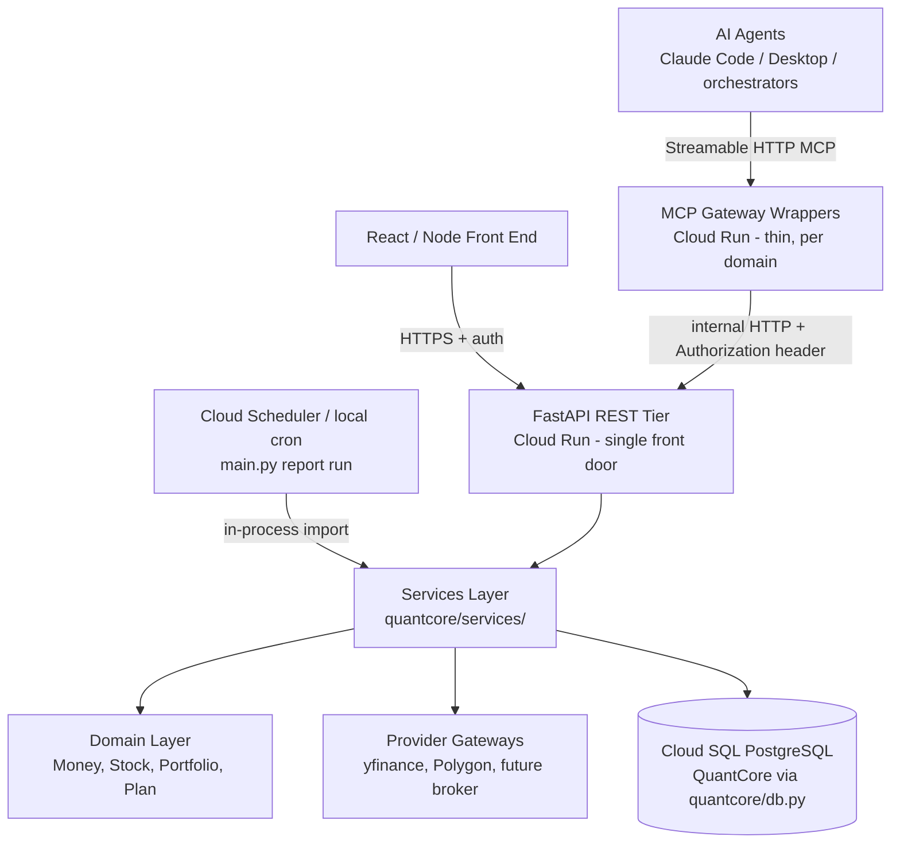
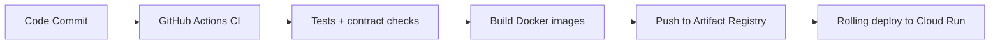

1# Architectural Standard v2: Services Layer + AI Gateway on FastAPI / GCP

**Status:** Adopted standard (supersedes the conclusions of the documents below)
**Author:** John Funk (with Claude Code)
**Date:** June 2026

This document unifies and supersedes the conclusions of:

- [`proposed_architectural_standard.md`](proposed_architectural_standard.md) — v1 "service-first" standard (retained as a record; its Rule 6 is inverted here, see §6)
- [`RFC-MCP-AI-Gateway-Architecture.md`](RFC-MCP-AI-Gateway-Architecture.md) — the "Headless API with an AI Gateway" RFC (retained as the discussion record)
- [`../capabilities-matrix.md`](../capabilities-matrix.md) — the capability/surface inventory that supplies the evidence base for this standard

---

## 1. Purpose & Status

This standard defines how we structure the system as it moves from rapidly-developed local tooling to a stable production runtime on GCP that multiple clients can count on. It resolves the conflict between the two prior proposals:

- The v1 standard said: all interfaces (REST, MCP, CLI) are thin **peer** adapters calling shared services directly, and explicitly forbade `MCP → REST`.
- The RFC said: MCP must be a thin wrapper **over** the REST API.

**Resolution: the two documents compose.** The RFC governs the *topology* (REST is the single front door; MCP is a thin AI Gateway over it). The v1 standard governs the *internals of the backend* (all business logic lives in a services layer; routes and gateways stay thin). Priorities, in order:

1. **First: extract the services layer.** All business logic moves into a cleanly defined shared services package.
2. **Then: adopt the gateway topology.** A FastAPI REST tier becomes the single front door; MCP servers become thin semantic wrappers over it, deployed to GCP.

---

## 2. Problem Statement

The capabilities matrix documents what rapid, surface-first development produced: **42 MCP tools, 35+ REST endpoints, 6 WebUI pages, 2 CLI tools, and 12 standalone scripts** built without a shared core. Concrete consequences, all verifiable in the matrix and the code:

- **Capabilities are trapped on whichever surface they were built on.**
  - All 12 fundamentals tools and all 3 market-microstructure signals (short interest, dark pool, bid/ask spread) are MCP-only — the dashboard cannot display them.
  - The most powerful synthesis tools — `get_trade_recommendation` (19 signals), `get_stop_loss_analysis` (7 sub-analyses), `get_relative_strength` — are LLM-accessible only.
  - IV Rank / IV Percentile is REST-only (no MCP equivalent); covered-call and put screening is CLI-only.
- **Logic is duplicated across surfaces.** `api/app.py:95` literally reads *"mirror of stock_price_server._bs_delta (no import needed)"*; `_compute_max_pain` reimplements options math in a route file; eight `experiments/` scripts re-implement analytics that now live in MCP tools.
- **Logic lives in interface layers.** `fastMCPTest/stock_price_server.py` alone is ~3,600 lines of analytics inline in `@mcp.tool()` bodies; `api/app.py` is ~1,650 lines with logic in route handlers.
- **Parallel state with no sync.** The Harvester `positions` table and `portfolio.csv` are two registries of the same data; `collect_options.py` imports classes that no longer exist.
- **No production runtime.** Everything runs on local machines; MCP servers are stdio processes only one person can use.

Every one of these is a symptom of the same root cause: **there is no single home for business logic, and no single front door for clients.**

---

## 3. Core Principles

In priority order:

> **P1 — All business logic lives in the shared services layer.** Every interface — REST route, MCP tool, CLI command, cron job — is a thin adapter.
>
> **P2 — The FastAPI REST tier is the single front door for all remote clients:** the React/Node front end, external partners, and the AI Gateway.
>
> **P3 — MCP servers are thin semantic wrappers (the AI Gateway) over the REST tier.** They contain no native business logic and no direct database access.
>
> **P4 — Every new capability is born as a service**, exposed via REST, then optionally surfaced to WebUI and/or MCP. Capabilities are never built surface-first.

---

## 4. Target Architecture



Notes:

- The front end's REST contract is preserved — it already talks only to the REST tier and is unaffected by this standard.
- **Cron/CLI jobs call services in-process** (same codebase). Unattended jobs must not depend on an HTTP service being up.
- The MCP wrappers are deployed per domain (see §10), matching the existing five-server decomposition.
- Locally, the same code runs unchanged: FastAPI via `uvicorn`, Cloud SQL via the Auth Proxy, MCP wrappers over stdio or streamable HTTP.

---

## 5. Layer Responsibilities

### 5.1 Services Layer (`quantcore/services/`) — the mandatory center

Owns: business logic, analytics/signal computation, validation, orchestration of providers and stores, caching policy, idempotency, transactions, audit events, and (future) risk/entitlement checks.

Organized by the capability domains from the matrix:

```text
quantcore/
  services/
    prices.py          # OHLCV, technicals (RSI, MACD, VWAP, OBV, patterns, ...)
    options.py         # chains, contracts, spreads, DAOI, gamma walls, IV rank, max pain
    fundamentals.py    # scores, revenue growth, earnings acceleration, calendars
    sentiment.py       # news collection, FinBERT scoring, trends
    microstructure.py  # short interest, dark pool, bid/ask spread
    harvester.py       # plan building, rung scanning, alerts
    portfolio.py       # positions, watchlist, screening
    recommendations.py # trade recommendation, stop-loss synthesis, relative strength
  db.py                # existing shared connection factory (unchanged)
```

### 5.2 Domain Layer

Core models (`Money`, `Stock`, `Portfolio`, plan/rung entities) and pure business rules. No external dependencies. The existing `portfolio/` package largely already follows this.

### 5.3 Provider Gateways

Thin adapters to external systems (yfinance, Polygon.io, future broker). Own API calls, auth, retries, rate limiting, and error translation. **Never** business rules.

### 5.4 FastAPI Routes (REST tier)

- Thin: parse/validate via **Pydantic request/response models**, call one service function, return the model.
- Own HTTP concerns only: auth, status codes, serialization (no hand-rolled JSON encoders).
- The Pydantic models are the **single contract** shared by the OpenAPI spec (front end) and the MCP tool schemas (AI Gateway).

### 5.5 MCP Gateway Wrappers

- Thin semantic wrappers: expose tool schemas, translate tool calls into HTTP requests against the REST tier, forward auth headers.
- Generated from the FastAPI OpenAPI spec where sensible (`FastMCP.from_fastapi()` / `fastapi-mcp`), with **hand-curated** tool selection and LLM-facing descriptions.
- **Never blanket-mirror the whole API.** Exposing an endpoint as a tool is a deliberate curation decision.
- Read-only by default. Write operations (plan mutations, future order placement) require explicit gating: confirmation step, idempotency key, full audit trail.

### 5.6 CLI / Cron

`main.py` (report + notifications) and operational scripts call services **in-process**. They must not require the REST tier to be running.

### 5.7 Front End (React/Node)

Unchanged role: calls the REST tier only, treats the OpenAPI schema as the contract, owns presentation and UI state, contains no trading/business logic.

---

## 6. Rules (Enforceable)

### Rule 1 — No business logic outside the services layer

❌ Forbidden: analytics, thresholds, or decisions inside `@mcp.tool()` bodies, FastAPI route handlers, CLI commands, or gateway classes.
✅ Required: `return prices_service.get_rsi(symbol, period)` — the adapter is one call deep.

### Rule 2 — No direct gateway or DB access from adapters

Routes, MCP tools, and CLI commands never import yfinance, `psycopg2`, or store modules directly. They call services.

### Rule 3 — Provider gateways stay thin

Translation, retries, auth, rate limits only. No validation rules, no risk decisions.

### Rule 4 — Shared core is stateless (or controlled state)

No global mutable state; all state flows through the database via services.

### Rule 5 — Cross-cutting concerns are centralized

Audit, idempotency, caching policy, and (future) risk/entitlements live in the services layer — never re-implemented per adapter.

### Rule 6 — MCP reaches business logic through the REST tier (⚠ inverted from v1)

> **v1 forbade `MCP → REST → Service`. This standard requires it.**

```text
✅ Required:   AI Agent → MCP wrapper → REST tier → Service
✅ Required:   CLI/cron → Service (in-process)
✅ Required:   Front end → REST tier → Service
❌ Forbidden:  MCP wrapper → Service or DB directly (bypasses the front door)
❌ Forbidden:  Cron → REST tier (unattended jobs must not depend on HTTP)
```

Rationale: in a multi-user GCP deployment, the REST tier is the single enforcement point for auth, validation, rate limiting, and audit. A wrapper that bypasses it bypasses all of them.

### Rule 7 — Capabilities are born as services (see §7)

A PR that adds a new analytic directly to a route, tool, or script — without a service function — fails review.

---

## 7. Capability Surface Policy

Target state for every capability in the [capabilities matrix](../capabilities-matrix.md):

1. **One service function** is the canonical implementation.
2. **REST is the canonical remote surface** — every capability that any remote client needs gets an endpoint.
3. **MCP and WebUI exposure are per-capability curation decisions**, not defaults. The matrix's surface columns become a checklist, not an accident of history.

Approved idiom carried over from the matrix: **"MCP writes, REST reads"** for snapshot-style data (e.g., the options-chain flow where collection persists a snapshot and dashboards read the store) — provided both sides go through the same service.

The matrix's current gap lists (fundamentals, microstructure, trade recommendation, stop-loss, relative strength, contract/spread pricing) define the REST endpoints to add in Phase 2 (§11).

---

## 8. Security Model

(Adopted from the RFC.)

- **Threats:** prompt/argument injection through LLM-controlled tool arguments; "confused deputy" privilege escalation if a high-privilege MCP process acts on a low-privilege user's behalf.
- **Containment:** the LLM never forms queries against the database or providers. It is restricted to the strict input schemas of curated tools; the REST tier performs type validation, permission checks, and rate limiting on every call — identically for human UIs and AI agents.
- **Identity passthrough:** the orchestrator extracts the client's JWT and passes it in MCP metadata; the wrapper forwards it as `Authorization: Bearer <token>` to the REST tier, preserving per-user audit trails.
- **Transport isolation:** MCP wrappers and their internal HTTP hop live inside the private network (VPC / Cloud Run internal ingress). Public clients reach only the authenticated REST front door.
- **Write gating:** any state-mutating tool (plans today, orders someday) requires explicit confirmation, an idempotency key, and an audit record — enforced in the services layer (Rule 5), not in the wrapper.

---

## 9. Technology Standards

| Concern | Standard | Notes |
|---|---|---|
| REST framework | **FastAPI** (replaces Flask) | Same idiom as FastMCP: type hints + docstrings → schemas |
| Contracts | **Pydantic models** | Single source of truth for OpenAPI, validation, and MCP tool schemas; replaces hand-rolled JSON encoders |
| MCP wrappers | **FastMCP**, generated from OpenAPI where sensible | Tool selection and descriptions hand-curated (§5.5) |
| ASGI server | uvicorn | `uvicorn api.main:app --port 5001` locally; container CMD in Cloud Run |
| Database | PostgreSQL (QuantCore) via `quantcore/db.py` | Unchanged; Cloud SQL in production, Auth Proxy locally |
| Async | Prefer `async def` routes/services for I/O-bound work | Replaces ad-hoc `ThreadPoolExecutor` fan-out in route handlers |

Why FastAPI: FastMCP was modeled on it, so the REST and MCP layers share one mental model; shared Pydantic models make schema drift between layers structurally impossible (largely replacing the RFC's proposed CI schema-sync scripts); native async fits the I/O-bound yfinance/Cloud SQL workload; and the migration is nearly free because every route is being rewritten as a thin adapter during service extraction anyway.

---

## 10. Deployment & CI/CD (GCP)

(RFC §8 retargeted from AWS to GCP.)



- **Cloud Run services:**
  - `quantcore-api` — the FastAPI REST tier (the front door).
  - One MCP gateway wrapper per domain, matching the existing five-server decomposition (stock-price, options-analysis, company-fundamentals, news-sentiment, market-analysis). Internal ingress only; streamable HTTP transport.
- **Cloud SQL** (already in place) reached via the Cloud SQL connector/Auth Proxy — no code changes between local and production (`QUANTCORE_DB_DSN`).
- **Scheduled work:** the daily report/notification run becomes a **Cloud Scheduler → Cloud Run job** executing `main.py`, importing services in-process (Rule 6).
- **CI checks:** unit tests; a wrapper smoke test that boots each MCP server and verifies `listTools()` exports valid schemas; an OpenAPI snapshot diff so contract changes are visible in PRs. (Shared Pydantic models make deeper schema-sync scripts mostly unnecessary — §9.)
- **Rolling deploys:** Cloud Run health checks gate traffic shifts; AI agents see zero downtime.

---

## 11. Migration Roadmap

### Phase 1 — Extract the services layer *(first priority)*

1. Create `quantcore/services/` organized by domain (§5.1).
2. Move logic out of `fastMCPTest/*_server.py` tool bodies and `api/app.py` route handlers into service functions. Tools and routes become one-call-deep adapters (temporarily both calling services in-process — local stdio MCP keeps working throughout this phase).
3. Eliminate known duplications: the `_bs_delta` mirror and `_compute_max_pain` in `api/app.py`; the eight superseded `experiments/` scripts listed in the matrix.
4. Cleanup from the matrix: fix or retire `collect_options.py` (imports non-existent classes); resolve the Harvester `positions`-table vs `portfolio.csv` dual registry (single source of truth).

**Exit criteria:** no analytics logic in any `@mcp.tool()` body or route handler; `python -m unittest discover` green; local MCP and REST behavior unchanged.

### Phase 2 — FastAPI REST tier ✅ *(complete — see [`phase2-fastapi-plan.md`](phase2-fastapi-plan.md))*

1. ✅ Rebuild the REST tier on FastAPI with Pydantic models, **preserving existing route paths and JSON shapes** so the front end is unaffected. (App factory `api/main.py`; route groups `api/routers/*`; request/response schemas `api/schemas/*`; `QuantCoreJSONResponse` preserves `Decimal→float` / `datetime→ISO` for byte-for-byte parity on pass-through analytics dicts.)
2. ✅ Close the matrix's surface gaps with new endpoints: fundamentals (`GET /api/securities/<ticker>/fundamentals` + score/revenue-growth/earnings-acceleration/history), microstructure, trade recommendation, stop-loss analysis, relative strength (+ history), contract lookup / vertical-spread pricing.
3. ⏭️ Add auth (JWT) and per-user audit to the front door. **Deferred to Phase 3** alongside the GCP/multi-user deployment it serves; Phase 2 preserves today's no-auth contract.

**Exit criteria (met):** front end runs unmodified against the FastAPI tier; OpenAPI spec published (`/openapi.json`, `/docs`); Flask app (`api/app.py`) retired.

### Phase 3 — AI Gateway + GCP deployment ✅ *(complete on the test project — see [`phase3-gateway-plan.md`](phase3-gateway-plan.md))*

1. ✅ Converted the five MCP servers to thin gateway wrappers over the REST tier (hand-rewritten to preserve curated docstrings, §5.5), streamable HTTP transport. All 47 tool bodies now call `mcp_gateway/rest_client.py` (the single HTTP seam); `options_analysis.py`'s only `get_services` use is its in-process CLI.
2. ✅ Containerized (`Dockerfile.{api,mcp,report}`, one shared mcp image) and deployed: `quantcore-api` (JWT-enforced) + 5 wrappers (app-JWT passthrough) to Cloud Run, `main.py` as a Cloud Run **Job** on a daily Cloud Scheduler trigger (in-process services, never HTTP — anti-pattern 5), CI/CD per §10 (`.github/workflows/deploy.yml`). Local `docker-compose.yml` stack remains the team's fallback daily driver.
3. ✅ Pointed the remote MCP client config (`fastMCPTest/.mcp.json`) at the Cloud Run wrapper URLs with JWT header passthrough; the root `.mcp.json` stays on the local container stack for dev.

**Exit criteria (met on the test project):** no MCP server contains business logic or DB access (grep-audited); everything runs on GCP Cloud Run; local machines are optional dev environments. **Final operational step — prod cutover:** repoint `QUANTCORE_DB_DSN` / the Cloud SQL connector from the test instance to production and redeploy (a supervised config change, deliberately *not* automated in CI).

---

## 12. Anti-Patterns

```text
1. Business logic in @mcp.tool() bodies or route handlers
2. Surface-first development (capability built into one interface with no service)
3. MCP wrapper calling services, stores, or the database directly (bypassing the front door)
4. Blanket auto-mirroring of every REST endpoint as an MCP tool
5. Cron/unattended jobs calling the REST tier over HTTP
6. Front end calling MCP tools or provider gateways directly
7. Hand-rolled JSON serialization instead of Pydantic models
8. Gateways growing into service layers
9. Duplicate "mirror" implementations across surfaces
10. AI tools mutating state without confirmation + idempotency + audit
```

(Note: v1 listed `MCP → REST` as anti-pattern; it is now **required** — see Rule 6.)

---

## 13. AI-Assistant Guidance

When generating or reviewing code in this repository, enforce:

**Always — for any new capability:**

1. Write the service function in `quantcore/services/<domain>.py` first.
2. Add a thin FastAPI route exposing it, with Pydantic request/response models.
3. Optionally expose it as an MCP tool — a curated wrapper over the REST endpoint, with an LLM-facing description.

**Never:**

- Add analytics, thresholds, or decisions to MCP tool bodies, route handlers, CLI commands, or gateway classes.
- Import yfinance, `psycopg2`, or store modules from an adapter.
- Create a standalone script that re-implements an existing service.

**When unsure:**

> Logic goes in `quantcore/services/`. Everything else is a thin adapter.
