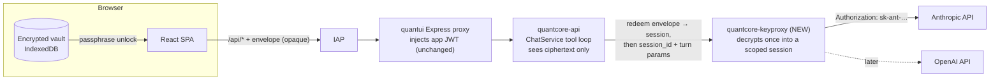
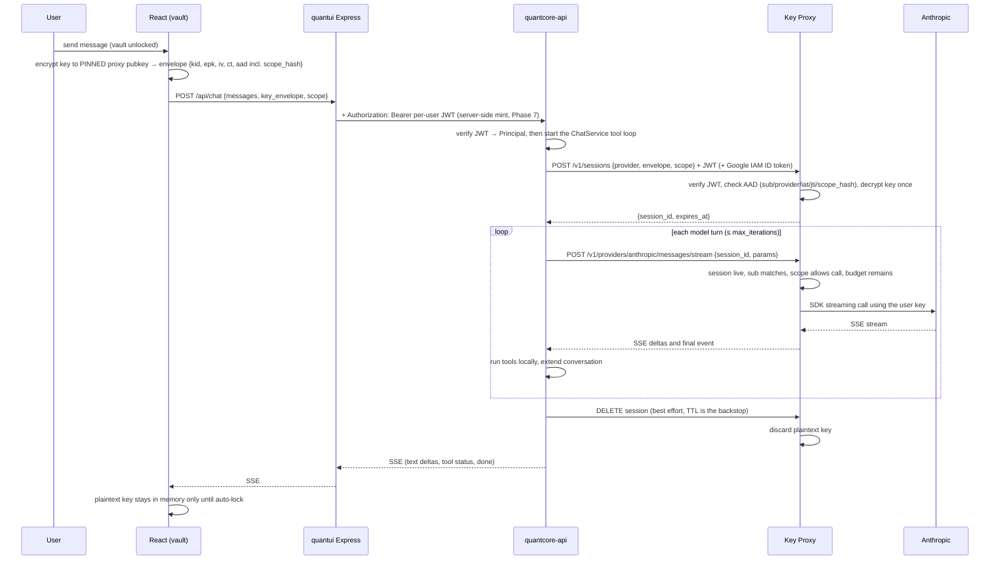
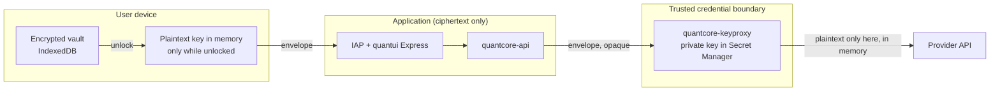
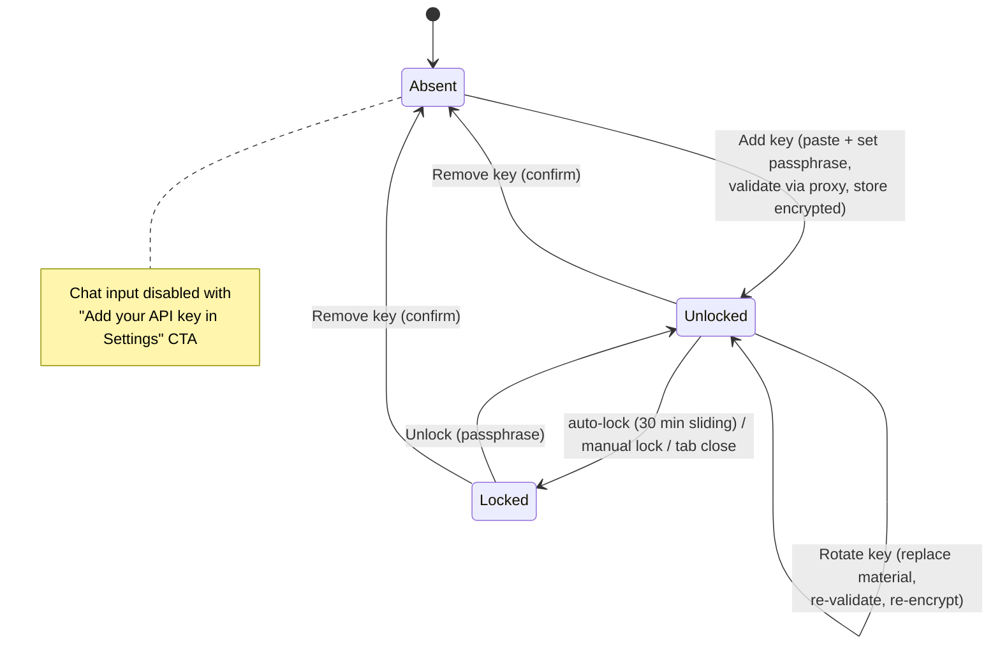
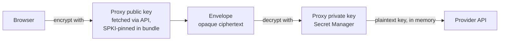

# BYOK — Bring Your Own LLM API Key (browser vault + Key Proxy) — plan + checkpoint log

> Status: **PROPOSAL — awaiting team review.** No code has been written. This doc is the canonical
> plan and checkpoint log for the BYOK feature, mirroring the cadence of `quantui-iap-plan.md` /
> `phase3-gateway-plan.md`: one commit per work packet, pushed, logged below (see "Executing this
> plan — session protocol", added 2026-07-16 to tailor the plan for execution by Claude Opus 4.8;
> progress comments go on issue #100 at full-phase boundaries). It adapts the
> user-controlled-key architecture proposal (HPKE-style envelope encryption, dedicated decrypting
> proxy) to the QuantCore stack, with the existing Anthropic chat sidekick as the first consumer.
> The source proposal's goals, security boundaries, cryptographic model, logging policy, and
> operational controls are incorporated below — **this document is self-contained**; the original
> does not need to be read alongside it.

## Executive summary

Today the chat sidekick authenticates to Anthropic with a single server-side `ANTHROPIC_API_KEY` —
one shared secret, one shared bill. This plan makes each user bring their own key while ensuring
**plaintext keys are visible to exactly one isolated service**:

- The key is stored **only in the user's browser**, encrypted at rest in IndexedDB under a
  passphrase-derived key (explicit unlock, sliding auto-lock).
- Per request, the browser encrypts the key to the public key of a new dedicated
  **Key Proxy** Cloud Run service (`quantcore-keyproxy`) and sends the resulting **opaque
  envelope** through the normal app path.
- `quantcore-api` never sees plaintext — it forwards the envelope. Only the Key Proxy holds the
  private key (Secret Manager), decrypts **in memory** into a short-lived **scoped session**
  covering the fan-out calls of one user action, streams the responses back, and discards the
  plaintext at session teardown.
- **Nothing is persisted server-side** — no new DB tables, no ciphertext at rest on servers. The
  browser vault is the sole store; the envelope rides on every request.

Why this is worth doing (from the source proposal): it eliminates persistent server-side
credential storage, prevents intermediate infrastructure from ever seeing plaintext keys, greatly
reduces accidental disclosure via logs/telemetry/middleware/debugging, preserves user ownership of
credentials, and leaves the door open to Confidential Computing, HSM-backed keys, or
enterprise-owned proxy deployments later — all without requiring users to own any cloud resources.

## Goals and non-goals

**Primary goals** (inherited from the source proposal, provider generalized):

- Users manage their own LLM provider API keys.
- No persistent plaintext API keys on application servers.
- Encrypted storage on the user's device.
- Encrypted transport through the entire application stack.
- Only the Key Proxy can decrypt keys.
- Plaintext keys exist only in memory, for at most one scoped user action (session).

**Secondary goals:**

- Reduce accidental disclosure via logs, telemetry, middleware, or debugging.
- Keep the architecture simple and maintainable.
- Avoid requiring users to own Google Cloud resources.
- Allow future migration to Confidential Computing or HSM-backed keys.

**Non-goal:** this design cannot prevent a malicious Key Proxy *deployment* from observing
credentials, because the proxy must ultimately authenticate to the provider. The mitigation is
minimizing and isolating that trusted computing base — a separate, tiny, auditable service with
its own service account — not eliminating it.

## Decisions already made

1. **Provider-agnostic, Anthropic first.** The vault, envelope, and proxy all carry a `provider`
   field. The chat sidekick (Anthropic) is the first consumer; OpenAI later is a new
   `keyproxy/providers/openai.py` module — no architecture change.
2. **Chat requires a user key.** The shared server key is retired for chat (kept only behind a
   default-off dev flag). Users without a key see an "add your API key in Settings" prompt.
3. **The UI ships add, rotate, remove, and unlock flows** on a new `/settings` page.
4. **Per-user JWTs are in scope** (decided 2026-07-16). Today all quantui users share one app
   JWT; Phase 7 has the quantui Express server mint a short-lived per-user JWT from the verified
   IAP identity, so the envelope's AAD `sub` binds each key to the person who vaulted it — not
   just to the deployment.
5. **Keyproxy scaling: `--max-instances=1`, no `--min-instances`** (decided 2026-07-16).
   Replay/rate-limit coherence requires a single instance; cold starts after idle are accepted
   for now. If first-message latency becomes annoying in practice, `--min-instances=1` is a
   one-flag change; sustained scale-out means moving the `jti` set to Redis.
6. **SSE pass-through and thinking-block fidelity get dedicated tests** (decided 2026-07-16).
   Both accepted-as-low risks are pinned by named Phase 3 tests rather than ad-hoc manual checks —
   see the Phase 3 verify criteria.
7. **Envelopes redeem into scoped sessions** (decided 2026-07-16, security review). One user
   action always fans out into many provider calls — a chat message becomes up to 8 model turns
   (interleaved with MCP/data-tool work), a future trading action becomes several backend
   transactions. The envelope is therefore **strictly single-use**: the first keyproxy call
   redeems it into a short-lived in-memory **session** whose **scope** (hash-bound into the
   envelope's authenticated AAD) declares exactly what those fan-out calls may do. See
   [Sessions and scopes](#sessions-and-scopes--one-user-action-many-provider-calls).
8. **The proxy public key is pinned in the frontend bundle** (decided 2026-07-16, security
   review). The SPA refuses to encrypt to any public key whose SPKI fingerprint isn't in the
   build-time pin list, so a compromised quantcore-api or Express layer cannot harvest plaintext
   keys by substituting its own key.
9. **The keyproxy is not internet-reachable** (decided 2026-07-16, security review). Deployed
   `--no-allow-unauthenticated`; only quantcore-api's runtime SA holds `run.invoker`. Google IAM,
   the app JWT, the AAD binding, and scope enforcement form four independent authorization
   layers (see Security boundaries).
10. **Per-user JWTs land before any cloud rollout** (decided 2026-07-16, security review).
    Phases reordered — per-user JWTs are now Phase 7 and cloud rollout Phase 8 — so real keys
    never flow in the cloud bound to a shared deployment identity.
11. **Streaming quality-of-life: all four hardening items accepted** (decided 2026-07-16).
    No compression may touch the SSE stream (pinned by a named test); `KeyProxyChatClient` uses
    a persistent pooled httpx client; both hops emit SSE heartbeat comments during quiet gaps;
    and platform timeouts must be ≥ app timeouts on every hop. Details in Phase 3 and the
    Phase 8 runbook.
12. **Multi-step trade workflows use plan / confirm / execute with scope v2** (decided
    2026-07-16). Workflow mechanics are authored in the quantcore business-logic layer, not the
    UI: the services layer *plans* an ordered step list, the user *confirms* the rendered plan
    (sealing it into the envelope's `scope_hash`), and the keyproxy *enforces* it step by step —
    a saga with pre-authorized `on_failure` compensation steps, not an ACID transaction, since
    broker calls cannot be rolled back. See "Multi-step workflows" under Sessions and scopes.
13. **Service JWTs go asymmetric — ES256 with audience claims** (decided 2026-07-16; the external
    security review's strongest catch). With shared-secret HS256, every verifier holds the signing
    key — a compromised quantcore-api could mint a JWT for any `sub` and redeem any captured
    envelope, defeating the AAD sub-binding entirely. In Phase 7 the quantui Express server signs
    with an ES256 **private key only it holds**; quantcore-api and the keyproxy verify with the
    public key and check an `aud` claim, so **verifiers cannot mint identities** and a token for
    one service cannot be replayed at another. Details in Phase 7.
14. **External security review folded in** (decided 2026-07-16). Adopted: the
    egress-allowlist-by-construction rule (provider base URLs hardcoded, never
    request-influenced), Unicode/escape-sequence canonicalization test vectors (Phase 1), a
    replay-race concurrency test (Phase 2), per-session correlation IDs in allowlist logs, CI
    secret scanning (Phase 8), Trusted Types (Phase 5), a cumulative per-session `max_tokens`
    budget (a breach-exposure cap, not spend throttling — see Scope schema), and an explicit
    invariants → tests map (under Overall verification). Considered and kept as-is: in-memory
    replay state (smallest-TCB wins for the LLM tier; durability is re-examined in the
    trading-tier design), PBKDF2-600k (Argon2id's WASM dependency contradicts the review's own
    supply-chain finding), and the three-party plan / confirm / execute design over a separate
    Authorization Service (see the considered-alternative note under Sessions and scopes).
    Phasing stays exactly as planned — nothing releases outside the immediate dev team until all
    phases are complete, so re-ordering the work buys nothing.

## High-level architecture



The chat **tool loop stays in `quantcore-api`** (`ChatService` is unchanged in role): each *model
turn* goes to the Key Proxy via a new `KeyProxyChatClient` implementing the existing `ChatClient`
protocol (`quantcore/services/chat.py`), instead of the in-process Anthropic SDK call
(`quantcore/gateways/anthropic_gateway.py`). The envelope rides on every `POST /api/chat` request
and is **redeemed exactly once**: the first model turn exchanges it for a short-lived keyproxy
session, and the remaining turns of that request reference the session — the envelope itself is
never reused (see [Sessions and scopes](#sessions-and-scopes--one-user-action-many-provider-calls)).

## Request flow (one chat message)



## Security boundaries



What each boundary is responsible for:

- **Browser** — stores only encrypted credentials and decrypts them after explicit user action
  (passphrase unlock). Plaintext lives in memory only, until auto-lock.
- **Application (IAP, quantui Express, quantcore-api)** — never receives plaintext credentials.
  Responsible only for authentication, authorization, and routing; the envelope passes through as
  opaque ciphertext.
- **Key Proxy** — the only component allowed to decrypt credentials. It decrypts **once** into a
  scoped in-memory session, constructs the provider `Authorization` header for each in-scope call,
  and discards the plaintext at session teardown (explicit `DELETE` or TTL — bounded to minutes).
  It runs as a separate deployment with its own dedicated service account, so no other service can
  read the private key from Secret Manager — and it is **not internet-reachable**: deployed
  `--no-allow-unauthenticated`, with `run.invoker` granted only to quantcore-api's runtime SA
  (decided 2026-07-16).

Defense in depth at the proxy — four independent authorization layers, each of which must pass:

1. **Google IAM** — the service is `--no-allow-unauthenticated`; only quantcore-api's runtime SA
   holds `run.invoker`, and it attaches a Google-signed ID token from the metadata server (~10
   lines of `google-auth`). Nothing else on the internet can even reach the app code.
2. **App JWT** — the proxy independently verifies the same HS256 app JWT
   (`quantcore-jwt-secret`) that `quantcore-api` enforces.
3. **AAD binding** — the envelope's GCM-authenticated AAD must match reality: `sub` = verified
   JWT sub, `provider` = requested provider, fresh `iat`, unredeemed `jti`, and `scope_hash` =
   hash of the accompanying scope. Any tampering breaks GCM authentication; a stolen envelope is
   useless without the matching token.
4. **Scope enforcement** — after decryption, every outgoing provider call is classified against
   the session's scope and budget before the key is attached (see
   [Sessions and scopes](#sessions-and-scopes--one-user-action-many-provider-calls)).

## Key lifecycle (browser vault)



- **Add** — provider select (Anthropic for now), key paste, passphrase set/confirm. The key is
  test-validated through the proxy (`models.list`, free) before storing; the UI keeps only a
  `last4` hint in the clear.
- **Rotate** — replace the key material for a provider under the existing passphrase; re-validated
  before the old record is overwritten.
- **Remove** — confirm dialog; deletes the IndexedDB record.
- **Unlock** — passphrase prompt; plaintext lives in a React ref (never state/storage) with a
  30-minute sliding auto-lock.

Tradeoff (accepted): the key is **per-browser**. Clearing site data or switching devices means
re-pasting the key. Mitigations: `navigator.storage.persist()` on vault creation, and UI copy
that says so.

## Cryptographic model

Asymmetric envelope encryption: the browser encrypts to the Key Proxy's **public** key; only the
proxy's **private** key (Secret Manager) can decrypt.



The source proposal recommends HPKE with **X25519 + HKDF-SHA256 + AES-256-GCM**. This plan keeps
the identical construction (ephemeral-static ECDH → HKDF-SHA256 → AES-256-GCM) but substitutes
the **P-256** curve — see the deviation callout below for why. **Accepted 2026-07-16.**

**Public-key pinning (decided 2026-07-16, security review):** the pubkey travels to the browser
*through quantcore-api*, so a compromised api (or Express layer) could substitute its own public
key and harvest plaintext on the user's next send — silently collapsing the "application sees
ciphertext only" boundary. The frontend therefore ships a **build-time pin list**
(`VITE_KEYPROXY_SPKI_PINS`: b64url SHA-256 fingerprints of the proxy keys' SPKI) and
`envelope.ts` refuses to encrypt to any public key whose fingerprint is not pinned. Substituting
a key now requires compromising the build pipeline or serving origin itself — a strictly harder
target. Rotation is dual-pin: ship a frontend release carrying old+new fingerprints, rotate the
proxy keypair, drop the old pin in the next release.

## Envelope spec (v1) — the load-bearing contract

```json
{
  "v": 1,
  "alg": "ECDH-ES-P256+HKDF-SHA256+A256GCM",
  "kid": "kp-2026-07-a",
  "epk": "<b64url uncompressed P-256 point (65 bytes)>",
  "iv":  "<b64url 12 bytes>",
  "ct":  "<b64url AES-256-GCM ciphertext || 16-byte tag over the UTF-8 API key>",
  "aad": { "sub": "<JWT sub>", "provider": "anthropic", "iat": 1752570000, "jti": "<uuid4>",
           "scope_hash": "<b64url SHA-256 of canonical scope JSON>" }
}
```

- GCM AAD bytes = canonical JSON of `aad` (sorted keys, no whitespace); an identical
  `canonical_aad()` is implemented in both TypeScript and Python and pinned by shared test vectors.
- KDF: `HKDF-SHA256(ikm = ECDH(epk, proxy_priv), salt = "", info = "quantcore-keyproxy-v1|" + kid,
  len = 32)`.
- The envelope travels with a **cleartext `scope` object** (see
  [Sessions and scopes](#sessions-and-scopes--one-user-action-many-provider-calls));
  `aad.scope_hash` is the b64url SHA-256 of its canonical JSON, so the proxy can read the scope
  while GCM authentication makes it tamper-proof — quantcore-api can relay it but not alter it.
- The proxy rejects — with a **generic 400 and no request-body logging** — on: unknown `kid`;
  `|now − iat| > 60 s`; already-redeemed `jti` (each envelope is redeemable **exactly once**, into
  a session); `aad.sub ≠` verified JWT sub; `aad.provider ≠` requested provider;
  `aad.scope_hash ≠` hash of the accompanying scope; GCM authentication failure.

### Deviation from the source proposal: P-256 instead of X25519 (✔ accepted 2026-07-16)

WebCrypto has no native HPKE, and X25519 in `crypto.subtle` is only recently cross-browser. ECDH
**P-256 + HKDF-SHA256 + AES-256-GCM** is natively supported everywhere (browser `crypto.subtle`
and Python `cryptography`), gives an identical security posture for this threat model, and needs
**zero new frontend crypto dependencies** (~120 auditable lines). The envelope is versioned
(`alg`, `kid`), so a later move to X25519/HPKE is just a new `kid` — no architecture change.

### Logging policy (both api and proxy)

Safe to log: request id, **correlation id** (a per-session id issued at redemption and echoed on
every fan-out call's log line — added 2026-07-16, external review — so one user action's calls can
be traced end-to-end without logging any payload), JWT `sub`, provider, model, latency, token
usage, HTTP status.
Never log: API keys, Authorization headers, envelopes, decrypted payloads, request bodies,
exception dumps that could contain any of the above. Enforced by tests that assert decrypt-failure
paths emit neither envelope nor key material.

## Sessions and scopes — one user action, many provider calls

Design driver: **one user action never maps to one provider call.** A chat send fans out into up
to 8 model turns (`ChatService.max_iterations`) interleaved with MCP/data-tool work; a future
trading action ("buy 100 AAPL") fans out into several backend transactions (quote → place →
poll → confirm). A strictly per-call envelope forces a bad choice: reuse the envelope across the
fan-out (replay protection dies) or re-enter the browser mid-action to mint fresh ones. The
session model resolves it — **the envelope is redeemed exactly once into a short-lived scoped
session that covers the whole fan-out.** (Decided 2026-07-16, security review; this also fixes
the original design's contradiction where a single-use `jti` met an envelope "re-used for each
turn".)

### Session mechanics

1. The browser builds a cleartext **`scope`** object describing what this one user action is
   allowed to do, and mints an envelope whose AAD carries `scope_hash` (b64url SHA-256 of the
   scope's canonical JSON). GCM authentication makes the scope tamper-proof in transit:
   quantcore-api can relay it, but any alteration breaks decryption.
2. `POST /v1/sessions {provider, envelope, scope}` — the proxy verifies IAM + JWT, checks the
   AAD (`sub`/`provider`/`iat`/`jti`/`scope_hash`), decrypts the key **once**, and returns
   `{session_id, expires_at}`. The `jti` is now burned; any second redemption attempt is a
   replay and gets a generic 400.
3. The proxy holds `{plaintext key, scope, verified sub, call counters}` in memory under a
   128-bit random `session_id`, with a sliding TTL (`KEYPROXY_SESSION_TTL`, default 300 s) and a
   hard lifetime cap (~900 s) regardless of activity.
4. Every subsequent call presents `session_id` + the app JWT. The proxy checks: session live,
   JWT `sub` == session sub, and the requested operation fits the scope and remaining budget —
   *before* the key is attached to anything.
5. When the action completes, quantcore-api calls `DELETE /v1/sessions/{id}` (best effort); the
   TTL is the backstop. The `session_id` never leaves the api↔proxy channel, and on its own it
   is useless — it only works alongside a JWT bearing the matching `sub`.

Security accounting vs. the per-call model: the plaintext key now lives in proxy memory for the
duration of one user action instead of one call — a bounded, TTL'd, in-memory-only widening,
kept coherent by `--max-instances=1`. In exchange: the envelope becomes strictly single-use (the
replay window collapses to zero once redeemed), turns 2+ skip the ECDH handshake, per-user rate
limiting counts *user actions* rather than fan-out calls (30/min no longer throttles an 8-turn
chat), and — decisive for the trading roadmap — the proxy gains the place to enforce *what* the
fan-out calls may do, not just *whether* the caller holds a key.

### Scope schema (v1)

```json
{ "v": 1, "provider": "anthropic", "action": "chat.turn", "params": {},
  "budget": { "max_calls": 20, "max_mutations": 0, "max_tokens": 250000, "ttl": 300 } }
```

A future trading scope, same shape:

```json
{ "v": 1, "provider": "broker-x", "action": "order.place",
  "params": { "symbol": "AAPL", "side": "buy", "type": "limit",
              "max_qty": 100, "max_limit_price": "190.00" },
  "budget": { "max_calls": 12, "max_mutations": 1, "ttl": 60 } }
```

`max_tokens` (added 2026-07-16, external review) is a **cumulative token budget for the whole
session**: the keyproxy sums the provider-reported usage of every call and kills the session when
the total crosses the line. It is a **breach-exposure cap, not spend throttling** — we don't
police how much a user chooses to spend, we bound how much a stolen live session can burn. The
scope's value cannot exceed the server-side ceiling (`KEYPROXY_MAX_SESSION_TOKENS`), and the
rejection copy must state plainly that the user **hit a system-imposed threshold and should talk
to the development team to have it raised** — during user testing that feedback loop is exactly
how the default gets tuned.

Trade workflows that need **more than one ordered mutation** under a single user action use
scope **v2** (`steps` + `on_failure`) — see
[Multi-step workflows](#multi-step-workflows--plan--confirm--execute-scope-v2) below.

### Provider modules classify every call — fail closed

Each provider module (`keyproxy/providers/<name>.py`) ships an **operation taxonomy** that
classifies every outgoing request as `read` or `mutate` *before* the key is attached:

- **Reads** (quotes, positions, `models.list`, streaming a model turn) are allowed within any
  live session for that provider, counted against `budget.max_calls`.
- **Mutates** (place/cancel order, transfer) must match the scope's `action` and satisfy its
  `params` constraints (`symbol`, `side`, `max_qty`, `max_limit_price`, …), counted against
  `budget.max_mutations`. The default of **1 gives at-most-once semantics** even if
  quantcore-api retries — the proxy derives a provider idempotency key from the envelope `jti`
  where the provider supports one, and refuses a second mutation regardless.
- **Unclassifiable requests are rejected.** A provider module that cannot positively classify an
  operation fails closed — new provider endpoints are unusable until someone consciously adds
  them to the taxonomy.
- **Egress is allowlisted by construction** (added 2026-07-16, external review). Each provider
  module **hardcodes its provider base URL**; no request field, scope param, header, or
  environment override may influence where a decrypted key is sent. There is nothing to SSRF —
  the proxy cannot be steered into posting a key to an attacker's host. (The trading deployment
  additionally gets network-level VPC egress lockdown — see the trading tier.)

v1 implements this machinery **for real, not as a stub**: the browser mints `action:"chat.turn"`
scopes for every send, and the Anthropic module's taxonomy permits exactly one operation
(`messages.stream`, a read) with `max_mutations: 0`. The trading tier then reuses a proven
mechanism instead of bolting one on.

### Consent tiers — how a scope gets authorized

| Tier | Example | How the envelope is minted |
|---|---|---|
| **Ambient** | LLM chat turn | Automatically per send while the vault is unlocked; `max_mutations: 0` |
| **Read-only** | Trading account reads (positions, quotes) | Automatically while unlocked; `max_mutations: 0` |
| **Confirmed mutation** | Placing or cancelling an order | Minted **only** when the user clicks Confirm in a dialog that renders the scope human-readably — e.g. *"Buy up to 100 AAPL, limit ≤ $190.00, valid 60 s"*. Tight `params`, `max_mutations: 1`, short `ttl` |
| **Confirmed workflow** *(added 2026-07-16)* | Multi-step trade actions (e.g. replacing a stop order) | Minted **only** on Confirm of the full server-planned step list, rendered verbatim — e.g. *"1. Cancel stop #abc123 · 2. Place trailing stop, up to 100 AAPL, trail ≤ 8% — if step 2 fails, your original stop ($185.00) will be restored"*. Scope v2, see below |

Roadmap for the trading tier: a **WebAuthn user-presence check** on Confirm, so a mutation scope
cannot be minted without a physical gesture even by script running in the page.

### Multi-step workflows — plan / confirm / execute (scope v2)

Driving case (decided 2026-07-16): the user converts a fixed-price stop loss into a wider
trailing stop. One-trigger orders can't bracket this into a single transaction, so one user
action fans out into **two ordered mutations of different types** — cancel the fixed stop, and
only after that completes, place the trailing stop — plus reads in between (polling the cancel
to a terminal state). Scope v1's single `action` + `max_mutations: 1` can't express this.

The added constraint that shapes the design: **the UI does not know the workflow mechanics.**
Fan-out is decided in the quantcore business-logic layer. But the scope is sealed into the
envelope's AAD in the browser — so the plan must round-trip through the user. Three parties,
three roles (prepare / sign / execute):

1. **Plan (services layer).** The UI sends only the *intent* ("convert stop #abc123 to an 8%
   trailing stop"). The trading service plans the workflow: resolves order ids, picks the
   ordering (native atomic cancel/replace when the broker offers one; otherwise
   cancel-then-place, or place-then-cancel where overlapping stops are allowed — briefly
   double-covered beats briefly uncovered), and emits the scope v2 JSON plus a human-readable
   rendering. **Planner determinism rule:** the plan must be fully determined at consent time —
   anything not knowable until mid-workflow must be expressed as a user-visible ceiling
   (`max_qty`, `trail_percent_max`), and a workflow whose params can't be bounded at plan time
   cannot be a single consent (the correct failure mode).
2. **Confirm (browser).** The API relays the proposed scope + rendering; the Confirm dialog
   shows the step list verbatim; on Confirm the browser computes `scope_hash` over **exactly the
   server-proposed bytes** and mints the envelope. A compromised services layer can *propose*
   anything, but it can only obtain authorization for what the user actually saw, and it cannot
   swap, reorder, or widen the plan afterwards — the hash is sealed into the GCM AAD.
3. **Execute (services ↔ keyproxy).** The service redeems the envelope into a session and drives
   the steps; the keyproxy — which never sees "intent", only the sealed plan — enforces it.

```json
{
  "v": 2,
  "provider": "broker-x",
  "workflow": "stop.replace",
  "steps": [
    { "action": "order.cancel", "params": { "order_id": "abc123" }, "require_success": true },
    { "action": "order.place",  "params": { "symbol": "AAPL", "side": "sell",
        "type": "trailing_stop", "max_qty": 100, "trail_percent_max": 8.0 } }
  ],
  "on_failure": [
    { "action": "order.place", "params": { "symbol": "AAPL", "side": "sell",
        "type": "stop", "max_qty": 100, "stop_price": "185.00" } }
  ],
  "budget": { "max_calls": 20, "ttl": 180 }
}
```

Keyproxy enforcement, extending the fail-closed taxonomy:

- **Strict ordering.** Each outgoing mutation must match the *next pending* step — action and
  params (exact where exact, ceiling where bounded). Any rejected mutation **kills the whole
  session**; there is no partial continuation after a violation.
- **Success gating.** The proxy already sees every broker response; with
  `require_success: true`, step N+1 stays locked until step N's response is an actual
  success/terminal state — a compromised backend cannot skip the cancel and go straight to
  placing orders.
- **Per-step at-most-once.** Each step's provider idempotency key derives from `jti` + step
  index: resending a step after a network blip is safe, executing it twice is impossible.
- **Compensation unlock rule.** `on_failure` steps are unreachable on the happy path — they
  unlock only after a forward step has been consumed and a later forward step has terminally
  failed, and they are budget-counted like everything else.

**This is a saga, not an ACID transaction.** The session maps to a transaction (redeem =
`BEGIN`, steps = statements, violation = abort), but there is no `ROLLBACK` — a broker cancel
that succeeded cannot be un-cancelled. Between "cancel succeeded" and "place succeeded" the
position is unprotected; the design's answer is layered: prefer the native atomic operation,
pick the safer ordering, pre-authorize the compensation step (restore the original stop), and if
even the compensation fails, raise a **blocking emergency alert** ("cancel completed,
replacement NOT placed — your position is unprotected") through Discord + the UI. The keyproxy
cannot compensate after the session dies; the alert is the honest last resort. *(If you can't
build a leak-proof boat, put in a bilge pump.)*

Interface between the business-logic layer and the keyproxy — two seams, mirroring `ChatClient`:

- **`plan_workflow(intent) → WorkflowPlan`** — pure services-layer, no keyproxy involvement;
  emits `{scope, human_rendering}` for the consent round-trip. The planner and the keyproxy
  provider modules share the action taxonomy — same vocabulary, enforced independently on both
  sides.
- **`execute_workflow(envelope, scope) → step results`** — a `KeyProxyWorkflowClient` in
  `quantcore/gateways/` that redeems the session, submits steps in order, polls reads, triggers
  `on_failure` on terminal step failure, and best-effort `DELETE`s the session at the end.

A chat turn remains the degenerate form — a one-step plan with `max_mutations: 0` and ambient
consent — so the workflow machinery is the same machinery, not a parallel path.

### Considered alternative: a separate Authorization Service (rejected 2026-07-16)

The external security review proposed a dedicated Authorization Service between identity and the
keyproxy: IAP establishes *who*, the Authorization Service issues a signed scoped capability, and
the keyproxy honors only such capabilities. The invariant it buys — *the client supplies intent,
not authority* — is correct, and this design already delivers it with three parties: the
**services layer** plans (intent → concrete bounded steps), the **user** confirms (the browser
seals `scope_hash` over exactly the server-proposed bytes), and the **keyproxy** enforces
(fail-closed taxonomy, budgets, step ordering, server-side ceilings). A standalone issuer would
be a **fourth secret-holding component without an independent trust domain to anchor it** —
deployed by the same pipeline, administered by the same operators, verified against the same
keys — so it adds attack surface and operational weight without adding separation. Rejected in
favor of keeping the TCB small; revisit only if a genuinely independent trust domain (separate
project, separate operators) ever becomes a requirement.

### What an attacker actually gets

| Compromise | What they get | What contains it |
|---|---|---|
| quantcore-api fully compromised | Can drive provider calls **only inside currently-live scopes**: burn chat tokens; for trading, at most execute the remaining already-confirmed steps, in order, within their pinned bounds — i.e. at worst, exactly what the user asked for. It *can* cancel and then drop the place (denial → middle state), which is why the partial-completion alert is a required control | SPKI pinning blocks key harvest via pubkey substitution; scope `params` + budgets cap blast radius; mutation counters + step ordering + success gating give at-most-once, in-order execution |
| Captured envelope (network appliance, log leak) | Nothing — by the time it's observable it's been redeemed; the `jti` is burned | Single-use redemption |
| Captured `session_id` | Nothing without a JWT bearing the matching `sub`; dies within minutes anyway | JWT sub check + sliding TTL + hard cap |
| XSS in the SPA | **Honest statement: same-origin script is effectively the user.** While the vault is unlocked it can mint envelopes; no vault design fixes this | Strict CSP (incl. `form-action 'self'; base-uri 'none'`), dependency hygiene; the confirmation ceremony + (roadmap) WebAuthn cap what *silent* script can do — it cannot confirm a mutation without the user |
| Key Proxy itself compromised | Plaintext keys of active sessions (an explicit non-goal to prevent, per the source proposal — the proxy must authenticate to the provider) | Smallest possible TCB (zero business logic); Confidential Space roadmap for the trading tier |

### Multiple providers and the trading tier

One envelope + one session **per provider** — there is no master capability that unlocks
everything. When trading arrives, its keys go through a **second deployment**,
`quantcore-keyproxy-trading`: same codebase, but its own keypair (own SPKI pins), own runtime SA,
own Secret Manager secret, and stricter defaults (shorter `KEYPROXY_SESSION_TTL`, lower budgets).
A bug or compromise in the busy LLM proxy then never touches trading credentials. Confidential
Space (TEE) is the hardening roadmap for that deployment.

Two further requirements are pre-registered for that deployment (2026-07-16, external review):

- **VPC egress lockdown.** Beyond the code-level hardcoded-URL rule, the trading proxy runs with
  Cloud Run VPC egress restricted to the broker endpoints — even fully compromised proxy code has
  no network path to send a key anywhere else.
- **Durable replay state.** The LLM tier deliberately keeps its `jti` set in memory (smallest
  TCB — the keyproxy has zero database dependencies, and the post-restart replay window is a
  minor risk for chat). For trading mutations that trade-off flips: the trading-tier design
  review must specify a durable nonce store and account for the TCB cost it brings.

**OAuth delegation — flagged for the trading-tier design** (noted 2026-07-16, external review).
Brokers commonly offer OAuth; a scoped, revocable, user-consented grant may beat a vaulted raw
API key outright — revocation happens at the broker, and no long-lived secret sits in the browser
at all. The envelope machinery generalizes (it would carry the refresh token instead of a key),
so this is a provider-module decision, not an architecture change. To be discussed when the
trading layer is designed.

Because the IndexedDB vault blob is offline-brute-forceable at PBKDF2-600k if exfiltrated, Phase 5
adds a **passphrase-strength minimum** in the Add-key dialog — worth it for LLM keys, mandatory
before trading keys.

## Operational controls

How each control required by the source proposal is realized here:

| Control (source proposal) | Realization in this plan |
|---|---|
| Separate deployment for the proxy | Own Cloud Run service `quantcore-keyproxy`, own `keyproxy/` package, own slim image (`Dockerfile.keyproxy`) |
| Dedicated service account | Keyproxy runs as its own runtime SA (`keyproxy-runtime@…`); **only** that SA gets accessor on `keyproxy-private-key` (Phase 7 runbook) |
| Strict CSP | quantui Express serves the SPA with a strict `Content-Security-Policy` (`default-src 'self'; connect-src 'self'; form-action 'self'; base-uri 'none'`, no third-party script/connect targets) — lands in Phase 5, before users first paste keys |
| Replay protection | Per-envelope `jti` in the GCM-authenticated AAD; redeeming the envelope into a session **burns** the `jti` (in-memory TTL set), so every envelope works exactly once |
| Payload expiration (30–60 s) | `iat` in the AAD; proxy rejects when `\|now − iat\| > 60 s` (`KEYPROXY_MAX_SKEW`) — the envelope must be redeemed promptly; the session TTL then governs the fan-out |
| Per-user rate limits | Per-`sub` token bucket in the proxy (`KEYPROXY_RATE_LIMIT_PER_MIN`, default 30) counting **envelope redemptions (user actions), not fan-out calls** — an 8-turn chat costs 1; per-session `max_calls`/`max_mutations` budgets bound the fan-out itself |
| Short unlock timeout | 30-minute sliding auto-lock on the browser vault (configurable constant; decided 2026-07-16, revisit after user testing) |
| Public-key pinning *(added 2026-07-16)* | Build-time SPKI fingerprints (`VITE_KEYPROXY_SPKI_PINS`); the SPA refuses unpinned proxy keys — blocks pubkey substitution by a compromised api |
| No direct internet exposure *(added 2026-07-16)* | Keyproxy deployed `--no-allow-unauthenticated`; `run.invoker` only for quantcore-api's runtime SA |
| Scope enforcement *(added 2026-07-16)* | Every provider call classified read/mutate against the session scope before the key is attached; unclassifiable → reject (fail closed) |

## Endpoints

**Key Proxy** (`keyproxy/` FastAPI app → new `quantcore-keyproxy` Cloud Run service). All routes
additionally sit behind Google IAM (`--no-allow-unauthenticated`; only quantcore-api can invoke) —
the "Auth" column is the *application-layer* check on top:

| Endpoint | Auth | Shape |
|---|---|---|
| `GET /healthz` | none | `{"status":"ok"}` |
| `GET /v1/publickey` | none (public material) | `{"keys":[{"kid","alg","spki"}]}`, newest first |
| `POST /v1/sessions` | Bearer JWT | `{"provider","envelope","scope"}` → `{"session_id","expires_at"}`; redeems the envelope exactly once, or generic 400/401 |
| `DELETE /v1/sessions/{id}` | Bearer JWT (matching `sub`) | Best-effort teardown; 204 either way (TTL is the backstop) |
| `POST /v1/keys/validate` | Bearer JWT | `{"provider","envelope","scope"}` with `action:"key.validate"` → `{"valid":true,"provider","key_hint":"…abcd"}` or generic 400/401 (immediate-teardown session internally) |
| `POST /v1/providers/anthropic/messages/stream` | Bearer JWT (matching session `sub`) | `{"session_id","params":{model,effort,max_tokens,system,tools,messages}}` → SSE `delta`…, one `final` (message dump), or `error` |

**quantcore-api additions** (all behind `require_principal`; OpenAPI surface snapshot updated):

| Endpoint | Purpose |
|---|---|
| `GET /api/keyproxy/publickey` | Relays proxy pubkey **plus `"sub": principal.subject`** — the browser never holds the JWT (Express injects it), so this is how it learns the AAD binding value |
| `POST /api/keyproxy/validate` | Relays to the proxy, forwarding `principal.token` as Bearer |
| `POST /api/chat` | `ChatRequest` gains optional `key_envelope: KeyEnvelope` |

## Env vars and secrets

| Where | Name | Value / source |
|---|---|---|
| quantcore-api | `KEYPROXY_URL` | `http://keyproxy:5002` (compose) / Cloud Run URL |
| quantcore-api | `KEYPROXY_TIMEOUT` | default 180 s |
| quantcore-api | `KEYPROXY_FAKE` | test-only canned gateway (mirrors `CHAT_FAKE`) |
| quantcore-api | `CHAT_ENV_KEY_FALLBACK` | **default off** — dev-only escape hatch to the legacy env-key `AnthropicChatClient` |
| keyproxy | `KEYPROXY_PRIVATE_KEYS` | PEM bundle ← Secret Manager **`keyproxy-private-key`** (distinct secret per project, never shared test↔prod) |
| keyproxy | `QUANTCORE_JWT_SECRET` | existing `quantcore-jwt-secret` secret, same wiring as quantcore-api — **compose/local only after Phase 7**, when the keyproxy switches to ES256-only verification and holds no signing material |
| keyproxy | `KEYPROXY_AUTH_DISABLED` | compose-parity override (like `AUTH_DISABLED`) |
| keyproxy | `KEYPROXY_MAX_SKEW` / `KEYPROXY_RATE_LIMIT_PER_MIN` | 60 s / 30 (redemptions per minute) |
| keyproxy | `KEYPROXY_SESSION_TTL` | sliding session TTL, default 300 s; hard lifetime cap 900 s regardless of activity |
| keyproxy | `KEYPROXY_MAX_SESSION_TOKENS` | server-side ceiling on any scope's `budget.max_tokens` (default 250 000); crossing it (or minting a scope above it) returns the "system-imposed threshold — ask the dev team to raise it" rejection |
| quantui (Express) | `QUANTUI_SIGNING_KEY` | ES256 **private** signing key ← new per-project secret `quantui-signing-key` (Phase 7) — only Express can mint user identities |
| quantui (Express) | `QUANTUI_IAP_AUDIENCE` | expected `aud` of the IAP assertion (`/projects/<num>/locations/<region>/services/quantui`, per project) — required whenever `QUANTUI_SIGNING_KEY` is set; Express fails fast at startup if the key is present without it (packet 7b) |
| quantcore-api + keyproxy | `QUANTCORE_JWT_PUBLIC_KEY` | ES256 **public** verification key ← `quantui-signing-pub` secret (Phase 7; public material, secret-mounted for uniform wiring) |
| keyproxy + api | `KEYPROXY_HEARTBEAT_SECS` | SSE `: ping` comment interval during provider quiet gaps, default 15 s (both hops) |
| frontend (build-time) | `VITE_KEYPROXY_SPKI_PINS` | comma-separated b64url SHA-256 SPKI fingerprints baked into the bundle; `envelope.ts` refuses unpinned proxy keys |

**Proxy keypair lifecycle:** `scripts/generate_keyproxy_keypair.py` prints (never writes to disk) a
fresh P-256 PEM + generated `kid`; the operator pipes it into
`gcloud secrets versions add keyproxy-private-key --data-file=-`. Rotation = append the new key to
the bundle (all listed keys stay decryptable), `/v1/publickey` advertises newest first, browsers
cache the pubkey ≤ 10 min so old envelopes drain within the skew window; drop the old PEM a version
later. Because the frontend **pins** SPKI fingerprints, rotation is dual-pin: first ship a frontend
release whose `VITE_KEYPROXY_SPKI_PINS` carries both fingerprints, then add the new key and let
`/v1/publickey` advertise it, then drop the old pin (and old PEM) in the following release.

## Adherence to architectural-standard-v2

Every new component maps onto an existing layer of
[`architectural-standard-v2.md`](architectural-standard-v2.md); nothing introduces a new kind of
seam:

| New component | Standard layer / rule | How it complies |
|---|---|---|
| `api/routers/keyproxy.py`, `key_envelope` on `api/routers/chat.py` | §5.4 routes, Rule 1 | Thin, exactly one service call deep; Pydantic schemas (`api/schemas/keyproxy.py`) are the contract; OpenAPI snapshot updated |
| `quantcore/services/keyproxy.py`, `TurnContext` in `quantcore/services/chat.py` | §5.1 services, P1 | The chat tool loop (the business logic) stays in `ChatService`; the new service owns the relay/orchestration; services never import each other or the registry — wiring stays in `registry.py` (composition root) |
| `quantcore/gateways/keyproxy_gateway.py` | §5.3 provider gateways, Rule 3 | API calls, auth forwarding, streaming, error translation **only** — no validation rules, no decisions (anti-pattern 8 guard: it must never grow logic) |
| `keyproxy/` service | §5.3 extended — it occupies the **provider position** | From quantcore-api's perspective the Key Proxy *is* the provider endpoint (like Anthropic itself). It is a separate deployment rather than in-process gateway code for exactly one reason: the credential-isolation requirement that only one service may hold the decryption key. It contains zero business logic — decrypt, forward, stream, discard |
| Browser envelope | §5.7 front end, P2 | The browser still talks **only to the REST front door**; the envelope is an opaque request field, not a new client→backend path. IAP + app-JWT enforcement points are unchanged |
| Keyproxy in-memory `jti`/rate-limit/**session** state | Rule 4 (⚠ controlled-state deviation) | Deliberate: this is *security* state at the trust boundary, not business state — size-capped, TTL'd, and coherent via `--max-instances=1`. It never flows through the database because persisting replay nonces (or, worse, session key material) would be strictly less safe. Scale-out honesty: Redis can host nonces and rate-limit counters, but **sessions cannot leave process memory** — plaintext keys must never enter Redis — so scaling past one instance needs instance affinity; consciously deferred (see Risks) |
| Rate limiting in the proxy, not the services layer | Rule 5 (justified exception) | Envelope-abuse throttling is a property of the trust boundary itself (it must hold even if quantcore-api is misconfigured), so it lives with the boundary — analogous to how `api/auth.py` enforces JWT at the front door rather than in services |
| No MCP exposure | §5.5, P4 curation | Chat/keyproxy capabilities are REST-only by deliberate curation — an AI agent bringing a user key envelope makes no sense through the MCP wrappers today |
| Compose + Cloud Run + CI wiring | §10 | Same build/deploy pattern as the existing services: `cloudbuild.yaml` step, test auto-deploy, digest-copy prod promotion |

Rule 6 (`MCP → REST → Service`) is untouched: the five MCP wrappers don't change, and the Key Proxy
sits *behind* the services layer (downstream, in the provider direction), not in front of it.

## Executing this plan — session protocol (added 2026-07-16, tailored for Claude Opus 4.8)

Implementation may be driven by Claude Opus 4.8. The plan below is restructured accordingly: the
eight phases keep their identities (decisions #1–14, the Risks section, the invariants map, and
issue #100 all cross-reference them by number), but the larger ones are split into lettered
**work packets** (1a/1b, 2a–2c, 3a–3c, 5a/5b, 7a/7b, 8a/8b). A packet is sized so one focused
session can hold the whole thing — its files, its tests, and the design context it depends on —
without juggling unrelated concerns.

Rules for the implementing session (they apply to any model; they just matter more the tighter
the context):

1. **One packet per session, one commit per packet.** Start each packet in a fresh or freshly
   compacted context; the commit is the saved state between sessions. John commits himself (he
   drives git to keep his GitHub skills sharp) — Claude prepares the diff and writes the commit
   message. Post a progress comment on issue #100 at each **full-phase** boundary (Phase 3 gets
   one comment when 3c lands, not three).
2. **Read before writing.** Every packet lists *Context to load first* — the doc sections and
   source files that packet depends on. Read those, plus `CLAUDE.md`, before the first edit.
   Never guess at an interface you can open.
3. **The design is settled.** Decisions #1–14 and the trade-offs recorded in this document were
   made deliberately with the team. If something looks wrong or won't work as specified, **stop
   and raise it with John** — never redesign mid-packet (no swapping crypto primitives, auth
   models, session semantics, or endpoint shapes).
4. **The Verify block is the exit contract.** A packet is done when every listed check passes,
   plus the repo-wide gates: `coverage run -m unittest discover` green with the coverage-ratchet
   floor; for frontend packets `cd frontend && npx vitest run --coverage` green and `tsc -b`
   clean; the OpenAPI surface snapshot (`docs/openapi-surface.txt`) matches whenever the api tier
   changed. Never report a packet done with failing, skipped, or weakened checks.
5. **Touch only the packet's files.** New/changed files are enumerated per packet. Refactors,
   renames, or "while I'm here" cleanups outside that list belong in a separate conversation with
   John, not in the packet's diff.
6. **The never-log policy applies to every packet:** no API keys, `Authorization` headers,
   envelopes, decrypted payloads, request bodies, or exception dumps containing credentials may
   reach any log or print — and it is enforced by tests, so when a packet adds a new failure
   path, it adds the corresponding log assertion.
7. **When blocked, say so.** A packet that ends half-done with a clear note about what remains
   beats one that "finishes" by weakening a test or skipping a verify item.

## Checkpoint log

| Packet | What | Status | Commit |
|--------|------|--------|--------|
| 0 | This proposal doc + GitHub issue #100 with the phase checklist (rides with packet 1a's commit) | ✅ 2026-07-16 | PR #101 (`b74c651`) |
| 1a | Python envelope crypto + keypair script + shared test vectors (`keyproxy/crypto.py`, `scripts/generate_keyproxy_keypair.py`, `tests/vectors/keyproxy_envelope_v1.json`) | ✅ 2026-07-17 | PR #102 (`de85cfb`) |
| 1b | TypeScript envelope crypto proven against the same vectors (`frontend/src/vault/envelope.ts`, SPKI pin check) | ✅ 2026-07-17 | #103 |
| 2a | Keyproxy core modules: `auth.py`, `replay.py`, `sessions.py`, `scopes.py` + unit tests (incl. `test_replay_race`, budget exhaustion) | ✅ 2026-07-17 | (this packet's PR) |
| 2b | Keyproxy app: factory, publickey/validate/sessions endpoints, Anthropic provider (taxonomy), correlation ids, never-log test | ✅ 2026-07-17 | (Phase 2 commit) |
| 2c | `Dockerfile.keyproxy` + compose wiring | ✅ 2026-07-17 | (Phase 2 commit) |
| 3a | Streaming turn endpoint (stub-provider tests, `: ping` heartbeats, keyproxy-side no-compression) | ✅ 2026-07-17 | (Phase 3 commit) |
| 3b | `KeyProxyChatClient` + session exchange + `test_keyproxy_stream_no_buffering` + `test_thinking_block_signature_roundtrip` | ✅ 2026-07-17 | (Phase 3 commit) |
| 3c | Chat-tier plumbing: `TurnContext`, `key_envelope`/`scope` on `/api/chat`, keyproxy router/schemas, registry precedence, `api/sse.py` heartbeats, OpenAPI snapshot, `test_keyproxy_stream_not_compressed` | ✅ 2026-07-18 | (Phase 3 commit) |
| 4 | Frontend vault: IndexedDB + WebCrypto (`vaultStore.ts`, `vaultCrypto.ts`, `KeyVaultContext.tsx`), `fake-indexeddb` tests | ✅ 2026-07-18 | (Phase 4 commit) |
| 5a | Settings UI: `/settings` route + nav, `ApiKeysSection`, Add/Rotate/Unlock dialogs, Remove confirm, validate-on-save UX, passphrase-strength minimum | ✅ 2026-07-18 | (Phase 5 commit) |
| 5b | Page hardening: CSP header + Trusted Types in `server.mjs` (must land before any real key is pasted); sink audit clean, fonts self-hosted to keep `default-src 'self'` | ✅ 2026-07-18 | (Phase 5 commit) |
| 6 | Chat integration: envelope attach in `chatStream.ts`/`ChatContext`, ChatRail gating (absent/locked/unlocked), retire env-key path, compose E2E (persistent dev keypair + pin bake in `runUI-CONTAINERS.sh`; empty-bearer h11 fix in the gateway) | ✅ 2026-07-18 | (Phase 6 commit) |
| 7a | ES256 verifiers: `api/auth.py` dual-mode (ES256 users + legacy HS256), keyproxy ES256-only, algorithm-confusion tests. Note: `cryptography` moved into `requirements-base.txt` (PyJWT needs it for ES256; invariant 1 refined — key material/decrypt path still keyproxy-only) | ✅ 2026-07-18 | (Phase 7 commit) |
| 7b | Express IAP-verify + per-user ES256 mint (`frontend/server/auth.mjs`, jose, `node --test` suite); ladder keyed on `QUANTUI_SIGNING_KEY` presence, hard 401 on bad/absent assertion. Cloud E2E (two IAP users → distinct subs in api logs) + secret creation (`quantui-signing-key`/`-pub`) are deploy-time steps | ✅ 2026-07-18 | (Phase 7 commit) |
| 8a | CI wiring: `cloudbuild.yaml` build-keyproxy step, `deploy.yml` (+ gitleaks secret-scanning job), `prod-rollout.yml` | ☐ | |
| 8b | Manual first-deploy runbook (IAM-locked keyproxy), executed interactively with John; results logged here | ☐ | |

## Phase details

### Phase 1 — Envelope crypto, both sides, shared vectors
Two packets: 1a produces the shared vector file that 1b must then match byte-exactly — the
vectors *are* the cross-runtime contract, so no test plumbing spans the two languages.

#### Packet 1a — Python crypto + keypair script + shared vectors
*Context to load first:* this doc's **Envelope spec**, **Cryptographic model**, **P-256
deviation**, and **Logging policy** sections; `CLAUDE.md`.
New: `keyproxy/crypto.py` (+ `keyproxy/requirements.txt`: fastapi, uvicorn, httpx, PyJWT,
`cryptography`, anthropic — quantcore-api does **not** gain `cryptography`),
`scripts/generate_keyproxy_keypair.py` (prints — never writes — the PEM + kid, plus the SPKI
fingerprint for the pin list), `tests/vectors/keyproxy_envelope_v1.json` (pinned recipient +
ephemeral JWKs + iv/aad — including `scope_hash` — → expected ciphertext; the vector set **must
include non-ASCII and escape-sequence edge cases** in `scope`/AAD string fields — Python's
`json.dumps` and JS's `JSON.stringify` disagree on non-ASCII escaping by default (added
2026-07-16, external review), and an untested divergence would make the same consent hash
differently on the two sides), `test_keyproxy_crypto.py`.
**Verify:** Python suite green; tamper cases (flipped AAD byte, wrong kid, stale iat, altered
`scope` vs `scope_hash`) fail closed; the vectors file is committed with the packet.

#### Packet 1b — TypeScript crypto proven against the same vectors
*Context to load first:* the same doc sections as 1a, plus `keyproxy/crypto.py` and
`tests/vectors/keyproxy_envelope_v1.json` from 1a (the contract to match), and
`frontend/src/setupTests.ts`.
New: `frontend/src/vault/envelope.ts` (pure `crypto.subtle`: ECDH → HKDF → AES-GCM, b64url
helpers, **SPKI-pin check** against `VITE_KEYPROXY_SPKI_PINS`, and canonical scope hashing for
`aad.scope_hash` — canonicalization identical to the Python side),
`frontend/src/vault/envelope.test.ts`, WebCrypto polyfill in `setupTests.ts` if jsdom lacks
`crypto.subtle`.
**Verify:** vitest green; encrypting with the vectors' pinned ephemeral key reproduces the
expected ciphertext byte-exactly (proving TS-encrypt → Py-decrypt); the non-ASCII
canonicalization vectors hash identically in TS and Python; `envelope.ts` refuses to encrypt to
an unpinned public key.

### Phase 2 — Key Proxy skeleton + Docker/compose
Three packets: the security-critical core modules land first as directly-tested units (2a), then
the app and endpoints assembled around them (2b), then containerization (2c).

#### Packet 2a — Core modules: auth, replay, sessions, scopes
*Context to load first:* this doc's **Session mechanics**, **Scope schema (v1)**, **Provider
modules fail closed**, and **Logging policy** sections; `api/auth.py` (the semantics
`keyproxy/auth.py` mirrors); `keyproxy/crypto.py` from 1a.
New: `keyproxy/auth.py` (~60-line HS256 verifier mirroring `api/auth.py` semantics incl. the
disabled mode; swapped to ES256-only later, in packet 7a), `keyproxy/replay.py` (TTL `jti` set +
per-sub token bucket, size-capped), `keyproxy/sessions.py` (in-memory session store: 128-bit
random ids, sliding `KEYPROXY_SESSION_TTL` + hard cap, teardown), `keyproxy/scopes.py` (canonical
scope JSON + hashing, schema validation, budget counters) — each with direct unit tests.
**Verify:** unit tests green, including `test_replay_race` (two **concurrent** redemptions of the
same `jti` racing the replay set — exactly one wins; added 2026-07-16, external review);
session-lifecycle tests (sliding TTL expiry, hard 900 s cap);
`max_calls`/`max_mutations`/`max_tokens` budget exhaustion — the token-budget rejection copy must
say the user hit a **system-imposed threshold** and to ask the dev team to raise it; scope
canonicalization agrees with the Phase 1 vectors.

#### Packet 2b — App factory + endpoints + Anthropic provider
*Context to load first:* this doc's **Endpoints**, **Session mechanics**, and **Logging policy**
sections; the 2a modules; `api/main.py` (this repo's app-factory conventions).
New: `keyproxy/main.py` (tiny app factory — the architectural standard's spirit at micro scale),
the `GET /healthz`, `GET /v1/publickey`, `POST /v1/keys/validate`, and `POST /v1/sessions` /
`DELETE /v1/sessions/{id}` endpoints, `keyproxy/providers/anthropic.py` (`validate_key` via
`models.list(limit=1)` + the operation taxonomy: `messages.stream` = read, everything else
unclassified → reject). Every session gets a **correlation id** at redemption, echoed on each
allowlist log line. A test asserts decrypt-failure paths log no envelope/key material.
**Verify:** `test_keyproxy_service.py` (TestClient: happy path with real crypto round-trip;
redemption burns the `jti` — second redemption 400; expiry/sub-mismatch/scope-hash-mismatch
rejections; session use with a wrong `sub` rejected; unclassifiable operation rejected; 429 from
the per-sub rate limit); the never-log assertion.

#### Packet 2c — Docker + compose wiring
*Context to load first:* this doc's **Env vars and secrets** section; `docker-compose.yml`,
`Dockerfile.api` (the pattern to follow), `runUI-CONTAINERS.sh`.
New: `Dockerfile.keyproxy` (python:3.12-slim multi-stage, non-root, `${PORT}`), compose service
`keyproxy` (:5002, `KEYPROXY_AUTH_DISABLED=1`) + `KEYPROXY_URL` on quantcore-api.
**Verify:** `./runUI-CONTAINERS.sh up --build` → curl the publickey endpoint from the host and
from inside the quantcore-api container.

### Phase 3 — Streaming turn + `KeyProxyChatClient` + api plumbing (largest)
The plan's largest phase, split into three packets: the keyproxy's streaming endpoint (3a), the
api-side client that consumes it (3b), and the chat-tier plumbing that puts it in front of users
(3c). The streaming hardening decided 2026-07-16 (the four finding-5 items) is distributed
across the packets, each item pinned by a test in the packet that owns it.

#### Packet 3a — Keyproxy streaming endpoint
*Context to load first:* this doc's **Session mechanics** and **Request flow** sections;
`quantcore/gateways/anthropic_gateway.py` — specifically `AnthropicChatClient.stream_turn`, the
exact shape this endpoint mirrors; the 2a/2b keyproxy modules.
New: `POST /v1/providers/anthropic/messages/stream` mirroring `AnthropicChatClient.stream_turn`
(incl. `output_config.effort`, betas, fallbacks). The endpoint takes a `session_id`: each call is
scope-checked and budget-counted before the session's key is attached; plaintext lives only in
the session store and is discarded at teardown/TTL. Hardening owned by this packet: the keyproxy
emits an SSE **heartbeat comment** (`: ping`) every ~15 s (`KEYPROXY_HEARTBEAT_SECS`) while
waiting on the provider — thinking pauses can run 30–60+ s with zero bytes on the wire, long
enough for idle-timeout appliances to drop the connection (SSE comments are invisible to
parsers) — and **no compression middleware may touch `text/event-stream`** in the keyproxy app —
a compressor buffers until its window fills, which looks exactly like broken streaming with no
error anywhere.
**Verify:** stub-provider endpoint tests (delta/final/error framing; per-call scope check and
budget count; expired-session rejection); heartbeat comments appear on the wire during an
artificially long stub-provider pause; a request sent with `Accept-Encoding: gzip` comes back
with no `Content-Encoding` (the keyproxy half of `test_keyproxy_stream_not_compressed`; the
`/api/chat` half lands in 3c).

#### Packet 3b — `KeyProxyChatClient` + session exchange
*Context to load first:* this doc's **Session mechanics** section and decision #11;
`quantcore/services/chat.py` (the `ChatClient` protocol, the injectable `client_factory`, and the
tool loop's `getattr` access pattern the client must satisfy);
`quantcore/gateways/anthropic_gateway.py`; `mcp_gateway/rest_client.py` (the httpx-client
template); the 3a endpoint.
New: `quantcore/gateways/keyproxy_gateway.py` — `KeyProxyChatClient` implementing the
`ChatClient` protocol (httpx streaming SSE parse; content blocks namespace-wrapped so the tool
loop's `getattr` access works **and** thinking-block signatures round-trip when echoed back into
the conversation) plus the **session exchange** — `POST /v1/sessions` before the first turn,
`session_id` on every turn, best-effort `DELETE` when the loop ends — and pubkey/validate calls;
`quantcore/services/keyproxy.py` (thin service). Hardening owned by this packet:
`KeyProxyChatClient` uses a **persistent pooled `httpx.Client`** (keep-alive), so turns 2+ reuse
the warm connection to the single keyproxy instance instead of paying TCP+TLS setup per turn.
**Verify:** client-parse tests; session-exchange tests (envelope redeemed exactly once per send,
turns 2+ reuse the session, teardown fires on both `Done` and `ErrorEvent`, an expired session
mid-chat surfaces a clean re-send error rather than a hang). Plus two of the three risk-pinning
tests (decided 2026-07-16):
- **`test_keyproxy_stream_no_buffering`** — proves the api → keyproxy hop passes chunks through as
  they arrive instead of accumulating the response. The keyproxy runs under a **real uvicorn
  server on a local port** (not an in-process TestClient, which would bypass socket-level
  buffering) with a stub provider that emits 5 deltas spaced ~200 ms apart. The test drives
  `KeyProxyChatClient` against it and records the wall-clock arrival time of each delta,
  asserting (a) the first delta arrives **before** the stub has emitted the last one, and (b) the
  arrival timestamps are spread across the emission window, not clustered at the end. Either
  assertion failing = something on the hop is buffering. Complemented by the Phase 6 compose E2E
  ("text visibly trickles") and the first-token latency sanity check under Overall verification.
- **`test_thinking_block_signature_roundtrip`** — proves a thinking block survives the
  serialize/deserialize round trip **byte-exactly**. A stub provider emits a `final` message
  containing a thinking block (with a fixed `signature` field) plus a `tool_use` block; the test
  runs it through the full path — keyproxy JSON serialization → SSE → `KeyProxyChatClient` parse →
  `ChatService` echoing the assistant content into the conversation (via the existing injectable
  `client_factory`) → the params payload the client would POST back to the keyproxy for the next
  turn — and asserts the thinking block in that outbound payload is **deep-equal to the original
  dict the stub emitted** (every field, including `signature`, unchanged). Complemented by the
  Phase 6 compose E2E exercising a real tool-using chat with a live key, which fails loudly on
  any signature error from Anthropic.

#### Packet 3c — Chat-tier plumbing + registry + OpenAPI
*Context to load first:* this doc's **Endpoints** and **Env vars and secrets** sections;
`quantcore/services/chat.py`, `api/routers/chat.py`, `api/sse.py`,
`quantcore/services/registry.py`, `api/auth.py` (`Principal.token` — the raw JWT forwarded to the
keyproxy), `docs/openapi-surface.txt`.
Changes: `quantcore/services/chat.py` — `TurnContext(key_envelope, scope, auth_token, subject)`;
`stream_chat(..., context)`; `client_factory` becomes `Callable[[TurnContext], ChatClient]`;
missing envelope with keyproxy configured → immediate
`ErrorEvent("Add your Anthropic API key in Settings to use the sidekick.")`.
`api/routers/chat.py` — add a `Depends(require_principal)` param and build the `TurnContext`
(still exactly one service call deep). New `api/routers/keyproxy.py` and `api/schemas/keyproxy.py`
(`KeyEnvelope` + `KeyScope` models). `quantcore/services/registry.py` precedence: `CHAT_FAKE` >
`KEYPROXY_URL` (KeyProxyChatClient) > `CHAT_ENV_KEY_FALLBACK=1` (legacy env-key client) >
keyless-error factory; `KEYPROXY_FAKE=1` swaps a canned gateway (real generated keypair, no
network) for route tests. Hardening owned by this packet: `api/sse.py` emits the same `: ping`
heartbeats toward the browser (no frontend change), and no compression middleware touches
`text/event-stream` in the api app. Update `docs/openapi-surface.txt`.
**Verify:** chat-service tests (envelope-required error, `TurnContext` plumbing, `CHAT_FAKE`
unaffected); keyproxy-router tests under `KEYPROXY_FAKE=1`; OpenAPI snapshot green. Plus the
third risk-pinning test (decided 2026-07-16):
- **`test_keyproxy_stream_not_compressed`** — proves no layer compresses (and thereby buffers)
  the event stream. Sends stream requests **with `Accept-Encoding: gzip`** to both the keyproxy
  and `POST /api/chat` and asserts the responses carry no `Content-Encoding` and arrive as plain
  uncompressed chunks. Also asserts heartbeat comments appear on the wire during an artificially
  long stub-provider pause (fake ~40 s gap), pinning the idle-keepalive behavior on both hops.

### Phase 4 — Frontend vault (IndexedDB + WebCrypto + context)
One packet.
*Context to load first:* this doc's **Key lifecycle** and **Security boundaries** sections;
`frontend/src/vault/envelope.ts` from 1b; `frontend/src/context/` (existing provider patterns,
e.g. `ChatContext`); `frontend/src/setupTests.ts`.
New: `frontend/src/vault/vaultStore.ts` (promise-wrapped IndexedDB, db `hl-keyvault`, store `keys`
keyed by provider; record `{provider, ct, iv, salt, kdf:{alg:"PBKDF2-SHA256", iterations:600000},
label, last4, createdAt}`), `vaultCrypto.ts` (PBKDF2 → AES-GCM wrap/unwrap),
`KeyVaultContext.tsx` (per-provider status `absent | locked | unlocked`;
add/rotate/remove/unlock/lock; plaintext in a ref with 30-min sliding auto-lock; one passphrase for
the whole vault). Dev-dep **`fake-indexeddb`**. `main.tsx`: `KeyVaultProvider` above `ChatProvider`.
`navigator.storage.persist()` on vault creation.
**Verify:** vitest round-trips, wrong-passphrase failure, auto-lock via fake timers; coverage
ratchet holds.

### Phase 5 — Settings UI (add / rotate / remove / unlock) + page hardening
Two packets: the settings page and dialogs (5a), then the serving-layer hardening (5b). Both must
land **before Phase 6** — 5b is what makes it safe for anyone to paste a real key.

#### Packet 5a — Settings page + key dialogs
*Context to load first:* this doc's **Key lifecycle** and **Endpoints** sections; the Phase 4
vault modules; `frontend/src/App.tsx` (routing/nav), `securities/AddSecurityDialog.tsx` and
`common/ConfirmDialog.tsx` (the dialog patterns to model), an existing `frontend/src/api/*`
module + hook pair (the fetch conventions).
New: `/settings` route + nav item in `App.tsx`;
`frontend/src/components/settings/SettingsPage.tsx` + `ApiKeysSection.tsx` (per-provider rows:
label, last4, status chip, Rotate/Remove); `AddKeyDialog.tsx` (modeled on
`securities/AddSecurityDialog.tsx`: provider select, key paste, passphrase set/confirm),
`RotateKeyDialog.tsx`, `UnlockDialog.tsx`; Remove via `common/ConfirmDialog.tsx`.
`frontend/src/api/keyproxy.ts` (`getKeyProxyInfo()` — pubkey + `sub`, cached 10 min;
`validateKey()`) + `hooks/useKeyProxy.ts`. Add/rotate: encrypt → `POST /api/keyproxy/validate` →
store on success (show last4), keep dialog open with the error on failure. `AddKeyDialog`
enforces a **passphrase-strength minimum** (length + estimated-entropy rule with inline feedback):
the IndexedDB blob is offline-brute-forceable at PBKDF2-600k if exfiltrated, so weak passphrases
are refused — worth it for LLM keys, mandatory before trading keys.
**Verify:** dialog-flow component tests (mocked api + fake-indexeddb, incl. weak-passphrase
rejection); `tsc -b`; manual compose walkthrough.

#### Packet 5b — CSP + Trusted Types (before anyone pastes a real key)
*Context to load first:* this doc's **Security boundaries** section and decision #14;
`frontend/server/server.mjs`; a grep of `frontend/src` for `dangerouslySetInnerHTML` and other
DOM sinks.
Changes: strict `Content-Security-Policy` header in `frontend/server/server.mjs`
(`default-src 'self'; connect-src 'self'; frame-ancestors 'none'; object-src 'none';
form-action 'self'; base-uri 'none'; style-src 'self' 'unsafe-inline'` — the style exception is
required by MUI/emotion), plus **Trusted Types** (added 2026-07-16, external review):
`require-trusted-types-for 'script'`, which makes DOM-XSS sinks (`innerHTML`, script-src
assignment) throw unless fed policy-typed values — React avoids those sinks by design, so the
expected cost is auditing any stray `dangerouslySetInnerHTML`/library sink and shipping a minimal
policy.
**Verify:** every existing page loads clean under the new headers (manual compose walkthrough of
the full UI, browser console free of CSP/Trusted-Types violations); the sink audit result is
recorded in the packet's commit message.

### Phase 6 — Chat integration + retire the env-key path
One packet — the integration seam plus the end-to-end proof.
*Context to load first:* this doc's **Request flow**, **Sessions and scopes**, and **Scope schema
(v1)** sections; `frontend/src/api/chatStream.ts`, `ChatContext`, `ChatRail.tsx`; the Phase 4
vault context and 1b `envelope.ts`; packet 3c's `/api/chat` contract
(`key_envelope`/`scope` fields).
`chatStream.ts` gains `keyEnvelope`/`scope` → `key_envelope`/`scope` body fields;
`ChatContext.sendMessage` pulls plaintext from the vault, fetches the cached pubkey + `sub`,
builds the `action:"chat.turn"` scope (ambient tier, `max_mutations: 0`), hashes it into
`aad.scope_hash`, and encrypts **fresh per send** (one single-use envelope per user action —
redeemed into one session covering that send's tool loop). `ChatRail.tsx` gating: `absent` → disabled input +
"Add your Anthropic API key in Settings" CTA linking `/settings`; `locked` → Unlock button →
UnlockDialog; `unlocked` → normal + small lock-status indicator. Docs updated: chat no longer reads
`ANTHROPIC_API_KEY` unless `CHAT_ENV_KEY_FALLBACK=1`.
**Verify:** ChatRail/ChatContext tests for all three states + envelope attach; backend no-envelope
error test; compose E2E with a real key (add → unlock → chat streams);
`docker compose logs | grep -c sk-ant` = 0.

### Phase 7 — Per-user JWTs (added to scope 2026-07-16; reordered before rollout)
Closes the shared-token AAD-binding gap **before** any real key flows in the cloud — with the
original ordering, cloud envelopes would have been bound to the shared deployment `sub` for an
interim window; reordering eliminates that window entirely. The design is decision #13:
`frontend/server/server.mjs` stops injecting the static shared token in cloud; instead it
**verifies IAP's `x-goog-iap-jwt-assertion` header** (Google-signed ES256; validated against
Google's public JWKS with the service's expected audience) to establish *who* is behind the
request, then **mints a short-lived ES256 JWT** (`sub` = the IAP email, `exp` ≈ 15 min,
`aud = ["quantcore-api","quantcore-keyproxy"]`, cached per user) signed with a **private key only
Express holds** (new per-project secret `quantui-signing-key`, mounted into `quantui`). Asymmetric
on purpose: verifiers hold only the public key, so **verifiers cannot mint identities** — a
compromised quantcore-api can no longer forge a JWT for an arbitrary `sub` and redeem someone
else's captured envelope — and a token scoped to these two services replays nowhere else. The AAD
`sub` now identifies the person, and per-user audit trails (§8 of the architectural standard,
"identity passthrough") light up for the UI for free. Browser remains JWT-free throughout —
nothing changes in the SPA or the envelope.

Two packets, **verifiers first**: both audiences must accept ES256 before Express starts minting
it, so 7a is safely deployable on its own.

#### Packet 7a — Python verifiers (dual-mode api, ES256-only keyproxy)
*Context to load first:* decision #13 and this doc's **Env vars and secrets** section;
`api/auth.py` (the existing HS256 path that must keep working); `keyproxy/auth.py` from 2a.
Changes: `api/auth.py` verifies ES256 user tokens (public key from `QUANTCORE_JWT_PUBLIC_KEY`,
own name required in `aud`) **alongside** the existing HS256 path — the MCP wrappers' long-lived
service tokens keep working unchanged; `keyproxy/auth.py` becomes **ES256-only** and holds no
signing material at all.
**Verify:** verifier tests — valid ES256 accepted with the right `sub`; wrong `aud` rejected; an
HS256 token crafted with the ES256 *public* key as its secret (the classic algorithm-confusion
probe) rejected; existing HS256 service tokens still accepted by `api/auth.py` and rejected by
the keyproxy; full backend suite green (proves the MCP-wrapper path is untouched).

#### Packet 7b — Express mint + cloud switchover
*Context to load first:* decision #13; `frontend/server/server.mjs` (current static-token
inject); the quantui IAP plan (`docs/proposals/quantui-iap-plan.md`) for the IAP header
mechanics.
Changes: the IAP-assertion verification + ES256 minting in `server.mjs`, with the fallback
ladder: IAP assertion present → mint per-user; else `QUANTCORE_API_TOKEN` set (compose/local, no
IAP) → legacy static inject; else no header. Create the `quantui-signing-key` /
`quantui-signing-pub` secrets per project. Once verified in both projects, the
`quantui-api-token` secret is retired from the cloud services (kept for compose).
**Verify:** Express unit tests (mocked assertion: valid/expired/wrong-audience/absent; ladder
fallbacks); cloud E2E — two different IAP users hit the UI and their distinct `sub`s appear in
quantcore-api logs (the keyproxy isn't deployed until Phase 8; its sub-binding is already covered
by compose tests).

### Phase 8 — CI/CD + cloud rollout
Two packets: the CI wiring lands as a normal code change (8a); the first deploy is an interactive
runbook session with John at the gcloud console (8b).

#### Packet 8a — CI wiring
*Context to load first:* this doc's **Env vars and secrets** section; `cloudbuild.yaml`,
`.github/workflows/deploy.yml` (the quantui image-only-deploy pattern is the template),
`.github/workflows/prod-rollout.yml`.
Changes — `cloudbuild.yaml`: `build-keyproxy` step + image entries
(`quantcore-keyproxy:${_TAG}` / `:latest`).
`deploy.yml`: image-only deploy step guarded by `gcloud run services describe` (the quantui
pattern), plus a **secret-scanning job** (gitleaks or equivalent; added 2026-07-16, external
review) so a pasted API key or PEM in a diff fails CI before it ever lands.
`prod-rollout.yml`: add to the digest-copy loop + a deploy step.
**Verify:** CI green on a PR; the gitleaks job proven to catch a planted dummy secret on a
throwaway branch (then deleted).

#### Packet 8b — Manual first-deploy runbook (with John, interactive)
*Context to load first:* this doc's **Operational controls** and **Env vars and secrets**
sections; the prod-rollout plan (`docs/proposals/prod-rollout-plan.md`) for project/SA
conventions.
The runbook (results to be logged here): create a **dedicated runtime SA** (`keyproxy-runtime@…`, no
project-level roles) → generate keypair → create `keyproxy-private-key` secrets (test + prod,
distinct) → per-secret accessor grants to that SA only →
`gcloud run deploy quantcore-keyproxy --service-account keyproxy-runtime@… --set-secrets KEYPROXY_PRIVATE_KEYS=keyproxy-private-key:latest,QUANTCORE_JWT_PUBLIC_KEY=quantui-signing-pub:latest --no-allow-unauthenticated`
(the JWT material is the ES256 **public** key from Phase 7 — the keyproxy holds no signing
secret)
with `run.invoker` granted **only to quantcore-api's runtime SA** (decided 2026-07-16 — the proxy
has exactly one legitimate caller, so it is IAM-locked from day one; quantcore-api attaches a
Google-signed ID token from the metadata server, ~10 lines of `google-auth`) →
`--update-env-vars KEYPROXY_URL=…` on quantcore-api → **`--timeout=300`** on the keyproxy (and
confirm quantcore-api's platform timeout covers the whole multi-turn loop): the platform timeout
must be **≥ the app timeout** (`KEYPROXY_TIMEOUT` = 180 s) on every hop — if the platform number
is lower it wins, and the user sees an abrupt connection reset instead of our clean SSE error
frame → **`--max-instances=1`** so the in-memory
replay/rate-limit/session state is globally coherent — deliberately **without `--min-instances`**
(decided 2026-07-16): cold starts after idle are accepted for now and `--min-instances=1` can be
added later if first-message latency becomes a real complaint. Frontend build gains
`VITE_KEYPROXY_SPKI_PINS` (per project — test and prod pin their own keypair).
**Verify:** unauthenticated curl to the keyproxy URL → 403 at the Google front
end (app code never runs); test-project browser E2E behind IAP; an envelope minted under user A's
identity replayed under user B's JWT is rejected (sub mismatch, 400); prod promotion via
`prod-rollout.yml` with approval.

## Overall verification

1. Per packet (the session protocol's exit contract): `coverage run -m unittest discover` +
   diff-cover ≥ 85 % on changed lines; frontend `tsc -b` + vitest coverage ratchet; OpenAPI
   surface snapshot.
2. Security checks after E2E: grep api/proxy logs for key fragments (must be zero); replay a
   captured envelope (400); resend after 90 s (400); wrong-sub JWT (400).
3. SSE latency sanity: first token through browser → Express → api → keyproxy within ~2 s of the
   pre-BYOK baseline.

### Security invariants → tests (added 2026-07-16, external review)

The review's ten security invariants, each mapped to the named control or test that holds it:

| # | Invariant | Held by |
|---|---|---|
| 1 | Only the Key Proxy decrypts credentials | By construction: the envelope private-key material (`KEYPROXY_PRIVATE_KEYS`) is mounted only into the keyproxy service, and the envelope is an opaque field everywhere except `keyproxy/crypto.py`. (Refined in packet 7a: the api image now carries the `cryptography` *library* — PyJWT needs it for ES256 verification — but never the key material or the decryption code path.) |
| 2 | Verifiers cannot mint identities | ES256 + `aud` (decision #13); Phase 7 verifier tests incl. the algorithm-confusion probe |
| 3 | One envelope = one redemption | `test_keyproxy_service.py`: second redemption of a burned `jti` → 400 (Phase 2) |
| 4 | Every session is bounded | Session-lifecycle tests: sliding TTL expiry + hard 900 s cap (Phase 2) |
| 5 | Costs are bounded | Budget-exhaustion tests (`max_calls` / `max_mutations` / `max_tokens`) + per-`sub` rate-limit 429 test (Phase 2); server ceiling `KEYPROXY_MAX_SESSION_TOKENS` |
| 6 | Browser never grants authority | Plan / confirm / execute: the browser can only seal what the server proposed and the user saw; the fail-closed taxonomy and server-side ceilings mean a hostile scope can narrow but never widen (unclassifiable-op rejection test, Phase 2) |
| 7 | Logging never records secrets | Allowlist logging policy; Phase 2 decrypt-failure log test; post-E2E log grep (item 2 above); CI secret scanning (Phase 8) |
| 8 | Replay always fails | Replay-rejection + `test_replay_race` concurrency test (Phase 2); `--max-instances=1`; the ≤ 60 s post-restart window is the one documented residual (Risks) |
| 9 | Policy is enforced independently | The keyproxy enforces scope, taxonomy, ordering, and budgets itself: wrong-`sub`, scope-hash-mismatch, unclassifiable-op, and out-of-order-step rejections all hold with quantcore-api assumed hostile |
| 10 | Adjacent services may be compromised | The "What an attacker actually gets" table states the blast radius per component; SPKI pinning; Phase 8 E2E includes the compromised-api simulation (user A's envelope replayed under user B's JWT → 400) |

## Risks / open questions

- **P-256 instead of X25519** — ✔ **accepted 2026-07-16**; envelope versioning
  keeps X25519/HPKE reachable later via a new `kid`.
- **Shared quantui token** — ✔ **pulled into scope 2026-07-16 as Phase 7, reordered before the
  cloud rollout (Phase 8)**: per-user JWTs (minted by the Express server from the verified IAP
  identity) land first, so real keys never flow in the cloud bound to the shared deployment
  `sub` — the interim gap in the original ordering is eliminated. Locally (compose, no IAP) the
  static token remains, which is fine — it's a dev environment.
- **SSE buffering on the new api → keyproxy hop** — ✔ **accepted as low risk 2026-07-16**, pinned
  by the dedicated `test_keyproxy_stream_no_buffering` test (real uvicorn server, timed deltas —
  see Phase 3 verify) plus the compose E2E, all before any cloud deploy. Mitigations: httpx
  streaming APIs + `X-Accel-Buffering: no`.
- **Streaming quality-of-life (four items)** — ✔ **all accepted 2026-07-16**: (1) compression on
  SSE — pinned by `test_keyproxy_stream_not_compressed`, because a gzip middleware silently turns
  streaming into blob delivery; (2) persistent pooled httpx client — protects time-to-first-token
  on turns 2+ (~50–150 ms TCP+TLS per turn otherwise); (3) `: ping` heartbeats every ~15 s on
  both hops — long thinking pauses otherwise get dropped by idle-timeout appliances mid-answer;
  (4) platform timeout ≥ app timeout on every hop (`--timeout=300`, Phase 8 runbook) — so long
  streams end with our clean error frame, never a platform-level reset.
- **In-memory replay/rate-limit is per-instance on Cloud Run** — ✔ **decided 2026-07-16:
  `--max-instances=1`, no `--min-instances`** (cold starts accepted; flip on `--min-instances=1`
  later if idle-wakeup latency annoys). Known residual: an instance restart wipes the `jti` set,
  opening a ≤ 60 s theoretical replay window immediately after — accepted for v1 (attacker needs a
  captured envelope + valid JWT + a restart in the same minute). A restart also wipes **live
  sessions**: in-flight chats fail with a clean "please re-send" error (pinned by a Phase 3 test),
  never a hang. Redis/Firestore is the scale-out path for nonces and rate limits only — sessions
  hold plaintext keys and can never leave process memory, so scaling past one instance would need
  instance affinity (consciously deferred). The external review recommended externalizing the
  nonce store now; **kept in-memory deliberately (2026-07-16)** — the smallest-TCB property (a
  keyproxy with zero database dependencies) outweighs the ≤ 60 s window for LLM keys. The
  trade-off flips for trading mutations and is re-examined in the trading-tier design (see
  Multiple providers and the trading tier).
- **Session plaintext lifetime** — ✔ **accepted 2026-07-16**: redeeming envelopes into sessions
  means the plaintext key lives in proxy memory for one user action (sliding 300 s, hard cap
  900 s) instead of one call. Bounded, in-memory-only, and the price of strict single-use
  envelopes + scope enforcement — a favorable trade (see Sessions and scopes).
- **SPKI pin ↔ key rotation coupling** — pinning ties proxy keypair rotation to a frontend
  release (dual-pin → rotate → drop old pin). Operational friction, not a security risk — the
  failure mode of a botched rotation is envelopes refusing to encrypt (fail closed), fixed by a
  redeploy. Documented in the keypair-lifecycle runbook.
- **Scope taxonomy is deliberate friction** — a new provider endpoint is unusable until someone
  classifies it read/mutate in the provider module (fail closed). This is the intended behavior
  for a credential boundary; expect occasional "the proxy rejected X" during provider upgrades.
- **Unprotected middle state in multi-step trade workflows** — ✔ **design accepted 2026-07-16**:
  between a successful cancel and a failed place, the position has no stop at all, and no key
  design fixes that (broker calls can't be rolled back — it's a saga, not an ACID transaction).
  Layered mitigation: prefer the broker's native atomic cancel/replace where one exists; let the
  planner pick place-then-cancel where overlapping stops are allowed; pre-authorize an
  `on_failure` compensation step (restore the original stop) in the same consent; and if the
  compensation also fails, raise a **blocking emergency alert** (Discord + UI) — the bilge pump
  when the boat leaks anyway. Partial completion is an alarm, never a log line.
- **PBKDF2-600k, not Argon2id** — ✔ **decided 2026-07-16**: the external review suggested
  Argon2id (memory-hard, better GPU resistance for the offline-brute-force case), but browsers
  have no native Argon2id — it would ride in as a WASM dependency, contradicting the review's own
  frontend-supply-chain finding. PBKDF2-SHA256 at 600k iterations (native `crypto.subtle`) plus
  the Phase 5 passphrase-strength minimum stands; revisit before trading keys ride in the vault.
- **IndexedDB durability** — Safari may evict after ~7 days of disuse; clearing site data loses the
  key. Mitigated by `navigator.storage.persist()` + "re-paste your key" UI copy. **Watch during
  user testing (2026-07-16)**; if re-pasting becomes a real complaint, the follow-up is an
  encrypted vault export/import blob (user-held file — servers still never see anything).
- **Thinking-block signature round-trip** through JSON in the multi-turn tool loop —
  ✔ **accepted 2026-07-16**, pinned by the dedicated `test_thinking_block_signature_roundtrip`
  test (byte-exact deep-equality through the full serialize/parse/echo path — see Phase 3 verify);
  fallback is passing raw block dicts end-to-end untouched (the SDK accepts plain dicts).
- **Unlock timeout** — ✔ **decided 2026-07-16: 30 min sliding** (configurable constant); revisit
  after user testing.
