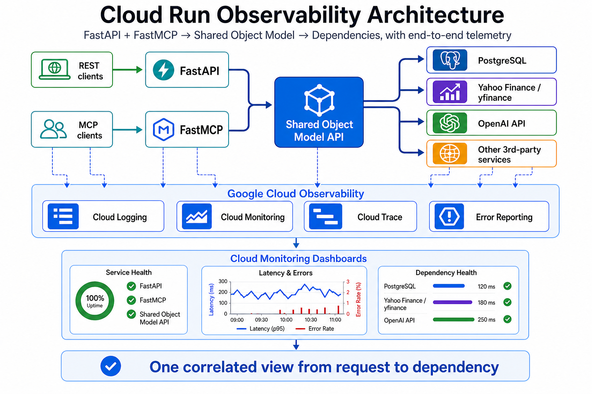
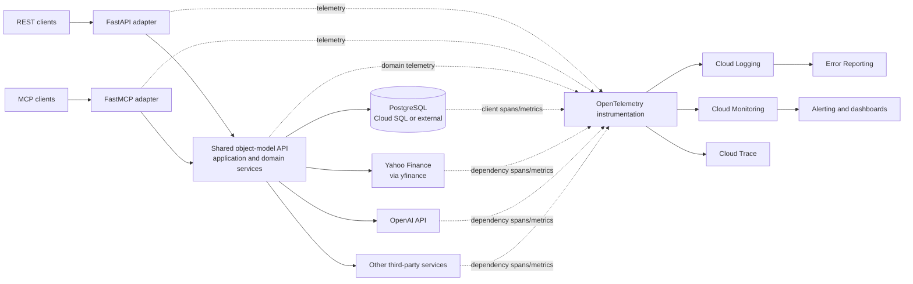
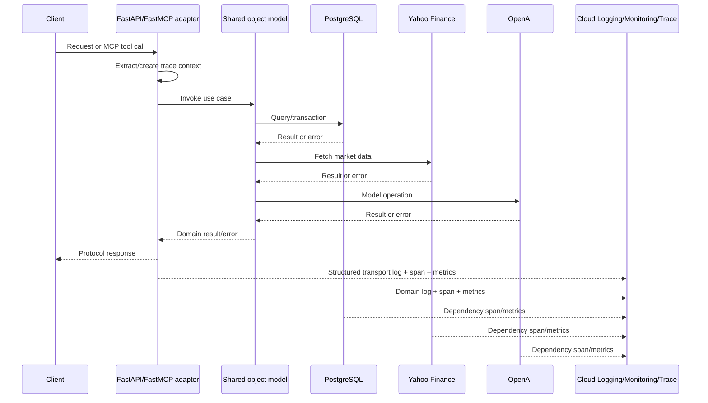
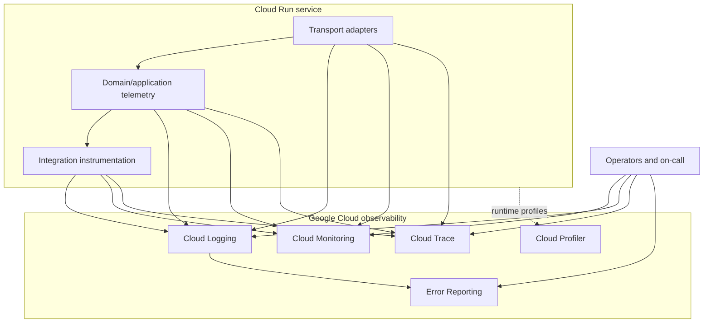

# High-Level Observability Architecture for Cloud Run

## Purpose

This document describes a high-level observability architecture for a service platform deployed on Google Cloud Run. The platform exposes capabilities through FastAPI and FastMCP transport adapters. Both adapters call a shared object-model API, which owns application orchestration and accesses PostgreSQL, Yahoo Finance through `yfinance`, OpenAI, and other third-party services.

The design is optimized for Google Cloud’s managed observability services while preserving a clean separation between transport, application/domain, and infrastructure layers.

## Executive summary

The proposed approach gives the team one operational view of every request—from a REST call or MCP tool invocation through the shared object model and into PostgreSQL, Yahoo Finance, OpenAI, and other third-party services.

The key architectural decision is to keep FastAPI and FastMCP as thin transport adapters. They capture protocol-level health and pass requests into the shared object-model API, where domain operations, orchestration, and dependency behavior are measured consistently. This avoids duplicating business logic or creating separate observability systems for REST and MCP.

Google Cloud Run provides the execution platform, while Google Cloud Observability provides the operational feedback loop:

- Cloud Logging captures structured, correlated events for diagnosis.
- Cloud Monitoring provides dashboards, service indicators, and alerts.
- Cloud Trace shows where latency is spent across layers and dependencies.
- Error Reporting groups actionable application failures.
- Cloud Profiler and Cloud Run runtime metrics help identify CPU, memory, concurrency, and cold-start issues.

The expected outcome is faster incident diagnosis, safer deployments, clearer ownership of failures, and earlier detection of dependency or capacity problems. The design also establishes a foundation for SLOs that reflect real user and business outcomes—not only whether the container responded successfully.

### Architecture at a glance

The dashboard layer turns the telemetry foundation into an operational view for engineers and on-call staff. A Cloud Monitoring dashboard should bring together Cloud Run service health, FastAPI and FastMCP traffic, shared object-model latency and outcomes, and PostgreSQL/Yahoo Finance/OpenAI dependency health. The dashboard is a decision surface: it should quickly show whether an incident is caused by the platform, a transport adapter, domain logic, or an external dependency.

Recommended dashboard pages or sections:

- **Service Health:** availability, request volume, revision health, instance count, concurrency, CPU, memory, and cold-start indicators.
- **Latency & Errors:** p50/p95/p99 latency, HTTP and MCP error rates, domain-operation failures, timeout counts, and trace links for representative slow requests.
- **Dependency Health:** PostgreSQL latency and pool pressure; Yahoo Finance and OpenAI latency, rate limits, retries, timeouts, and failure rates.

Use Cloud Monitoring widgets for native Cloud Run metrics, OpenTelemetry/custom metrics, SLOs, and PromQL-backed metrics from Managed Service for Prometheus. Keep Grafana as an optional development or alternate visualization surface; the production dashboard shown here is the Cloud Monitoring view.

### Executive takeaways

1. **Instrument once, observe everywhere.** Domain telemetry belongs in the shared object model so HTTP and MCP clients receive consistent behavior and measurement.
2. **Correlate the full path.** A trace ID should connect the inbound request, domain operation, database work, external API calls, retries, and errors.
3. **Separate platform, transport, domain, and dependency health.** This makes it possible to distinguish Cloud Run saturation from a slow provider or a failing use case.
4. **Protect sensitive information by design.** Logs and traces should contain metadata and sanitized error context—not credentials, prompts, tokens, or raw provider payloads.
5. **Alert on user impact.** Availability, latency, and critical domain-operation success should drive SLOs and paging decisions.

## Goals and principles

- Provide one correlated view of an operation across HTTP or MCP, the object model, database calls, and external APIs.
- Keep FastAPI and FastMCP thin: instrumentation should capture transport activity, while business-operation telemetry is emitted by the shared object model/application layer.
- Prefer structured logs, OpenTelemetry-compatible traces, and low-cardinality metrics.
- Use Cloud Monitoring for service health, Cloud Logging for diagnosis, Cloud Trace for request causality, and Error Reporting for actionable exceptions.
- Make third-party dependency behavior visible without exposing secrets, prompts, tokens, or sensitive payloads.
- Design for Cloud Run’s autoscaling, revisions, concurrency, request timeouts, and ephemeral instances.

## Target architecture

### Layer responsibilities

| Layer | Responsibility | Primary telemetry |
|---|---|---|
| FastAPI adapter | HTTP routing, request validation, response/error translation | HTTP request count, latency, status, route, request trace context |
| FastMCP adapter | MCP tool/resource registration, protocol validation, response/error translation | MCP call count, tool name, latency, outcome, protocol errors |
| Object-model/application layer | Use cases, orchestration, domain rules, transaction boundaries | Domain operation count, duration, outcome, business-relevant failure reason |
| Infrastructure adapters | PostgreSQL, `yfinance`, OpenAI, and other integrations | Dependency latency, timeout, retry, status/category, error count |
| Cloud Run platform | Deployment, instance lifecycle, concurrency, scaling | Request/container metrics, revision health, instance utilization |

The domain and object-model code should not import FastAPI, FastMCP, Cloud Run APIs, or vendor SDK types solely to emit telemetry. Use a small internal telemetry interface or standard OpenTelemetry APIs behind an application-owned instrumentation module.

## Google Cloud observability services

### Cloud Logging

Emit JSON structured logs to stdout/stderr so Cloud Run automatically collects them. Include:

- `severity`, `message`, `timestamp`
- `trace` and `span_id` correlation fields
- `service`, `revision`, `environment`, and `region`
- `transport` (`http` or `mcp`)
- `operation` or use-case name
- `outcome` and a sanitized `error_kind`
- `duration_ms` where useful
- dependency name and operation for integration logs

Use log-based metrics sparingly; prefer native or OpenTelemetry metrics for numeric time series. Never log API keys, authorization headers, full prompts, raw provider responses, database credentials, or unredacted personal/financial data.

### Cloud Monitoring

Use Cloud Run built-in metrics for platform behavior and OpenTelemetry/custom metrics for application and dependency behavior. Build dashboards around:

1. Request health: traffic, error rate, latency percentiles, and saturation.
2. Adapter comparison: FastAPI versus FastMCP traffic, latency, and failures.
3. Domain health: operation throughput, duration, and outcome by use case.
4. Dependencies: PostgreSQL, Yahoo Finance, OpenAI, and other provider latency/error/timeout rates.
5. Runtime health: instance count, concurrency, CPU/memory utilization, cold starts, and revision distribution.

Keep metric labels bounded. Good labels include `transport`, `operation`, `dependency`, `outcome`, `status_class`, `region`, and `revision`. Avoid user IDs, request IDs, ticker symbols, prompt text, URLs with query parameters, or arbitrary exception messages as metric labels.

### Cloud Trace

Propagate W3C trace context from incoming HTTP requests and MCP requests where the MCP client supports it. Create spans for:

- inbound FastAPI requests and FastMCP tool calls;
- object-model use cases;
- PostgreSQL queries or logical database operations;
- Yahoo Finance requests or fetch operations;
- OpenAI requests, including model and operation category but not prompt content;
- retries, backoff, and timeouts.

Use span attributes with bounded values. Record failures on spans and attach sanitized exception information. Sample enough traffic to debug production issues while controlling volume; consider adaptive or tail-based sampling outside the request path if the platform grows.

### Error Reporting

Allow unhandled and explicitly reported exceptions to flow into Error Reporting. Group errors using stable exception types and sanitized context. Separate expected domain rejections, client validation errors, provider outages, and programming defects so a high volume of expected 4xx responses does not hide actionable failures.

### Cloud Profiler and Cloud Run diagnostics

Enable Cloud Profiler where supported and appropriate for production workloads, especially for CPU- or latency-heavy object-model operations. Use Cloud Run revision and instance metrics to identify cold-start costs, excessive concurrency, memory pressure, and scaling limits. Profiling must not capture secrets or sensitive request content.

## Telemetry flow and correlation

A single trace should make it possible to answer: “Was this request slow because of Cloud Run queuing, the object-model operation, PostgreSQL, Yahoo Finance, OpenAI, retries, or application CPU?”

## Recommended metric catalog

Metric names may be implemented as OpenTelemetry instruments and exported to Cloud Monitoring using the project’s chosen collector/export path.

| Metric | Type | Key labels | Purpose |
|---|---|---|---|
| `service_transport_requests_total` | Counter | `transport`, `route_or_tool`, `status_class` | HTTP/MCP traffic and response health |
| `service_transport_duration_ms` | Histogram | `transport`, `route_or_tool` | Transport latency percentiles |
| `service_domain_operations_total` | Counter | `operation`, `outcome` | Use-case throughput and success/failure |
| `service_domain_operation_duration_ms` | Histogram | `operation` | Business-operation latency |
| `service_dependency_requests_total` | Counter | `dependency`, `operation`, `outcome` | Integration call volume and failures |
| `service_dependency_duration_ms` | Histogram | `dependency`, `operation` | Provider/database latency |
| `service_dependency_retries_total` | Counter | `dependency`, `reason` | Retry pressure and instability |
| `service_dependency_timeouts_total` | Counter | `dependency`, `operation` | Timeout detection |
| `service_inflight_operations` | UpDownCounter | `operation` | Concurrency and bottleneck analysis |

For PostgreSQL, add pool utilization, wait time, connection failures, and transaction rollback metrics if the client/pool exposes them. For OpenAI and Yahoo Finance, track provider response categories, rate limits, timeouts, retries, and freshness/availability outcomes without recording sensitive payloads.

## Logging and error taxonomy

Use a stable error taxonomy across both adapters:

| Error category | Typical response | Logging/alerting treatment |
|---|---|---|
| Client validation/protocol error | 4xx or MCP validation error | Structured log at info/warning; generally no paging |
| Domain rejection | 4xx or domain-specific result | Count separately from defects; dashboard trend |
| Dependency timeout/unavailable | 5xx or controlled fallback | Warning/error with dependency and retry state; alert on sustained rate |
| Database transaction failure | 5xx | Error Reporting when unexpected; page if sustained |
| Programming/configuration defect | 5xx | Error Reporting and paging based on rate/impact |

Include the trace ID in user-visible support responses when safe. This gives operators a lookup key without exposing internal stack traces.

## Alerting strategy

Create service-level alerts around user impact and dependency risk:

- high 5xx rate by Cloud Run service/revision;
- elevated p95/p99 latency for HTTP and MCP separately;
- increased domain-operation failure rate;
- PostgreSQL connection exhaustion, transaction failures, or sustained latency;
- Yahoo Finance/OpenAI timeout, rate-limit, or error spikes;
- Cloud Run instance/concurrency saturation and memory pressure;
- unhealthy or unexpectedly uneven revision traffic during rollout;
- missing telemetry or a sudden drop in expected operation volume where applicable.

Use multi-window, multi-burn-rate SLO alerting for critical user-facing operations when reliable traffic volume exists. Route urgent alerts through the team’s supported notification channel and use lower-severity notifications for trends and capacity signals.

## SLO suggestions

Define SLOs by transport and by critical domain operation rather than only by container availability. Example initial targets should be validated against real traffic:

- availability for successful HTTP responses and successful MCP tool calls;
- latency for selected routes/tools at p95 or p99;
- success rate for critical object-model operations;
- freshness or completeness for market-data operations;
- availability of provider-dependent features, with explicit degraded-mode behavior.

Cloud Run request success alone cannot establish that the object model returned a correct or useful result, so domain-level indicators are essential.

## Deployment and operational guidance

1. Instrument the shared telemetry module and object-model use cases first.
2. Add equivalent middleware/hooks for FastAPI and FastMCP adapters.
3. Propagate trace context through asynchronous work and outbound HTTP clients.
4. Configure service account permissions using least privilege for writing telemetry and reading operational data.
5. Use Secret Manager for provider credentials; keep secrets out of environment logs and traces.
6. Attach deployment metadata such as Git revision, Cloud Run revision, region, and environment to logs and traces.
7. During rollouts, compare old and new revisions by latency, errors, domain outcomes, and dependency behavior.
8. Test telemetry with representative success, validation-error, timeout, retry, and provider-failure scenarios.

## Reference ownership model

The platform team owns Cloud Run, project-level telemetry configuration, dashboards, alert policies, retention, and access control. Service owners own operation names, error taxonomy, instrumentation correctness, and SLO definitions. This division keeps observability useful as the number of MCP tools, REST endpoints, and integrations grows.

## Summary

The recommended architecture treats Google Cloud observability as a cross-cutting capability around the Cloud Run service, not as logic embedded in either transport adapter. FastAPI and FastMCP emit transport telemetry, the shared object model emits domain telemetry, and infrastructure adapters emit dependency telemetry. Structured Cloud Logging, correlated Cloud Trace spans, Cloud Monitoring metrics and alerts, Error Reporting, and selective Profiling together provide an end-to-end view from client request to database or third-party dependency.
