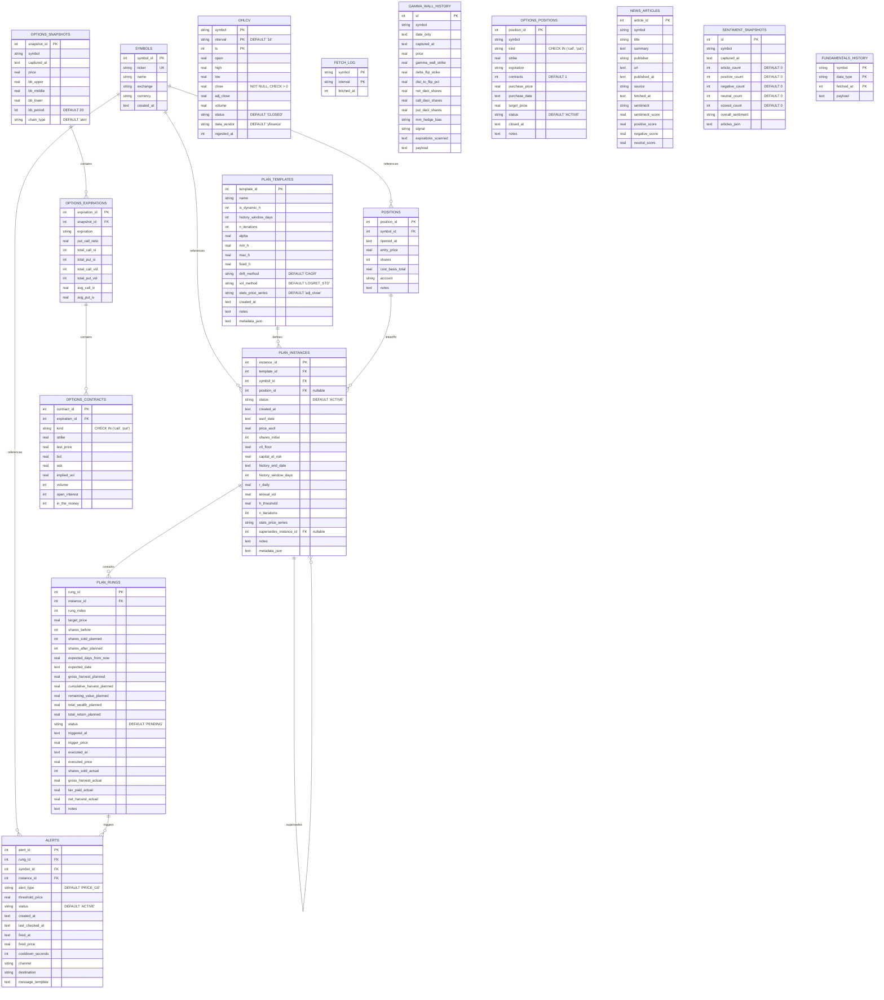

# QuantCore Database ERD

## Key Relationships

### Portfolio & Positions
- **SYMBOLS** is the central entity for all stock data
- **POSITIONS** links equity positions to symbols
- **PLAN_INSTANCES** and **PLAN_RUNGS** form the Harvester system for systematic selling

### Options Data
- **OPTIONS_SNAPSHOTS** captures a point-in-time snapshot
- **OPTIONS_EXPIRATIONS** breaks down by expiration date
- **OPTIONS_CONTRACTS** contains individual strike data
- **GAMMA_WALL_HISTORY** tracks market-maker positioning over time
- **OPTIONS_POSITIONS** tracks owned options contracts

### News & Sentiment
- **NEWS_ARTICLES** stores individual articles by symbol
- **SENTIMENT_SNAPSHOTS** aggregates sentiment at a point in time

### Harvester System
- **PLAN_TEMPLATES** define the algorithm parameters
- **PLAN_INSTANCES** create specific instances for each symbol
- **PLAN_RUNGS** define the harvest targets (price levels where to sell)
- **ALERTS** trigger when rungs are hit, linked to Discord notifications

## Indices

All tables have appropriate indices for common queries:
- `ohlcv`: lookup by (symbol, interval, ts)
- `plan_instances`: unique constraint on one active plan per symbol
- `plan_rungs`: instance status tracking
- `alerts`: symbol and status filtering
- `options_*`: snapshot and expiration lookups
- `news_articles`: symbol and published_at for temporal queries
- `sentiment_snapshots`: symbol and captured_at for time-series
