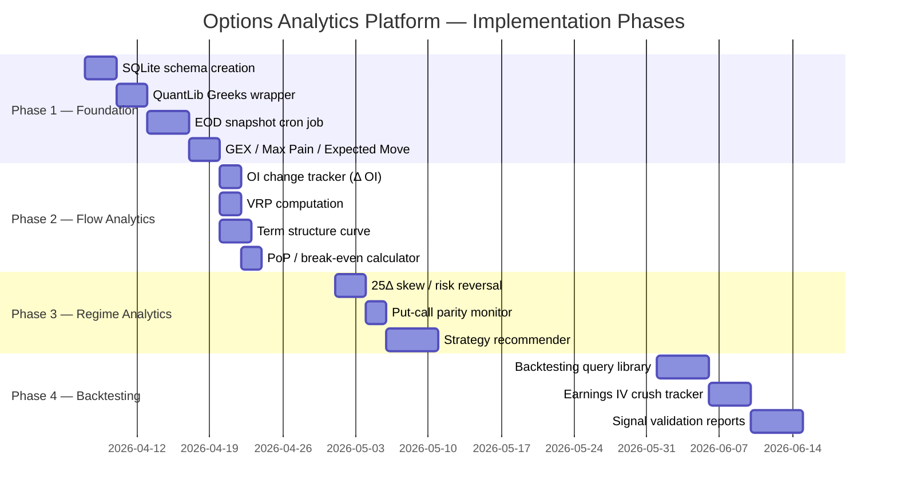

# Options Analytics Platform — Technical Proposal

**Project:** Stock Portfolio MCP Analysis Tools — Options Analytics Extension
**Date:** April 2026
**Status:** Pre-implementation Proposal — For Partner Review
**Audience:** Python engineers with derivatives trading background

---

## Abstract

Our current MCP-based analysis toolkit provides solid price momentum, candlestick pattern detection, and basic options chain summaries via the `stock-price-server` and `options_analysis.py` CLI. These tools are stateless — they fetch, compute, and discard. This proposal outlines a two-part extension:

1. **A persistent, daily EOD options data store** capturing options chain snapshots that cannot be reconstructed after the fact from any free data source, seeded by a nightly cron job.
2. **A suite of twelve analytical capabilities** — built on top of that historical store and the QuantLib pricing library — that materially improve our ability to identify high-conviction options trade setups, assess volatility regimes, quantify institutional flow, and eventually backtest signal hypotheses against accumulated history.

The proposal covers architecture, schema design, library selection rationale (with specific focus on QuantLib vs Black-Scholes-Merton approximations), the analytical capability roadmap, and a phased implementation plan.

---

## Table of Contents

1. [Background and Motivation](#1-background-and-motivation)
2. [The Irreversibility Problem](#2-the-irreversibility-problem)
3. [Data Architecture: Tier 1 Store](#3-data-architecture-tier-1-store)
4. [Pricing Engine: QuantLib over BSM](#4-pricing-engine-quantlib-over-bsm)
5. [Analytical Capabilities](#5-analytical-capabilities)
6. [EOD Cron Job Design](#6-eod-cron-job-design)
7. [Implementation Roadmap](#7-implementation-roadmap)
8. [Limitations and Risk Factors](#8-limitations-and-risk-factors)
9. [Appendix A: Full Schema DDL](#appendix-a-full-schema-ddl)
10. [Appendix B: External References](#appendix-b-external-references)

---

## 1. Background and Motivation

### 1.1 Current State

The existing toolkit consists of three components:

| Component | Role | Statefulness |
|---|---|---|
| `stock_price_server.py` | MCP server: price, RSI, MACD, candlestick patterns, OBV, volume analysis, unusual call detection | Stateless |
| `market_analysis_server.py` | MCP server: short interest, dark pool proxy, bid/ask spread | Stateless |
| `options_analysis.py` | CLI: watchlist-level P/C scoring, IV rank, put trade recommendations | Stateless |
| `ohlcv_cache.db` | SQLite: OHLCV bar cache shared across all servers | **Persistent** |

The OHLCV cache established that persistence is valuable — cold-start performance improved significantly and historical price data is always available. The natural next step is applying the same discipline to options data, where the case for persistence is far stronger.

### 1.2 What Is Missing

The current system answers: *"What is the options market saying right now?"*

It cannot answer: *"Is this level of put/call ratio elevated vs. historical norms for this stock?"*, *"What did IV do after the last three earnings cycles?"*, or *"When sweep scores were ≥7, what happened to the stock over the next two weeks?"*

These are the questions that separate reactive analysis from probabilistic edge.

---

## 2. The Irreversibility Problem

This is the central motivation for acting now rather than later.

### 2.1 What yfinance Provides vs. What It Keeps

yfinance exposes the live options chain (strikes, bid/ask, last, volume, OI, IV) for any active expiration. Once a contract expires, **that data is gone from yfinance forever**. There is no `ticker.option_chain(expiration="2026-04-17", as_of="2026-04-10")`.

Contrast this with OHLCV data, where `ticker.history(period="2y")` reconstructs the full price history. No equivalent exists for options.

```
                OHLCV Data                    Options Chain Data
                ──────────                    ──────────────────
 Today         ████████████████▶             ████████████████▶
 Tomorrow      ██████████████████▶           ████████████████▶
 +30 days      Back-fillable from yfinance   █████ (expired, gone)
 +1 year       Back-fillable from yfinance   ░░░░░ (unrecoverable)
```

### 2.2 What Paid Data Costs

To reconstruct historical options data retroactively:

| Vendor | Product | Approximate Cost |
|---|---|---|
| OptionMetrics (Ivy DB) | EOD chains + Greeks + IV surface | $5,000–$20,000/year |
| CBOE DataShop | EOD settlement data | $2,000–$8,000/year |
| Bloomberg Terminal | Full options history | $25,000+/year |
| Quandl/Nasdaq Data Link | Select options datasets | $1,000–$5,000/year |

**Every day we run the cron job is a day of data we own and never have to pay for.**

### 2.3 Data That Is Non-Reproducible

The following fields reset, expire, or become unavailable after the fact:

| Field | Why Non-Reproducible |
|---|---|
| Daily volume per contract | Resets to 0 at 9:30 AM each day |
| Open interest per contract | Reflects settlement of expired contracts; yfinance only serves current chains |
| Bid / ask spread | Point-in-time market microstructure |
| Implied volatility | Derived from live market prices; historical IV is not served by yfinance |
| IV rank / percentile | Depends on rolling HV window that existed on that specific date |
| Term structure shape | Requires all active expirations simultaneously |
| Sweep activity | Intraday volume anomalies visible only on the trading day |

---

## 3. Data Architecture: Tier 1 Store

### 3.1 Design Principles

- **One snapshot per symbol per trading day**, taken at market close (~4:10 PM ET after volume settles)
- **SQLite** for zero-ops portability (consistent with `ohlcv_cache.db`)
- **Parameterized queries only** — no string interpolation (established pattern from `ohlcv_cache.py`)
- **Append-only writes** — never modify historical rows; corrections are new rows flagged with a `corrected` status
- **Auditable** — every row records the snapshot timestamp and risk-free rate used for Greek computation

### 3.2 Entity Model

```
┌─────────────────────────────────────────────────────────────────┐
│                      options_store.db                           │
│                                                                 │
│  market_rates          options_contracts        options_sweeps  │
│  ─────────────         ─────────────────        ──────────────  │
│  snapshot_date ◀──┐    symbol               ┌─▶ symbol          │
│  risk_free_rate    ├──  snapshot_date ───────┤   snapshot_date  │
│  source            │   expiration            │   expiration      │
│                    │   contract_type         │   strike          │
│                    │   strike                │   sweep_score     │
│                    │   underlying_price      │   vol_oi_ratio    │
│                    │   bid / ask / last      │   conviction      │
│                    │   volume / open_interest│                   │
│                    │   implied_vol           │  iv_snapshots     │
│                    │   delta / gamma         │  ─────────────    │
│                    │   theta / vega / rho    │  symbol           │
│                    │   otm_pct               │  snapshot_date    │
│                    │                         │  iv_rank          │
│                    │  options_snapshots      │  iv_percentile    │
│                    │  ──────────────────     │  hv_30            │
│                    └─ symbol                 │  iv_vs_hv         │
│                       snapshot_date ─────────┘  label           │
│                       expiration                                 │
│                       days_to_expiry           short_interest    │
│                       near_oi_pc               ──────────────    │
│                       near_vol_pc              symbol            │
│                       near_atm_pc              settlement_date   │
│                       vol_oi_ratio             shares_short      │
│                       total_call_oi            short_float_pct   │
│                       total_put_oi             short_ratio_days  │
│                       avg_call_iv              squeeze_potential │
│                       avg_put_iv                                 │
│                       atm_call_iv                                │
│                       atm_put_iv                                 │
└─────────────────────────────────────────────────────────────────┘
```

### 3.3 Core Table: `options_contracts`

The most granular table — one row per contract per snapshot day. This is the primary input for all downstream analytics.

```sql
CREATE TABLE options_contracts (
    symbol            TEXT    NOT NULL,
    snapshot_date     DATE    NOT NULL,
    snapshot_ts       INTEGER NOT NULL,  -- Unix epoch at capture
    expiration        TEXT    NOT NULL,
    days_to_expiry    INTEGER NOT NULL,
    contract_type     TEXT    NOT NULL CHECK(contract_type IN ('call','put')),
    strike            INTEGER NOT NULL,  -- strike × 1000, integer to avoid float keys
    underlying_price  REAL    NOT NULL,
    bid               REAL,
    ask               REAL,
    last_price        REAL,
    volume            INTEGER,
    open_interest     INTEGER,
    implied_vol       REAL,             -- decimal (0.45 = 45%)
    in_the_money      INTEGER,          -- 0/1
    otm_pct           REAL,             -- (strike/1000 - S) / S × 100
    -- QuantLib-computed Greeks
    delta             REAL,
    gamma             REAL,
    theta             REAL,             -- $ per day
    vega              REAL,             -- $ per 1% IV move
    rho               REAL,
    -- Audit
    risk_free_rate    REAL,
    dividend_yield    REAL,
    PRIMARY KEY (symbol, snapshot_date, expiration, contract_type, strike)
);
```

**Note on strike storage:** The industry standard is `strike × 1000` stored as INTEGER (OCC convention). This eliminates floating-point key comparison issues (e.g., `112.5` represented as `112500`).

### 3.4 Summary and Derived Tables

See **Appendix A** for the complete DDL for all six tables: `options_contracts`, `options_snapshots`, `iv_snapshots`, `options_sweeps`, `short_interest_snapshots`, and `market_rates`.

---

## 4. Pricing Engine: QuantLib over BSM

### 4.1 The American Option Problem

All US equity options are **American-style** (early exercise permitted at any time before expiration). Black-Scholes-Merton prices **European-style** options (exercise at expiry only). For a data system intended to support backtesting, using BSM introduces systematic mispricing that will corrupt conclusions.

The early-exercise premium is non-trivial in precisely the scenarios we most want to analyze:

```
Scenario                         BSM Error      Frequency in Practice
────────────────────────────────────────────────────────────────────
Deep ITM put near expiry         Undervalues    Every market crash/selloff
Call on high-div stock pre-exdiv Undervalues    Every quarterly dividend cycle
High-IV, short-DTE environment   Greeks biased  Exactly the high-fear scenarios
                                                we care most about backtesting
```

For example, during MU's selloff from $444 → $321 in March 2026, deep ITM puts in the final week before expiration would have carried a meaningful early-exercise premium that BSM ignores entirely. Any backtest built on BSM Greeks for that period would overstate the cost of those puts and understate their delta.

### 4.2 QuantLib's Approach

QuantLib uses a **Binomial tree (Cox-Ross-Rubinstein)** for American options by default. At each node in the tree, it evaluates whether early exercise is optimal, correctly pricing the early-exercise premium.

```
BSM (European):
  Value = closed-form solution — one calculation
  ✓ Fast
  ✗ Cannot price American exercise
  ✗ Cannot model discrete dividends

QuantLib Binomial (American):
  Value = backward induction through N-step tree
  ✓ Correctly handles early exercise at every node
  ✓ Supports discrete dividends (actual $ amounts on actual ex-div dates)
  ✓ Supports full yield curve (not just a flat rate)
  ✓ Actively maintained — v1.41 released January 2026
  ~ Slower per contract (~2–5ms), acceptable for EOD batch work
```

### 4.3 Inputs Required

| Input | Source | Notes |
|---|---|---|
| Underlying price `S` | `ticker.fast_info.last_price` | Already fetched |
| Strike `K` | Options chain | Already captured |
| Time to expiry `T` | `(expiration - snapshot_date).days / 365.0` | Computed |
| Implied vol `σ` | Options chain `impliedVolatility` | Already captured |
| Risk-free rate `r` | `yf.Ticker("^IRX").fast_info.last_price / 100` | 13-week T-bill, free via yfinance |
| Dividend yield `q` | `ticker.info.get("dividendYield", 0.0)` | 0.0 for non-payers (MU, WDC, TER, GEV) |

### 4.4 API Complexity vs. Capability

QuantLib's Python API is verbose compared to `py_vollib`. Constructing a single pricer requires building a `BlackScholesMertonProcess`, a `BinomialVanillaEngine`, yield term structures, and exercise objects. However:

1. **This complexity is encapsulated once** in a `compute_greeks()` helper function and never seen again by calling code.
2. **For a daily batch snapshot** over ~400 contracts per symbol, even the unvectorized per-contract object construction runs in under one second total — QuantLib's C++ bindings are fast despite the verbose Python API.
3. **Maintenance matters for a long-term data store.** QuantLib shipped v1.41 in January 2026. `py_vollib_vectorized`'s last release was 2021 (beta status). A backtesting database is worthless if the library used to compute its values is abandoned mid-project.

```python
# The QuantLib wrapper — written once, used everywhere
def compute_greeks(chain_df, underlying_price, expiration,
                   snapshot_date, risk_free_rate, dividend_yield=0.0):
    """
    Price American vanilla options and return Greeks via QuantLib CRR binomial.
    Returns chain_df with delta, gamma, theta, vega, rho columns appended.
    """
    import QuantLib as ql

    calc_date = ql.Date(snapshot_date.day, snapshot_date.month, snapshot_date.year)
    expiry    = ql.Date(expiration.day, expiration.month, expiration.year)
    ql.Settings.instance().evaluationDate = calc_date

    dc       = ql.Actual365Fixed()
    cal      = ql.UnitedStates(ql.UnitedStates.NYSE)
    flat_r   = ql.YieldTermStructureHandle(ql.FlatForward(calc_date, risk_free_rate, dc))
    flat_q   = ql.YieldTermStructureHandle(ql.FlatForward(calc_date, dividend_yield, dc))
    spot     = ql.QuoteHandle(ql.SimpleQuote(underlying_price))
    exercise = ql.AmericanExercise(calc_date, expiry)

    results = []
    for _, row in chain_df.iterrows():
        if not row.get("implied_vol") or row["implied_vol"] < 0.001:
            results.append(dict(delta=None, gamma=None, theta=None, vega=None, rho=None))
            continue
        vol_ts  = ql.BlackVolTermStructureHandle(
                    ql.BlackConstantVol(calc_date, cal, float(row["implied_vol"]), dc))
        process = ql.BlackScholesMertonProcess(spot, flat_q, flat_r, vol_ts)
        engine  = ql.BinomialVanillaEngine(process, "crr", 100)
        opt_type = ql.Option.Call if row["contract_type"] == "call" else ql.Option.Put
        option  = ql.VanillaOption(ql.PlainVanillaPayoff(opt_type, row["strike"] / 1000), exercise)
        option.setPricingEngine(engine)
        results.append(dict(
            delta = option.delta(),
            gamma = option.gamma(),
            theta = option.theta() / 365,
            vega  = option.vega()  / 100,
            rho   = option.rho()   / 100,
        ))

    import pandas as pd
    return chain_df.assign(**pd.DataFrame(results, index=chain_df.index))
```

---

## 5. Analytical Capabilities

The following twelve capabilities form the analytics layer. They range from computable on day one (needing only the current day's snapshot) to capabilities that require weeks or months of accumulated history. Each section notes its data dependency.

```
Data Dependencies
─────────────────────────────────────────────────────────────────
 Computable Day 1           Requires History
 ─────────────────          ─────────────────────────────
 GEX                        OI Change (Δ OI)      (≥ 2 days)
 Max Pain                   VRP Tracker           (≥ 30 days)
 Expected Move              IV Term Structure     (≥ 14 days)
 PoP / Break-even           Earnings Crush        (≥ 1 earnings)
 Skew / Risk Reversal       Strategy Recommender  (calibrated)
 Put-Call Parity Check      Backtesting Engine    (≥ 60 days)
```

---

### 5.1 Gamma Exposure (GEX)

**Data dependency:** Current day snapshot only.

GEX quantifies the aggregate delta-hedging obligation of market makers across all outstanding contracts. Because dealers are on the opposite side of most retail and institutional options flow, their hedging activity creates predictable price behavior in the underlying.

**Computation:**

```
GEX per strike (calls) = +gamma × open_interest × 100 × underlying_price
GEX per strike (puts)  = -gamma × open_interest × 100 × underlying_price
  (puts are negative because dealers are long puts when customers buy them,
   and long-put delta is negative, requiring dealers to short the underlying)

Net GEX = Σ(call GEX across all strikes) + Σ(put GEX across all strikes)
```

**Interpretation:**

```
                Net GEX
                   │
    Negative ◀─────┼─────▶ Positive
  (Short Gamma)    │     (Long Gamma)
                   │
  Dealers buy      │    Dealers sell
  into rallies,    │    into rallies,
  sell into dips   │    buy into dips
                   │
  Amplifies moves  │    Dampens moves
  Trending markets │    Mean-reverting
  ─────────────────┼──────────────────
  Buy breakouts    │    Sell premium
  Buy straddles    │    Iron condors
                   │    Covered calls
```

**The Gamma Flip:** The price level where Net GEX crosses zero is one of the most reliable intraday support/resistance levels in the market, often more durable than technicals. It represents the price where dealers transition from volatility-damping to volatility-amplifying behavior.

**GEX by Strike (Call Wall / Put Wall):**

```
Strike  |  Call GEX   |  Put GEX   |  Net GEX   |
──────────────────────────────────────────────────
$380    |   +$12.4M   |   -$3.1M   |   +$9.3M   |  ← Call Wall (ceiling)
$370    |   +$8.7M    |   -$2.4M   |   +$6.3M   |
$365    |   +$4.2M    |   -$4.2M   |    $0.0M   |  ← Gamma Flip (key level)
$360    |   +$2.1M    |   -$6.8M   |   -$4.7M   |
$350    |   +$0.8M    |  -$11.2M   |  -$10.4M   |  ← Put Wall (support)
```

Services like SpotGamma and SqueezeMetrics charge $100–$200/month for this data. We compute it ourselves from OI we already capture.

---

### 5.2 Max Pain

**Data dependency:** Current day snapshot only.

The max pain price is the underlying price at expiration where the aggregate dollar value of all outstanding options (measured against the option writers) is maximized — equivalently, where option buyers collectively lose the most. Due to dealer delta-hedging, stocks frequently gravitate toward max pain in the days approaching expiration.

```
For each candidate strike price K:
  pain(K) = Σ[ call_OI(i) × max(0, K − strike_i) × 100 ]   (ITM calls have intrinsic value)
           + Σ[ put_OI(i)  × max(0, strike_i − K) × 100 ]   (ITM puts have intrinsic value)

Max Pain = argmin_K [ pain(K) ]
```

**Visualized:**

```
Total Options Value ($)
        │
   $8M  │         ████
   $6M  │       ██████████
   $4M  │     ██████████████
   $2M  │  ████████████████████
        └──────────────────────────── Strike Price
        $340  $350  $360 ↑ $370  $380
                      Max Pain ≈ $362
                      (minimum loss to option holders)
```

Most useful in the final 5 trading days before expiration. Adds a gravity-based price target distinct from technical support/resistance.

---

### 5.3 Expected Move

**Data dependency:** Current day snapshot only.

The options market's own forecast of the magnitude of price movement before a given expiration, implied by the straddle price:

```
Expected Move ($) = (ATM Call Ask + ATM Put Ask) × 0.85
Expected Move (%) = Expected Move ($) / Underlying Price × 100

The 0.85 adjustment accounts for the skew premium embedded in the straddle price.
A more precise formula using the full chain is the "1-standard-deviation move":
  1σ Move = ATM IV × √(DTE / 365) × Underlying Price
```

**Use cases:**
- Before entering any directional trade, compare the expected move to your target
- For earnings: compare implied expected move to historical actual earnings moves to identify systematic over- or under-pricing of volatility
- Identify whether the current premium environment justifies a straddle vs. spread

---

### 5.4 Volatility Risk Premium (VRP) Tracker

**Data dependency:** ≥30 days of IV snapshots + OHLCV history (already in `ohlcv_cache.db`).

The volatility risk premium is the persistent spread between implied volatility (what the market charges) and realized volatility (what actually occurs). It is the theoretical foundation of all options premium-selling strategies.

```
VRP = IV_ATM_30d − HV_30   (both annualized, as decimals)

Positive VRP: options are expensive → premium selling has structural edge
Negative VRP: options are cheap → premium buying / long vol has structural edge

Rolling average VRP > 0 for most equities most of the time — this is the
"volatility risk premium" that makes selling covered calls and cash-secured
puts structurally profitable over long horizons.
```

**VRP Percentile:** With 30+ days of history, we rank today's VRP vs. its own distribution. A VRP at the 90th percentile means options are more expensive than 90% of observed days — a premium-selling opportunity. A VRP at the 10th percentile means options are unusually cheap — consider buying premium or avoiding short-vol strategies.

```
VRP Distribution (example: MU, 6 months)
     │
 30  │  ██
 25  │  ████
 20  │  ██████
 15  │  ████████
 10  │  ██████████
  5  │  ████████████
     └──────────────────────── VRP
     -5%  0%  5%  10%  15%
                ↑
            Today's VRP = +8.2%  →  82nd percentile
            → Premium selling favored
```

---

### 5.5 IV Term Structure (Constant-Maturity Curve)

**Data dependency:** ≥14 days of snapshots (to capture multiple expirations maturing through).

Comparing the raw nearest-expiry IV day-over-day is noisy because DTE changes every day. The standard solution is **constant-maturity interpolation**: compute IV at fixed time horizons (7d, 14d, 30d, 60d, 90d, 180d) by interpolating between actual expirations.

```
Term Structure States
─────────────────────────────────────────────────────

Contango (Normal):               Backwardation (Fear):
IV                               IV
│                                │  ●
│         ●──●──●                │    ●
│   ●──●                         │      ●──●──●
└────────────────── DTE          └────────────────── DTE
  7  30  60  90  180               7  30  60  90  180

Near < Far IV                    Near > Far IV
Stable, no event risk            Elevated near-term fear
Calendar spreads favorable       Avoid short near-term vol
```

**Why it matters for trade selection:**
- Steep contango → sell near-dated premium, buy further-dated protection (calendar spread)
- Flat curve → no structural edge from term structure; focus on skew and VRP
- Backwardation → a near-term event is priced in; identify what it is before trading

---

### 5.6 OI Change Analysis (Δ OI)

**Data dependency:** ≥2 days of `options_contracts` snapshots.

Open interest changes tell you whether today's volume represents **new positioning** or **closing of existing positions**. This is a key distinction the raw OI number alone cannot provide.

```sql
-- Daily OI change per contract
SELECT
    c.symbol, c.snapshot_date, c.expiration, c.contract_type,
    c.strike / 1000.0 AS strike,
    c.open_interest AS oi_today,
    p.open_interest AS oi_yesterday,
    (c.open_interest - p.open_interest) AS delta_oi,
    c.volume AS volume_today
FROM options_contracts c
JOIN options_contracts p
  ON  p.symbol        = c.symbol
  AND p.expiration    = c.expiration
  AND p.contract_type = c.contract_type
  AND p.strike        = c.strike
  AND p.snapshot_date = date(c.snapshot_date, '-1 day')
WHERE c.snapshot_date = date('now')
ORDER BY abs(delta_oi) DESC;
```

**Interpretation matrix:**

```
Price Direction | Δ OI  | Volume | Interpretation
────────────────────────────────────────────────────────────────
Up              | +     | High   | New longs added — strong bullish
Up              | -     | High   | Shorts covering — rally may be exhausted
Down            | +     | High   | New shorts added — strong bearish
Down            | -     | High   | Longs exiting — capitulation / bottoming signal
Flat            | + big | Low    | Position rollout (adjusting strikes/expirations)
```

This is the same logic as OBV for equities, applied to the options market. Used in combination with `get_unusual_calls` sweep detection, it distinguishes genuine institutional conviction from noise.

---

### 5.7 Probability of Profit (PoP) and Break-Even Calculator

**Data dependency:** Current day snapshot (Greeks required).

Delta is a market-implied probability: a 0.30-delta call has approximately a 30% probability of expiring in-the-money. With QuantLib Greeks stored, we can compute strategy-level probabilities at the time of trade entry.

```
Strategy          | PoP Formula
──────────────────────────────────────────────────────────────────
Long call @ K     | delta(K)
Short put @ K     | 1 - abs(put_delta(K))
Long put @ K      | abs(put_delta(K))
Bull call spread  | delta(long_strike) - delta(short_strike)
  [K_low / K_high]|
Bear put spread   | abs(put_delta(short_K)) - abs(put_delta(long_K))
Iron condor       | 1 - delta(call_short) - abs(put_delta(put_short))
  [pc / ps / cs / cc]|    (approximate, ignores correlation)
Straddle          | ≈ 50% by construction (symmetric)
```

**Break-even computation:**

```
Long call debit spread [buy K1, sell K2, net debit D]:
  Break-even = K1 + D
  Max profit = (K2 - K1) - D  at expiry with price ≥ K2
  Max loss   = D              at expiry with price ≤ K1
  Risk/reward = Max profit / Max loss

Short put [sell K, receive credit C]:
  Break-even = K - C
  Max profit = C              at expiry with price ≥ K
  Max loss   = K - C          at expiry with price = 0 (theoretical)
  Annualized yield = (C / (K - C)) × (365 / DTE)
```

---

### 5.8 Volatility Smile and 25-Delta Skew

**Data dependency:** Current day snapshot (delta values required).

The volatility smile describes how IV varies across strikes. The raw smile is noisy; the industry standard is to evaluate it at fixed **delta levels** (10Δ, 25Δ, 50Δ) which are comparable across underlyings and across time.

```
25-Delta Risk Reversal (RR):
  RR = IV(25Δ put) − IV(25Δ call)

  RR = -5%:  Puts much more expensive than calls
             → Market pricing significant downside fear
             → Short puts are expensive; short calls are cheap

  RR = 0%:   Symmetric smile (rare for equities)

  RR = +3%:  Calls more expensive than puts
             → Squeeze/FOMO priced in; be cautious buying calls

25-Delta Butterfly (Fly) — measures smile "fatness":
  Fly = [IV(25Δ put) + IV(25Δ call)] / 2 − IV(50Δ ATM)

  High Fly:  Fat tails priced in → market expects large moves
             → Avoid selling wings; consider selling ATM straddle and buying wings

  Low Fly:   Skinny tails → cheap wing protection
             → Sell ATM straddle, buy 25Δ strangle for defined risk
```

**Why delta-normalized vs. strike-based:** A 5% OTM call on a $10 stock and a 5% OTM call on a $900 stock (like GEV) are not equivalent. A 25-delta call on both stocks occupies the same position in the probability distribution — genuinely comparable across names and across time.

```
Typical Equity Smile (illustrative):
IV (%)
 60  │ ●                               ●
 55  │    ●                         ●
 50  │        ●               ●
 45  │             ●       ●
 40  │                  ●  ← ATM (50Δ)
     └──────────────────────────────── Delta
     10Δ  25Δ  35Δ  50Δ  35Δ  25Δ  10Δ
     Put ◀─────────────────────▶ Call
```

---

### 5.9 Put-Call Parity Monitor

**Data dependency:** Current day snapshot.

Put-call parity is a no-arbitrage constraint that must hold for European options (and approximately for American options):

```
C − P = S − PV(K)   where PV(K) = K × e^(−r×T)

Rearranged:
  Synthetic long = long call + short put ≈ long stock (adjusted for carry)

Violation threshold:
  abs( (C − P) − (S − PV(K)) ) > (call_ask − call_bid) + (put_ask − put_bid)

A violation exceeding the bid-ask spread of both legs indicates:
  (a) Stale price data from yfinance  ← most common cause
  (b) Dividend event not captured in the model
  (c) Liquidity-driven pricing anomaly
```

**Why it matters for our system:** Large systematic parity violations are a data quality indicator. If MU calls and puts consistently violate parity by 3–5%, we know the yfinance IV and price data for that expiration is unreliable and should be excluded from the VRP tracker, IV rank, and strategy recommender. It is a built-in data quality gate.

---

### 5.10 Strategy Recommender

**Data dependency:** All current-day signals (GEX, VRP, IV rank, skew, BB position, RSI, PoP).

A rule-based scorer that synthesizes all signals into a recommended strategy type and conviction level, following the same architecture as the existing `long_score` / `put_score` system in `options_analysis.py`.

```
Signal Inputs → Weights → Strategy Scores → Ranked Recommendations
──────────────────────────────────────────────────────────────────

Inputs:                    Strategy Scoring Matrix:
  BB position  (0–1)
  RSI (0–100)              Sell CSP:   BB_pos < 0.3  +3
  IV rank (0–100)                      RSI < 40       +2
  VRP (signed %)                       IV rank > 60   +2
  GEX (pos/neg)                        VRP > 0        +2
  RR skew                              GEX > 0        +1  (vol suppressed)
  Term structure slope
  Δ OI direction           Buy Call:   BB_pos > 0.5  +2
  Sweep score                          RSI > 50       +1
                                       MACD bullish   +2
                                       IV rank < 40   +2  (cheap options)
                                       GEX < 0        +1  (trending)
                                       Sweep score>5  +3

                           Iron Condor: IV rank > 75  +3
                                       GEX > 0        +3  (rangebound)
                                       No catalyst    +2
                                       Term contango  +1

                           Buy Straddle: IV rank < 20 +3  (cheap vol)
                                        Catalyst near +3
                                        Term backwd.  +2
                                        Low GEX pos.  +1
```

The recommender is not a signal generator — it is a synthesis layer. It does not predict direction; it identifies when the risk/reward profile of a specific strategy structure is favorable given the current volatility regime.

---

### 5.11 Earnings IV Crush Tracker

**Data dependency:** At least one complete earnings cycle per symbol (typically one quarter).

IV consistently spikes before earnings announcements as the market prices in event uncertainty, then collapses after the announcement regardless of outcome — this is "IV crush." The magnitude of crush is systematic and symbol-specific.

```
Pre-earnings snapshot (T-5):   IV_rank = 85, ATM_IV = 68%
Post-earnings snapshot (T+1):  IV_rank = 42, ATM_IV = 31%

IV Crush = (68 - 31) / 68 = 54.4%

Historical average crush for this symbol: 48%
Today's crush vs historical: 1.13× — slightly above average
```

**Actionable implications:**
- If average crush is 45% and you're considering a short straddle through earnings, you can estimate the expected IV-driven P&L reduction
- If current pre-earnings IV is at the 90th percentile vs historical pre-earnings IVs, the premium is richer than usual — higher expected EV for selling
- If current pre-earnings IV is at the 30th percentile — the event is being underpriced; consider buying

```
Earnings IV Profile (MU example, 4 cycles accumulated):
IV (%)
  │
70│              ████  ← Pre-earnings spike
  │           ████  ████
60│        ████      ████
  │     ████            ████
50│  ████                  ████
  │                            ████████  ← Post-crush plateau
40│
  └──────────────────────────────────── Days to/from Earnings
  -20 -15 -10  -5  E   +1  +5  +10  +20
```

---

### 5.12 Backtesting Engine

**Data dependency:** ≥60 days of snapshots across at least one earnings cycle.

The backtesting engine is the long-term payoff of the entire data infrastructure. It answers the question: *"Does this signal actually predict anything?"*

**Example queries against accumulated history:**

```sql
-- Q: When call sweep score ≥ 7, what was the 5-day return?
SELECT
    s.symbol,
    s.snapshot_date           AS signal_date,
    s.underlying_price        AS price_at_signal,
    s.sweep_score,
    o.underlying_price        AS price_5d_later,
    round((o.underlying_price - s.underlying_price)
          / s.underlying_price * 100, 2) AS return_5d_pct
FROM options_sweeps s
JOIN options_contracts o
  ON  o.symbol        = s.symbol
  AND o.snapshot_date = date(s.snapshot_date, '+5 days')
  AND o.expiration    = s.expiration
  AND o.contract_type = s.contract_type
  AND o.strike        = s.strike
WHERE s.sweep_score >= 7
ORDER BY s.snapshot_date;

-- Q: When IV rank > 80, did short puts outperform?
-- Q: Did GEX > 0 predict rangebound behavior (low 5-day realized vol)?
-- Q: Does 25Δ RR skew < -8% precede outsized downside moves?
-- Q: Which symbol has the most consistent pre-earnings IV crush?
```

The backtesting engine is not a complex framework — it is SQL queries against the options store joined to `ohlcv_cache.db`. The analytical value grows monotonically with the length of the historical record.

---

## 6. EOD Cron Job Design

### 6.1 Execution Schedule

```
Trading day close: 4:00 PM ET
Options volume fully settled: ~4:05 PM ET

Recommended snapshot time: 4:10 PM ET

Cron expression (macOS launchd or Linux cron):
  10 16 * * 1-5    # 4:10 PM, Monday–Friday

With market holiday exclusion:
  The job checks pandas_market_calendars.get_calendar("NYSE").valid_days()
  and exits immediately on non-trading days.
```

### 6.2 Job Execution Flow

```
┌─────────────────────────────────────────────────────────────────┐
│                    EOD Snapshot Job                              │
│                                                                 │
│  1. Market calendar check                                       │
│     └─ Is today a NYSE trading day? No → exit.                 │
│                                                                 │
│  2. Fetch market rate                                           │
│     └─ yf.Ticker("^IRX").fast_info.last_price / 100            │
│     └─ Store in market_rates table                              │
│                                                                 │
│  3. For each symbol in watchlist:                               │
│     │                                                           │
│     ├─ 3a. Fetch live price (yf.Ticker.fast_info)              │
│     ├─ 3b. Fetch all active expirations (ticker.options)        │
│     ├─ 3c. For each of the nearest 4 expirations:              │
│     │       └─ Fetch full options chain (ticker.option_chain)  │
│     │       └─ Compute Greeks via QuantLib                      │
│     │       └─ Insert into options_contracts                    │
│     │       └─ Insert summary into options_snapshots            │
│     ├─ 3d. Compute and store IV rank → iv_snapshots             │
│     ├─ 3e. Run sweep detector → options_sweeps                  │
│     ├─ 3f. Check short_interest_date → store if new            │
│     │                                                           │
│  4. Compute derived analytics (same-day):                       │
│     ├─ GEX per symbol (from today's contracts + Greeks)         │
│     ├─ Max pain per expiration                                  │
│     └─ Expected move per expiration                             │
│                                                                 │
│  5. Log completion, errors, symbols skipped                     │
└─────────────────────────────────────────────────────────────────┘
```

### 6.3 Failure Handling

- **Symbol fetch failure:** Log and skip; do not abort the job. Missing one symbol for one day is acceptable; aborting leaves the entire day unrecorded.
- **QuantLib pricing failure** (zero IV, expired contract): Store `NULL` for Greeks; still persist the raw chain data.
- **Partial run:** The `snapshot_ts` column allows detection of symbols that completed vs. were skipped on any given day.
- **Deduplication:** `INSERT OR IGNORE` (or `ON CONFLICT DO NOTHING`) on the primary key prevents duplicate rows if the job is accidentally run twice.

### 6.4 Storage Estimate

```
Assumptions:
  10 symbols in watchlist
  4 expirations captured per symbol
  ~50 strikes per expiration × 2 sides (call/put)
  = 400 rows per symbol per day
  = 4,000 rows total per trading day

Row size (options_contracts): ~200 bytes
Daily storage: 4,000 × 200B = ~800 KB/day
Annual storage: ~200 MB/year (252 trading days)

After 2 years: ~400 MB — trivially small for SQLite.
```

---

## 7. Implementation Roadmap



### Phase Summary

| Phase | Prerequisite | New Capabilities |
|---|---|---|
| **1 — Foundation** | None | Schema, QuantLib Greeks, cron job, GEX, Max Pain, Expected Move |
| **2 — Flow Analytics** | ≥2 days data | Δ OI, VRP, term structure, PoP / break-even |
| **3 — Regime Analytics** | ≥14 days data | 25Δ skew, parity monitor, strategy recommender |
| **4 — Backtesting** | ≥60 days data + 1 earnings | Earnings crush tracker, signal validation |

---

## 8. Limitations and Risk Factors

### 8.1 Data Source Constraints

- **yfinance is unofficial.** Yahoo Finance's API has no SLA, rate limits are undocumented, and the schema has changed without notice in the past. The snapshot job should be written defensively with per-symbol error handling.
- **IV from yfinance is mid-market.** It is computed from the last trade price, not necessarily the current bid/ask midpoint. This introduces noise in the IV rank and VRP calculations, particularly for illiquid strikes. Mitigated by filtering contracts with `volume = 0` and `bid = 0`.
- **Short interest lags 2 weeks.** FINRA reports short interest on two settlement dates per month. The `short_interest_date` field should always be inspected before acting on short-squeeze signals.
- **yfinance does not provide Level 2 order book.** True sweep detection requires OPRA (trade-by-trade) data. Our `get_unusual_calls` tool uses volume/OI ratios and aggressive-fill proxies — statistically useful but not exchange-confirmed.

### 8.2 QuantLib Assumptions

- **Flat volatility surface.** We price each contract with its own IV (the "practitioner's BSM" approach), not a fitted surface model. This is the standard approach for single-contract pricing but does not capture volatility surface dynamics (skew, curvature) in the pricing itself.
- **Flat yield curve.** Using `^IRX` as a single flat rate is a simplification. For options with DTE > 90 days, using the appropriate constant-maturity Treasury rate improves accuracy.
- **Continuous dividend yield.** Using `ticker.info['dividendYield']` provides an annualized continuous yield. For stocks with lumpy quarterly dividends, discrete dividend modeling (QuantLib's `DividendVanillaOption`) would be more precise. This is noted as a future enhancement.

### 8.3 Model Risk

No model is a substitute for judgment. The strategy recommender scores probabilities; it does not guarantee outcomes. All signals should be interpreted in the context of:
- Current macro regime (rate environment, VIX level)
- Symbol-specific catalysts not captured in historical price data
- Position sizing and portfolio-level Greeks (not addressed in this proposal)

---

## 9. Conclusion

The case for starting the options data collection **now** is straightforward: the data is free to collect, the storage cost is negligible, and the analytical value compounds with every day of history. Options data that expires without being captured is permanently unrecoverable from free sources.

The proposed architecture — a daily EOD cron job writing to SQLite, using QuantLib for accurate American-style Greeks, storing full contract-level chains — requires approximately two weeks of focused development. The twelve analytical capabilities that sit atop that data range from immediately available (GEX, Max Pain, Expected Move) to capabilities that will mature over one to two earnings cycles (Earnings IV Crush Tracker, Backtesting Engine).

The total cost is development time, a `pip install QuantLib`, and a cron entry. The return is an options analytics platform that, after 6–12 months of operation, will support signal validation work that would otherwise require a $10,000+/year data vendor relationship.

---

## Appendix A: Full Schema DDL

```sql
-- ─────────────────────────────────────────────────────────────────
-- options_store.db  —  Full Schema DDL
-- ─────────────────────────────────────────────────────────────────

PRAGMA journal_mode = WAL;     -- concurrent reads during snapshot writes
PRAGMA foreign_keys = ON;

-- Risk-free rate by date (one row per trading day)
CREATE TABLE IF NOT EXISTS market_rates (
    snapshot_date  TEXT PRIMARY KEY,   -- 'YYYY-MM-DD'
    risk_free_rate REAL NOT NULL,      -- decimal, e.g. 0.0435
    source         TEXT DEFAULT 'IRX'  -- '^IRX' | 'manual'
);

-- Full options contract snapshot (primary data table)
CREATE TABLE IF NOT EXISTS options_contracts (
    symbol            TEXT    NOT NULL,
    snapshot_date     TEXT    NOT NULL,
    snapshot_ts       INTEGER NOT NULL,
    expiration        TEXT    NOT NULL,
    days_to_expiry    INTEGER NOT NULL,
    contract_type     TEXT    NOT NULL CHECK(contract_type IN ('call','put')),
    strike            INTEGER NOT NULL,  -- strike × 1000 (OCC convention)
    underlying_price  REAL    NOT NULL,
    bid               REAL,
    ask               REAL,
    last_price        REAL,
    volume            INTEGER,
    open_interest     INTEGER,
    implied_vol       REAL,
    in_the_money      INTEGER,
    otm_pct           REAL,
    -- QuantLib Greeks
    delta             REAL,
    gamma             REAL,
    theta             REAL,
    vega              REAL,
    rho               REAL,
    -- Audit columns
    risk_free_rate    REAL,
    dividend_yield    REAL,
    PRIMARY KEY (symbol, snapshot_date, expiration, contract_type, strike)
);

-- Per-expiration summary (aggregated from contracts)
CREATE TABLE IF NOT EXISTS options_snapshots (
    symbol           TEXT NOT NULL,
    snapshot_date    TEXT NOT NULL,
    expiration       TEXT NOT NULL,
    days_to_expiry   INTEGER,
    underlying_price REAL,
    total_call_oi    INTEGER,
    total_put_oi     INTEGER,
    total_call_vol   INTEGER,
    total_put_vol    INTEGER,
    near_oi_pc       REAL,
    near_vol_pc      REAL,
    near_atm_pc      REAL,
    vol_oi_ratio     REAL,
    put_unwinding    INTEGER,
    fresh_put_buying INTEGER,
    avg_call_iv      REAL,
    avg_put_iv       REAL,
    atm_call_iv      REAL,
    atm_put_iv       REAL,
    expected_move    REAL,
    max_pain_strike  REAL,
    net_gex          REAL,
    PRIMARY KEY (symbol, snapshot_date, expiration)
);

-- IV rank / percentile (per symbol per day)
CREATE TABLE IF NOT EXISTS iv_snapshots (
    symbol           TEXT NOT NULL,
    snapshot_date    TEXT NOT NULL,
    underlying_price REAL,
    atm_iv           REAL,
    hv_30            REAL,
    iv_vs_hv         REAL,
    vrp              REAL,
    vrp_percentile   REAL,
    iv_rank          REAL,
    iv_percentile    REAL,
    skew_25d         REAL,    -- 25Δ risk reversal
    fly_25d          REAL,    -- 25Δ butterfly
    iv_7d            REAL,    -- constant-maturity term structure
    iv_14d           REAL,
    iv_30d           REAL,
    iv_60d           REAL,
    iv_90d           REAL,
    label            TEXT,
    PRIMARY KEY (symbol, snapshot_date)
);

-- Unusual options flow (sweeps) log
CREATE TABLE IF NOT EXISTS options_sweeps (
    symbol           TEXT    NOT NULL,
    snapshot_date    TEXT    NOT NULL,
    snapshot_ts      INTEGER NOT NULL,
    expiration       TEXT    NOT NULL,
    contract_type    TEXT    NOT NULL CHECK(contract_type IN ('call','put')),
    strike           INTEGER NOT NULL,  -- × 1000
    underlying_price REAL,
    last_price       REAL,
    bid              REAL,
    ask              REAL,
    volume           INTEGER,
    open_interest    INTEGER,
    vol_oi_ratio     REAL,
    otm_pct          REAL,
    in_the_money     INTEGER,
    sweep_score      INTEGER,
    conviction       TEXT,
    PRIMARY KEY (symbol, snapshot_date, expiration, contract_type, strike)
);

-- Short interest (bi-monthly cadence)
CREATE TABLE IF NOT EXISTS short_interest_snapshots (
    symbol              TEXT NOT NULL,
    settlement_date     TEXT NOT NULL,
    captured_date       TEXT NOT NULL,
    shares_short        INTEGER,
    short_float_pct     REAL,
    short_ratio_days    REAL,
    float_shares        INTEGER,
    squeeze_potential   TEXT,
    underlying_price    REAL,
    PRIMARY KEY (symbol, settlement_date)
);

-- Indexes for common query patterns
CREATE INDEX IF NOT EXISTS idx_contracts_symbol_date
    ON options_contracts (symbol, snapshot_date);

CREATE INDEX IF NOT EXISTS idx_contracts_expiry
    ON options_contracts (symbol, expiration, snapshot_date);

CREATE INDEX IF NOT EXISTS idx_sweeps_score
    ON options_sweeps (sweep_score DESC, snapshot_date);

CREATE INDEX IF NOT EXISTS idx_iv_symbol_date
    ON iv_snapshots (symbol, snapshot_date);
```

---

## Appendix B: External References

### QuantLib

| Resource | URL |
|---|---|
| QuantLib official site | https://www.quantlib.org |
| QuantLib-Python documentation | https://quantlib-python-docs.readthedocs.io |
| QuantLib PyPI (v1.41, Jan 2026) | https://pypi.org/project/QuantLib/ |
| American option with binomial tree (tutorial) | http://gouthamanbalaraman.com/blog/american-option-binomial-tree-quantlib-python.html |
| QuantLib cookbook (Python examples) | https://github.com/lballabio/QuantLib-SWIG/tree/master/Python/examples |

### Options Pricing Theory

| Resource | Notes |
|---|---|
| Black, F. & Scholes, M. (1973). *The Pricing of Options and Corporate Liabilities.* Journal of Political Economy, 81(3), 637–654. | Original BSM paper |
| Cox, J., Ross, S., & Rubinstein, M. (1979). *Option Pricing: A Simplified Approach.* Journal of Financial Economics, 7(3), 229–263. | CRR binomial model used by QuantLib for American options |
| Hull, J. (2022). *Options, Futures, and Other Derivatives* (11th ed.). Pearson. | Standard reference text for Greeks, parity, American pricing |
| Natenberg, S. (2015). *Option Volatility and Pricing* (2nd ed.). McGraw-Hill. | Practitioner-focused; volatility regimes, skew, strategy selection |

### Volatility and Greeks Analytics

| Resource | Notes |
|---|---|
| Wilmott, P. (2006). *Paul Wilmott on Quantitative Finance* (2nd ed.). Wiley. | Chapter 8: American options and early exercise |
| Gatheral, J. (2006). *The Volatility Surface: A Practitioner's Guide.* Wiley. | Term structure, skew, surface interpolation |
| SpotGamma — GEX methodology | https://spotgamma.com/gamma-exposure/ |
| SqueezeMetrics — GEX whitepaper | https://squeezemetrics.com/monitor/docs |
| "The Implied Volatility Surface" (Derman & Kani, 1994) | Foundation for smile/skew modelling |

### Industry Data Standards

| Resource | Notes |
|---|---|
| OCC Options Symbology Initiative | https://www.theocc.com/Company-Information/Documents-and-Archives/Options-Symbology |
| FINRA Short Sale Regulation | https://www.finra.org/rules-guidance/rulebooks/finra-rules/4560 |
| OPRA (Options Price Reporting Authority) | https://www.opradata.com |
| OptionMetrics Ivy DB data dictionary | https://optionmetrics.com/data/ |

### Python Libraries

| Library | PyPI | Notes |
|---|---|---|
| QuantLib | https://pypi.org/project/QuantLib/ | Primary pricing engine |
| yfinance | https://pypi.org/project/yfinance/ | Market data source |
| pandas_market_calendars | https://pypi.org/project/pandas-market-calendars/ | NYSE trading day detection for cron job |
| py_vollib | https://pypi.org/project/py-vollib/ | BSM reference (European only; not recommended for production) |

### Gamma Exposure (GEX) Background

| Resource | Notes |
|---|---|
| Brent Kochuba, SpotGamma (2020). *Gamma Exposure and Its Effects on Equity Markets.* | The canonical retail-accessible explanation of GEX mechanics |
| Sinead Colton Grant, Goldman Sachs (2021). *Dealer Positioning and Market Dynamics.* | Institutional treatment of dealer gamma hedging flows |
| Kris Sidial (2022). *Understanding the GEX Framework.* The Ambrus Group. | Practitioner notes on GEX signal reliability and edge cases |

---

*Document prepared for internal partner review. Not for external distribution.*
